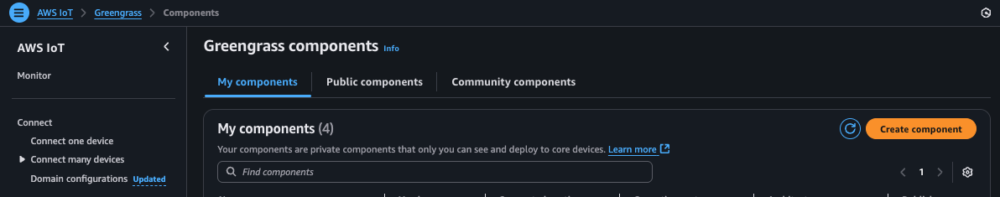
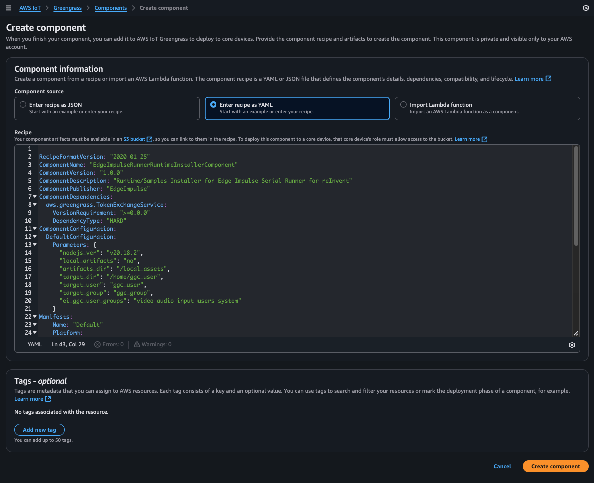
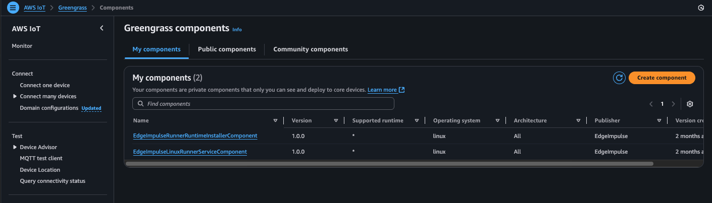

## Create the non-camera custom component

For edge devices without a camera, this component provides sample images for the Edge Impulse Linux Runner. Configure `gst_args` in the Edge Impulse Linux Runner component's JSON to use image data from a file instead of a camera.

### Clone the component repository

Clone the [Edge Impulse AWS Greengrass workshop supplemental repository](https://github.com/edgeimpulse/aws-greengrass-workshop-supplemental). You'll find the following files:

```text
EdgeImpulseEdge Impulse Linux RunnerRuntimeInstallerComponent.yaml
artifacts/EdgeImpulseEdge Impulse Linux RunnerRuntime/1.0.0/install.sh
artifacts/EdgeImpulseEdge Impulse Linux RunnerRuntime/1.0.0/models.tar.gz
artifacts/EdgeImpulseEdge Impulse Linux RunnerRuntime/1.0.0/samples.tar.gz
```

### Copy the artifact files to Amazon S3

In the AWS Console, open Amazon S3 and navigate to the bucket you created for the Edge Impulse Linux Runner custom component.

In that bucket, create the following directory structure:

```text
artifacts/EdgeImpulseEdge Impulse Linux RunnerRuntime/1.0.0
```

In the `1.0.0` directory in S3, upload these files from `./artifacts/EdgeImpulseEdge Impulse Linux RunnerRuntime/1.0.0` in your cloned repository:

```text
install.sh
models.tar.gz
samples.tar.gz
```

Edit `EdgeImpulseEdge Impulse Linux RunnerRuntimeInstallerComponent.yaml` and change the artifact location from "YOUR\_S3\_ARTIFACT\_BUCKET" to your S3 bucket name. You'll find "YOUR\_S3\_ARTIFACT\_BUCKET" near the end of the YAML file. Save the file.

### Register the custom component

In the AWS Console, open **AWS IoT Core**. Under **Greengrass devices**, select **Components**.



Select **Create component**, then select **YAML** as the recipe format.

Clear the initial contents of the recipe editor, then paste the contents of your updated `EdgeImpulseEdge Impulse Linux RunnerRuntimeInstallerComponent.yaml` file:



Select **Create component**. The registered component list now contains two custom components:



## What you've accomplished

You've created the non-camera support component and registered it in AWS IoT Greengrass.

Return to the [component deployment steps](/learning-paths/embedded-and-microcontrollers/edge_impulse_greengrass/customcomponentdeployment/) to deploy these components to your edge device through AWS IoT Greengrass.
