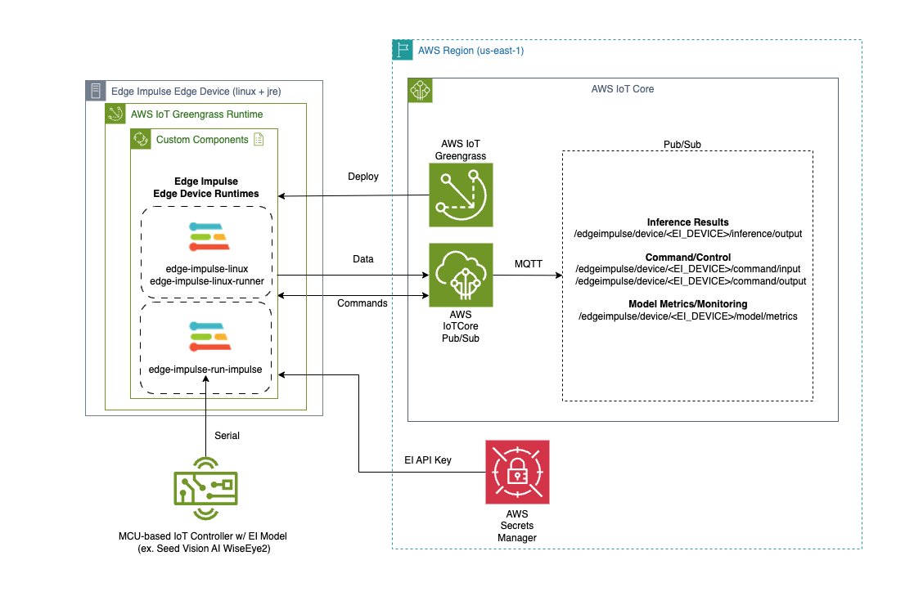

## What is Edge Impulse with AWS IoT Greengrass?

Running machine learning models on edge devices is only part of the challenge. In production, you also need a way to deploy models at scale, collect inference results centrally, and manage device fleets remotely. This Learning Path shows you how to connect Edge Impulse and AWS IoT Greengrass to accomplish exactly that on Arm-based Linux devices.

[Edge Impulse](https://edgeimpulse.com/) is a development platform for building, training, and optimizing ML models purpose-built for edge devices. It handles the full ML lifecycle, from data collection through model deployment, and outputs lightweight models optimized for Arm processors.

[AWS IoT Greengrass](https://docs.aws.amazon.com/greengrass/v2/developerguide/what-is-iot-greengrass.html) is an AWS IoT service that extends cloud capabilities to edge devices. It lets you package software into reusable "components" that can be deployed, configured, and updated remotely across thousands of devices. Combined with AWS IoT Core, it provides a managed MQTT message broker (a lightweight publish/subscribe messaging protocol commonly used in IoT) for relaying data from edge devices to the cloud.

By integrating the two, you can train an ML model in Edge Impulse Studio, package the Edge Impulse Runner as a Greengrass custom component, and deploy it to your entire fleet of Arm edge devices from the AWS console. Inference results and model metrics then stream back to AWS IoT Core in real time.

## Why use this integration?

This approach solves several real-world challenges for edge AI deployments:

- **Scalable deployment**: Push ML model updates to hundreds or thousands of devices through Greengrass deployments, rather than manually updating each device.
- **Centralized monitoring**: Stream inference results and model performance metrics to AWS IoT Core, where you can route them to dashboards, databases, or alerting systems.
- **Remote management**: Issue commands to the Edge Impulse Runner service through IoT Core MQTT topics. You can restart inference, adjust confidence thresholds, or retrieve model information without SSH access to the device.
- **Secure credential handling**: Store the Edge Impulse API key in AWS Secrets Manager rather than passing it on the command line.

## Example applications

This integration is well suited for scenarios where ML inference runs on edge hardware, but results need to flow back to the cloud for action or analysis:

- **Smart building occupancy**: Deploy a person-detection model to cameras at building entrances. Inference results stream to IoT Core, where they feed occupancy dashboards or trigger HVAC adjustments.
- **Wildlife monitoring**: Run an animal classification model on remote camera traps. Results are published to IoT Core and stored in S3 for conservation researchers.
- **Manufacturing quality inspection**: Detect defects on a production line using an object detection model. Inference confidence metrics are monitored in IoT Core to flag when model accuracy degrades and retraining is needed.
- **Retail analytics**: Count and classify products on shelves using edge cameras. Results are aggregated in the cloud for inventory management.

In each case, Edge Impulse handles the ML model, Greengrass handles deployment and lifecycle management, and IoT Core handles the data pipeline back to AWS.

## Architecture overview

The Edge Impulse integration with AWS IoT Core and AWS IoT Greengrass is structured as follows:



The key elements of this architecture are:

- The Edge Impulse Runner service includes a `--greengrass` option that activates the AWS IoT integration.
- AWS Secrets Manager protects the Edge Impulse API key by removing it from command line arguments.
- Inference results are relayed to IoT Core for cloud-side processing, storage, or alerting.
- Model performance metrics (mean confidence, standard deviation) are published at configurable intervals.
- A bi-directional command interface lets you configure and manage the Runner service remotely through IoT Core MQTT topics.

For more detail on the Runner service itself, see the [Edge Impulse for Linux Node.js SDK documentation](https://docs.edgeimpulse.com/docs/tools/edge-impulse-for-linux/linux-node-js-sdk).

Edge Impulse provides pre-built Greengrass component recipes and artifacts in the [AWS Greengrass components repository](https://github.com/edgeimpulse/aws-greengrass-components).

## The EdgeImpulseLinuxRunnerServiceComponent

This Greengrass component downloads, installs, and runs the Edge Impulse Runner service on your edge device. Once running, it connects to your Edge Impulse project, pulls down the deployed model, and starts inference.

The Runner uses MQTT topics to communicate with AWS IoT Core. Think of each topic as a named channel: the Runner publishes messages to a topic, and any service subscribed to that topic (a cloud dashboard, an AWS Lambda function, or the MQTT test client in the AWS console) receives those messages automatically. The `<EdgeImpulseDeviceName>` placeholder in each topic is replaced with your device's actual name at runtime.

The Runner publishes inference results (classification labels, bounding boxes, confidence scores) each time the model processes a frame:

```text
/edgeimpulse/device/<EdgeImpulseDeviceName>/inference/output
```

Accumulated model performance statistics (mean confidence, standard deviation) are published on a timer you configure through the component settings:

```text
/edgeimpulse/device/<EdgeImpulseDeviceName>/model/metrics
```

You can send commands to the Runner by publishing a JSON message to the command input topic. Use this to restart inference, adjust confidence thresholds, or query model information without direct SSH access:

```text
/edgeimpulse/device/<EdgeImpulseDeviceName>/command/input
```

The Runner publishes the result of each command back to a separate output topic, so you can confirm the command was received and see the response:

```text
/edgeimpulse/device/<EdgeImpulseDeviceName>/command/output
```

The full command reference, including JSON structure details, is available in the [Edge Impulse AWS Greengrass integration documentation](https://docs.edgeimpulse.com/docs/integrations/aws-greengrass#commands-january-2025-integration-enhancements).

## What you'll do in this Learning Path

In this Learning Path, you:

1. Set up a supported Arm-based edge device (or an EC2 Arm instance as a simulated device).
2. Create an Edge Impulse project with a pre-trained object detection model (cat and dog detector).
3. Install AWS IoT Greengrass on the edge device.
4. Store the Edge Impulse API key securely in AWS Secrets Manager.
5. Create and deploy a Greengrass custom component that runs the Edge Impulse Runner.
6. Verify inference results streaming to AWS IoT Core through the MQTT test client.
7. Issue remote commands to the Runner service through IoT Core.

The next section walks you through setting up your edge device hardware.
