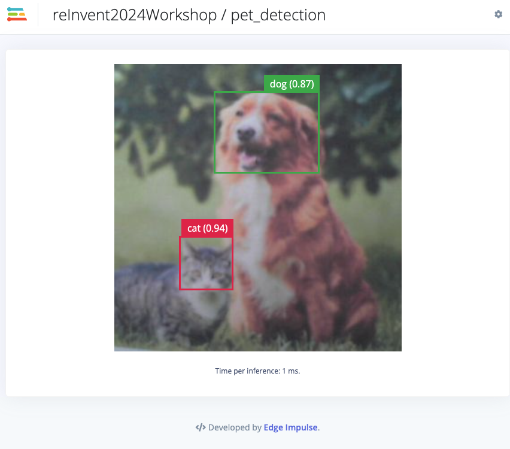
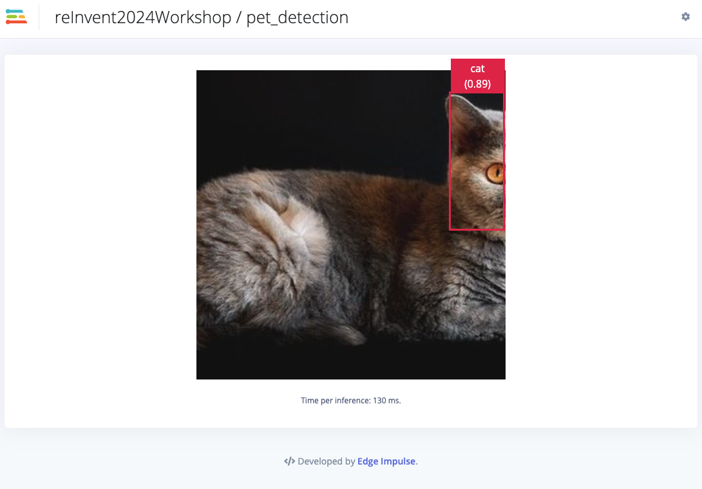
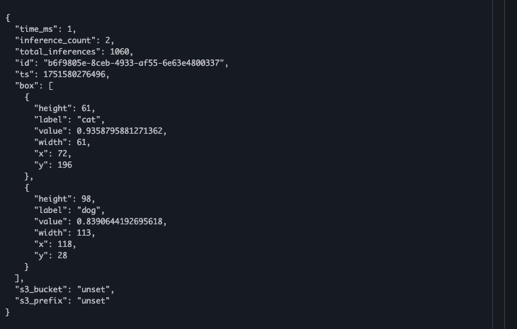
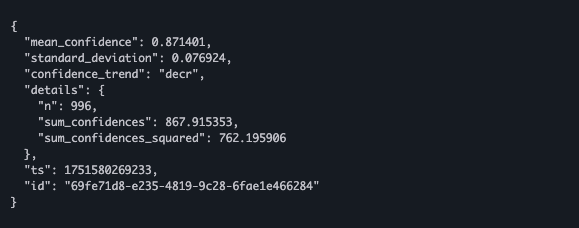

## Running

Now that we have our Edge Impulse component(s) deployed to our edge device, how do we confirm things are working?

Simple!

On your browser, open the following url:

		http://<your edge devices public IP address>:4912
		
So, for example, if my public ip address of my edge device is "1.1.1.1", my url would be:

		http://1.1.1.1:4912
		
You should now see both the imput (video either from file or from your edge devices attached camera) as well as inference results and inference times. There are two output scenarios depending on whether your edge device has a camera or does not have a camera... read below!

### Option 1: Edge devices with cameras

You should be able to see live video of your camera via the url above. Now, point your camera at this picture:

You should see that your model, running on the edge, is identifying both the dog and the cat! It should look something like this:

### Option 2: Edge devices without cameras

In this case, you don't have a camera to use but your component is actually configured to pull its image data from local files installed by the optional non-camera component. 

In this instance, a video of a cat will be shown. The url above should be displaying something similar to this:

Now, if yours looks to be frozen... don't worry! It simply means that the "Runner" has completed playing the 90 second cat video.  The "Runner" service is now waiting for you to issue a "restart" command to replay the same video... please continue reading below... we'll outline how to dispatch the "restart" command via AWS IoTCore!

### AWS IoTCore Integration

With our installed components, we can also examine the ML inference output in AWS IoTCore. 

From the AWS Dashboard, bring up the IoTCore dashboard. Select the "MQTT Test Client" from the left hand side:

In the "Subscribe to a topic" section, enter this and press "subscribe":

		/edgeimpulse/device/#
		
For those edge devices WITH cameras, you should see output on the left whenever your model identifies a cat and/or dog. The output format should look something like this:

Additionally, you will see, model metrics being published periodically:

#### Issuing a command and examing the command result

The integration provides a set of commands (see the [Summary](8_Summary.md) for details on the commands). One command, in particular, restarts the Edge Impulse "Runner" service. 

In order to use commands we have to know what our device is "named" in IoTCore. You can easily find this by looking the inference output in the "MQTT Test Client": the publication "topic" is shown for each inference result you see.  The topic structure is as follows:

	/edgeimpulse/devices/<my_device_name>/inference/output
	/edgeimpulse/devices/<my_device_name>/model/metrics
	/edgeimpulse/devices/<my_device_name>/command/output
	/edgeimpulse/devices/<my_device_name>/command/input
	
You will want to copy and save off the "my_device_name" portion of the topics that YOU see in your "MQTT Test Client" dashboard's inference results. 

Once you have the device name, back on the "MQTT Test Client" dashboard, select the "Publish to a topic" tab and enter this topic (but with YOUR device name filled in):

	/edgeimpulse/devices/<my_device_name>/command/input

Clear out the message content window and add the following JSON:

	{ 
	   "cmd": "restart"
	}
	
Click on the "Additional configuration" button and enable the "Retain message on this topic" checkbox. 

Press the "Publish" button. 

What you should see now is that on the topic

	/edgeimpulse/devices/<my_device_name>/command/output

notifications that the runner service has been restarted. On your browser, navigate back to:

	http://<your edge devices public IP address>:4912
	
and you should see your inferencing resuming. You should also see more inference output in IoTCore on this topic:

	/edgeimpulse/devices/<my_device_name>/inference/output

>**_NOTE:_**
>For those who have edge devices WITHOUT cameras, your runner will read is input image video and report inferences until the video ends. Once ended, the "Runner" will simply wait for you to issue the above "restart" command to replay the video file. The restart command will cause the Runner to restart and it will once again, play the video file. 

Cool!  Congradulations!  You have completed this workshop!!

#### Supplemental notes
Below are a few additional notes regarding the component deployment, log files, launch times for some devices:

>**_NOTE:_**
>After the deployment is initiated, on the FIRST invocation of a given deployment, expect to wait several moments (upwards of 5-10 min in fact) while the component installs all of the necessary pre-requisites that the component requires... this can take some time so be patient. You can also log into the edge gateway, receiving the component, and examine log files found in /greengrass/v2/logs. There you will see each components' current log file (same name as the component itself... ie. EdgeImpulseLinuxServiceComponent.log...) were you can watch the installation and invocation as it happens... any errors you might suspect will be shown in those log files. 

>**_NOTE:_**
>While the components are running, in addition to the /greengrass/v2/logs directory, each component has a runtime log in /tmp.  The format of the log file is: "ei\_lockfile\_[linux | runner | serial]\_\<EI DEVICE\>.log.  Users can "tail" that log file to watch the component while it is running. 

>**_NOTE:_**
>Additionally, for Jetson-based devices where the model has been compiled specifically for that platform, one can expect to have a 2-3 minute delay in the model being loaded into the GPU memory for the first time.  Subsequent invocations will be very short. 
