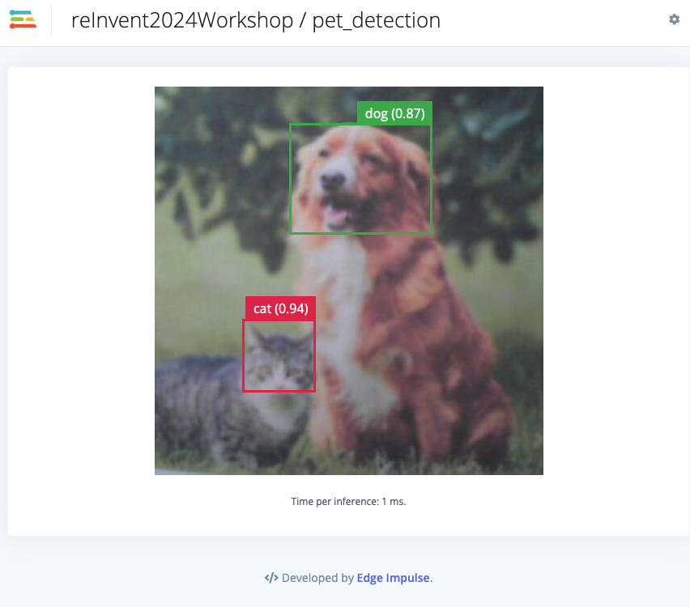
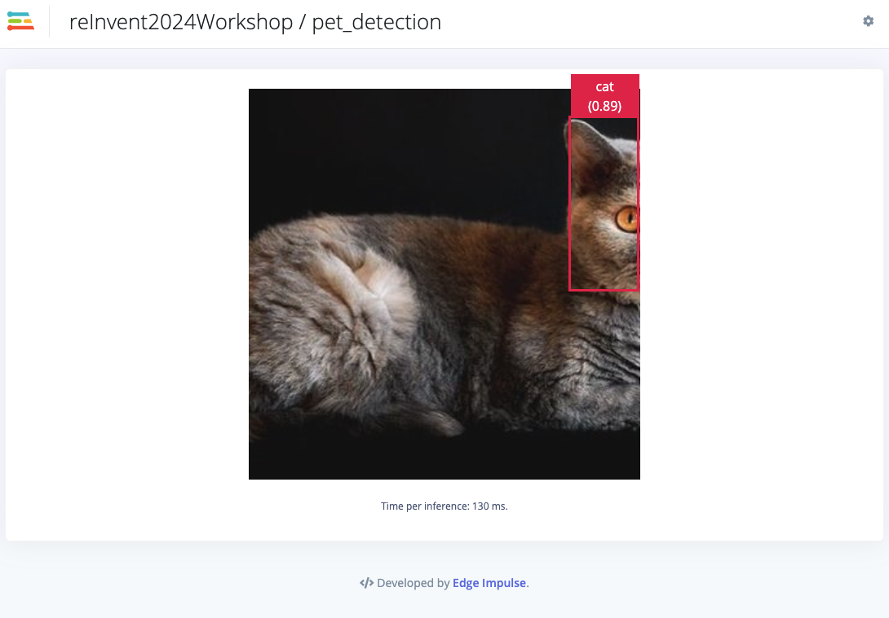
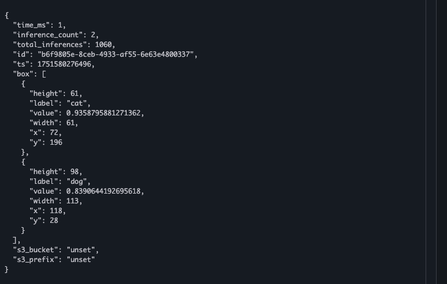
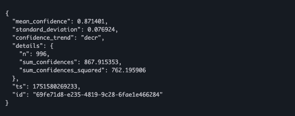

## View live inference in the browser

After the deployment completes and the Runner starts, it hosts a local web interface on port 4912. This page shows the live video input (from a camera or a file) alongside real-time inference results and timing information.

Open a browser and navigate to:

```text
http://<your-edge-device-ip>:4912
```

Replace `<your-edge-device-ip>` with the public IP address (for EC2) or local IP address of your edge device. For example, if your device's IP address is `1.1.1.1`:

```text
http://1.1.1.1:4912
```

### Edge devices with cameras

If your device has a camera attached, you should see live video in the browser. Point the camera at this test image to verify the model is detecting objects:


The model, running on your edge device, identifies both the dog and the cat. The browser output should look similar to this:



### Edge devices without cameras

If your device doesn't have a camera, the component plays a pre-installed 90-second video of a cat. The browser should display something similar to this:



If the image appears frozen, the Runner has finished playing the video. The Runner is waiting for a `restart` command to replay the video file. The section below explains how to send this command through AWS IoT Core.

## View inference output in AWS IoT Core

The Runner publishes inference results and model metrics to AWS IoT Core MQTT topics. You can view these messages in the AWS Console.

Open the AWS Console and navigate to **AWS IoT Core**. Select **MQTT test client** from the left sidebar.

In the **Subscribe to a topic** section, enter the following topic filter and select **Subscribe**:

```text
/edgeimpulse/device/#
```

For devices with cameras, inference results appear whenever the model identifies an object. The output looks similar to this:



Model metrics are published periodically (controlled by the `metrics_sleeptime_ms` configuration field):



## Send commands through AWS IoT Core

The Edge Impulse Greengrass component supports commands sent through MQTT topics. One common command is `restart`, which restarts the Runner service. This is especially useful for devices without cameras, where the Runner pauses after the video ends.

### Find your device name

To send a command, you need the device name that the Runner registered in IoT Core. Look at the inference output in the MQTT test client. Each message is published to a topic with this structure:

```text
/edgeimpulse/devices/<device-name>/inference/output
```

Copy the `<device-name>` portion from the topic. You'll use it in the next step.

The Runner uses four MQTT topics per device:

```text
/edgeimpulse/devices/<device-name>/inference/output
/edgeimpulse/devices/<device-name>/model/metrics
/edgeimpulse/devices/<device-name>/command/input
/edgeimpulse/devices/<device-name>/command/output
```

### Send the restart command

In the MQTT test client, select the **Publish to a topic** tab. Enter the following topic, replacing `<device-name>` with your actual device name:

```text
/edgeimpulse/devices/<device-name>/command/input
```

Clear the message body and enter the following JSON:

```json
{
   "cmd": "restart"
}
```

Select **Additional configuration** and enable the **Retain message on this topic** checkbox. Then select **Publish**.

After publishing, you should see a response on the command output topic:

```text
/edgeimpulse/devices/<device-name>/command/output
```

The response confirms that the Runner has restarted. Navigate back to `http://<your-edge-device-ip>:4912` in your browser to confirm inference has resumed. You should also see new inference results appearing in the MQTT test client.

{}
For devices without cameras, the Runner reads the sample video file and reports inferences until the video ends. After that, the Runner waits for a `restart` command to replay the video. Sending the restart command causes the Runner to start the video from the beginning.
{}

## Troubleshooting

If the Runner doesn't start or the browser page doesn't load, check the following:

**First deployment takes time**: On the first deployment, the component installs all prerequisites (Node.js, libvips, Edge Impulse CLI). This can take 5–10 minutes. Monitor progress by tailing the component log on your device:

```bash
sudo tail -f /greengrass/v2/logs/EdgeImpulseLinuxRunnerServiceComponent.log
```

**Runtime logs**: While the component is running, the Runner writes a separate log file in `/tmp`. The filename follows the pattern `ei_lockfile_runner_<device-name>.log`. Tail this file to watch live inference activity:

```bash
sudo tail -f /tmp/ei_lockfile_runner_*.log
```

**Jetson GPU model loading**: On Jetson devices where the model is compiled for GPU acceleration, expect a 2–3 minute delay the first time the model loads into GPU memory. Subsequent starts are much faster.

## What you've accomplished

In this section, you verified that the Edge Impulse Runner is running inference on your edge device, viewed results in the browser and AWS IoT Core MQTT topics, and sent a restart command through IoT Core. In the next section, you'll find a complete command and configuration reference.
