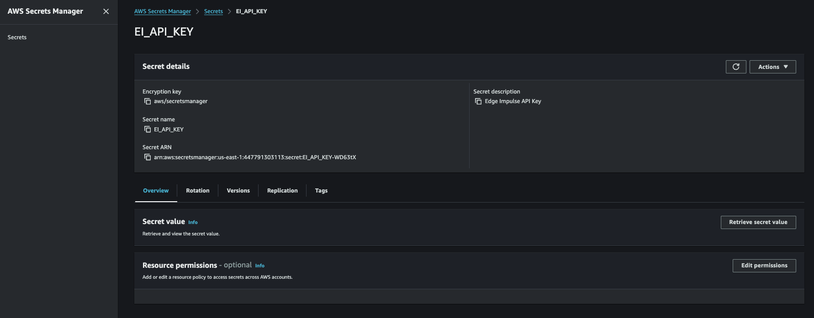

## Why use AWS Secrets Manager?

The Edge Impulse Greengrass component needs your Edge Impulse API key to download and run your ML model. Rather than hard-coding the key in the component configuration, you store it in AWS Secrets Manager. The component retrieves the key securely at runtime, which keeps it out of configuration files and makes rotation straightforward.

The component expects two specific values:
- A secret with the ID `EI_API_KEY` (this is the name you give the secret in Secrets Manager).
- A key-value pair inside that secret where the key is `ei_api_key` and the value is your actual API key.

These names must match the `ei_sm_secret_id` and `ei_sm_secret_name` fields in the component configuration JSON you saved during hardware setup.

## Create the secret

In the previous section, you generated an API key in Edge Impulse Studio and saved it. Now store that key in AWS Secrets Manager.

Open the AWS Console and navigate to **Secrets Manager**. Select **Store a new secret** and follow these steps:

1. Select **Other type of secret** as the secret type.
2. In the **Key** field, enter `ei_api_key`.
3. In the **Value** field, paste the API key you copied from Edge Impulse Studio.
4. Select **Next**.
5. For **Secret name**, enter `EI_API_KEY`.
6. Select **Next**.
7. Leave the rotation settings at their defaults and select **Next**.
8. Review the configuration and select **Store**.

After the secret is stored, you can verify it by selecting **EI_API_KEY** in the Secrets Manager list and confirming the key-value pair is present.

## What you've accomplished

You've securely stored your Edge Impulse API key in AWS Secrets Manager. The Greengrass component retrieves this key at runtime to authenticate with your Edge Impulse project. In the next section, you configure the Edge Impulse custom Greengrass component.
