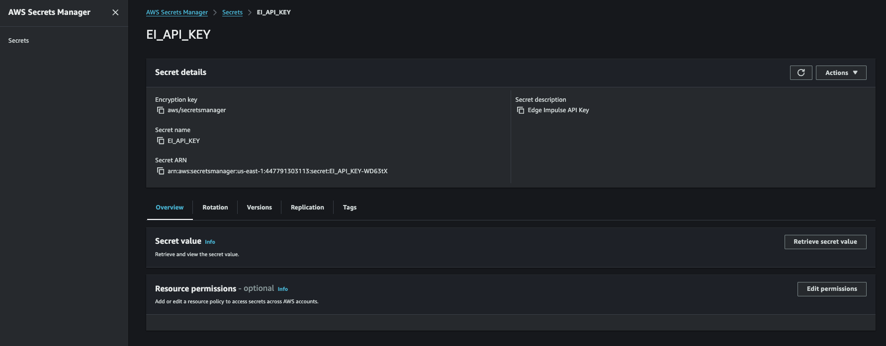

## Why you'll use AWS Secrets Manager

The Edge Impulse Greengrass component needs your Edge Impulse API key to download and run your ML model. Rather than hard-coding the key in the component configuration, you'll store the API key in AWS Secrets Manager. The component retrieves the key securely at runtime, which keeps it out of configuration files and makes rotation straightforward.

The component expects two specific values:
- A secret with the ID `EI_API_KEY` (the name that you give the secret in Secrets Manager).
- A key-value pair inside that secret where the key is `ei_api_key` and the value is your actual API key.

These names must match the `ei_sm_secret_id` and `ei_sm_secret_name` fields in the component configuration JSON that you saved during hardware setup.

## Create the secret

Earlier, you generated an API key in Edge Impulse Studio and saved it. Now, store that key in AWS Secrets Manager.

To save the API key as a secret:

1. Open the AWS Console and navigate to **Secrets Manager**. 
2. Select **Store a new secret**.
3. Select **Other type of secret** as the secret type.
4. In the **Key** field, enter `ei_api_key`.
5. In the **Value** field, paste the API key that you copied from Edge Impulse Studio.
6. Select **Next**.
7. For **Secret name**, enter `EI_API_KEY`.
8. Select **Next**.
9. Leave the rotation settings at their defaults and select **Next**.
10. Review the configuration and select **Store**.

After storing the secret, verify it by selecting **EI_API_KEY** in the Secrets Manager list and confirming that the key-value pair is present.

## What you've accomplished and what's next

You've securely stored your Edge Impulse API key in AWS Secrets Manager. The Greengrass component retrieves this key at runtime to authenticate with your Edge Impulse project. 

Next, you'll configure the Edge Impulse custom Greengrass component.
