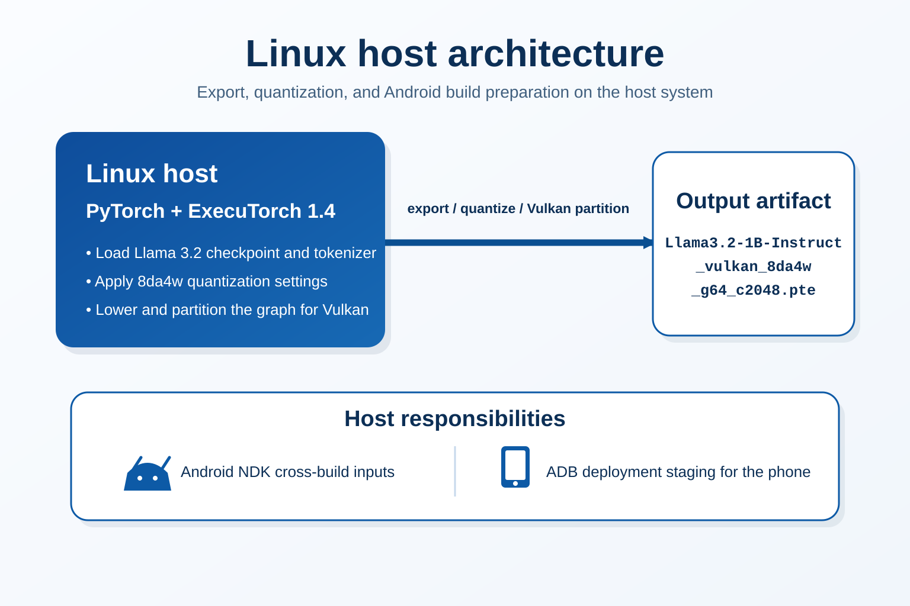
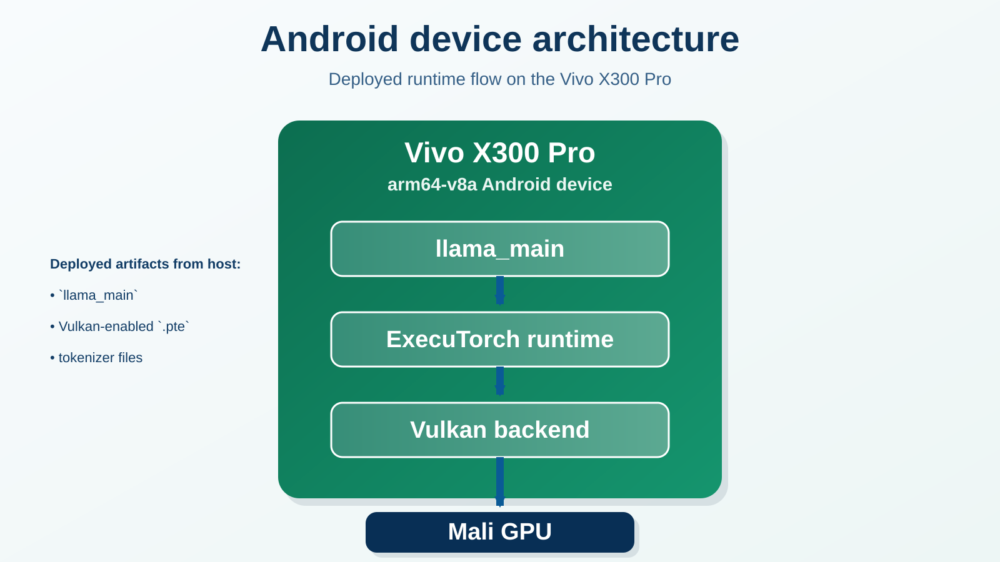

## Goal

The goal is to run Meta Llama 3.2 1B Instruct directly on a Vivo X300 Pro with ExecuTorch, using the phone GPU through the Vulkan backend.

The Linux host is used for:

- model export
- quantization
- graph lowering and partitioning
- Android cross-compilation
- ADB deployment

The Linux host does not need CUDA, ROCm, or a working Vulkan GPU.

## Linux host architecture

## Android device architecture

## Measured result

The successful measured run produced the following values:

| Metric | Observed value |
|---|---|
| Model load time | 3.033 s |
| Prompt tokens | 7 |
| Generated tokens | 112 |
| Prompt evaluation | 0.157 s / 44.586 tokens/s |
| Decode | 112 tokens in 3.760 s / 29.787 tokens/s |
| Total measured inference | 3.917 s / 28.593 tokens/s overall |
| Time to first token | 0.157 s |
| RSS after model load, prefill, and generation | about 2404.8 MiB |

## What you will build

By the end of this Learning Path you will have:

- an ExecuTorch 1.4 host environment with the correct PyTorch pin
- a Vulkan-enabled Llama `.pte`
- an Android `llama_main` binary for `arm64-v8a`
- the model, tokenizer, and runner deployed under `/data/local/tmp/llama`
- a reproducible validation flow for checking that Vulkan is actually in use
