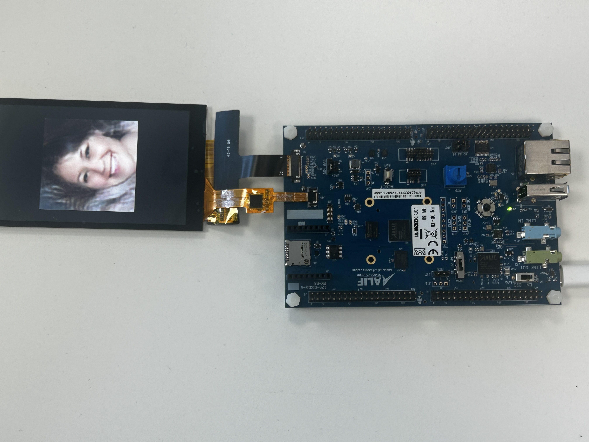

## Open the application console

Keep **SW4** set to **UART4**. In VS Code, open **Serial Monitor** on the serial port exposed through **PRG USB** and use these settings:

- Baud rate: `115200`
- Data bits: `8`
- Parity: `None`
- Stop bits: `1`

If the port was open before you changed **SW4**, close and reopen it.

## Build and debug the application

In the **CMSIS** view, confirm that `DevKit-E8` is active. Select **Build**, then select **Debug**. Keil Studio starts the J-Link GDB server over SWD and loads the application into MRAM.

The debugger stops at `main`. Press **F5** to continue.

The firmware initializes the display and NPU, loads the two ExecuTorch methods, and generates a repeatable boot image. The output is similar to:

```output
Ethos-U version info:
    Arch:       v2.0.0
    MACs/cc:    256
ExecuTorch pico-faces (m3_long_cfg, a16w8/a8w8)
Methods:
  dit_step  2 input(s), 1 output(s)
  decode    1 input(s), 1 output(s)
Generating: seed 3, 4 steps, class 1, w 4.0
Image: 128x128x3, CRC32 <export-dependent-value>
Test_result: PASS
```

The LCD displays the 128 x 128 result scaled to 384 x 384 pixels in the center of the screen. The CRC depends on the host-side export, so use `Test_result: PASS` and the displayed image as the functional checks.

## Confirm NPU execution

Inspect the two performance lines printed after generation. They report NPU cycles, NPU active time, multiply-accumulate array activity, and AXI reads for `dit_step` and `decode`. These counters come from the Ethos-U performance monitoring unit and confirm that both methods executed on the NPU.

The source project's reference DevKit run uses these conditions:

| Setting | Reference value |
| --- | --- |
| Processor | Cortex-M55 high-performance core at 400 MHz |
| NPU | Ethos-U85 with 256 MACs per cycle |
| Model | `m3_long_cfg`, `a16w8` DiT and `a8w8` decoder |
| Sample | Seed 3, four steps, class 1, guidance 4.0 |
| Execution model | Bare-metal, single core; thread count and CPU affinity don't apply |
| Observed time | About 78 ms total: about 68 ms for eight `dit_step` calls and 3 ms for `decode` |

Treat the timing as a reference measurement rather than a pass threshold. Tool versions, the exported program, and board conditions can change the result.

## Generate more faces

Use the **SW2** joystick after the boot image appears:

- Press toward the left to generate one face with the next seed.
- Press toward the right to start continuous generation. Press in the same direction again to stop.

Each completed generation updates the LCD and prints its seed, class, guidance, timing, and CRC to the console.

## View an example result

The following image shows a generated face displayed on the DevKit LCD:



## Troubleshoot common problems

Use these checks if the application doesn't reach the pass marker:

| Symptom | Check |
| --- | --- |
| J-Link connects but execution doesn't stop at `main` | Set **SW4** to **SEUART** and repeat the debug-stub task from the previous section. |
| Debug remains at **Connecting** | Confirm that the target uses SWD, not JTAG, then power-cycle the board. |
| UART has no application output | Set **SW4** to **UART4**, then close and reopen Serial Monitor. |
| `app-write-mram` receives no response | Set **SW4** to **SEUART**, close programs using the port, and press reset while the tool waits. |
| The build can't find `ai_layer/model_pte.c` | Run **Setup Python virtual environment**, followed by **Create AI layer**. |

## Optional: use the Corstone-320 FVP

The same CMSIS solution also includes the `SSE-320-U85` target for the Corstone-320 Fixed Virtual Platform (FVP). Select that target in **Manage Solution**, recreate the AI layer, and select **Run** or **Debug**. The FVP produces the same seed-based image and writes its raw result to `out/fvp_image.bin`, but the physical DevKit workflow is the primary target for this Learning Path.

## What you've accomplished

You've exported a generative model through ExecuTorch, loaded it on the Alif Ensemble E8 DevKit, and generated faces with both neural-network methods delegated to Ethos-U85. You also validated the run through the LCD, pass marker, and hardware performance counters.
