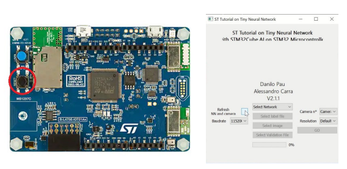
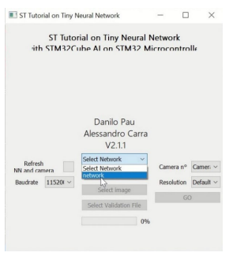
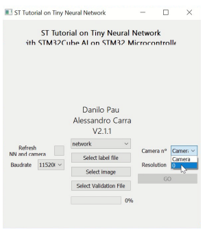

---
# User change
title: Run the image classification NN model on STM32

weight: 5 # 1 is first, 2 is second, etc.

# Do not modify these elements
layout: "learningpathall"
---
For testing, use a custom python tool for sending images to the board. The tool is provided by STMicroelectronics.

## Anaconda setup

Return to your Anaconda Prompt, or start a new session and activate your environment for the lab.
```console
conda activate ml_lab
```
Install necessary packages to run the tool.

```console
 python -m pip install -U opencv-python protobuf==3.20 tqdm==4.50.2
```

## Test model

Navigate to the working folder, and then the `Misc` folder. Execute the tool with:

```console
python ui_python_ai_runner.py
```
If the board is not detected, click the black button on the board to reset, then click on `Refresh NN and camera`.

{}
- The testing tool has been written with `X-CUBE-AI 7.0.0`. Later versions may not connect successfully.
- Ensure that the serial port, which uses the same interface, is not connected to terminal application.
{}

Select the model network from the list of models deployed on the board.



Select the network and the label file (`Data/labels/cifar10_labels.txt`)



Open an image to test. The tool will automatically launch a new pane, and show the inference result.

Observe that the model correctly predicted the label. In addition, note the time taken to finish the prediction.


You can also use your workstation camera to test image classification. Hold an appropriate picture up to your camera, then press `S`. The tool captures the image and sends it to the board.



You have now successfully ran the model on your STM32 board.
