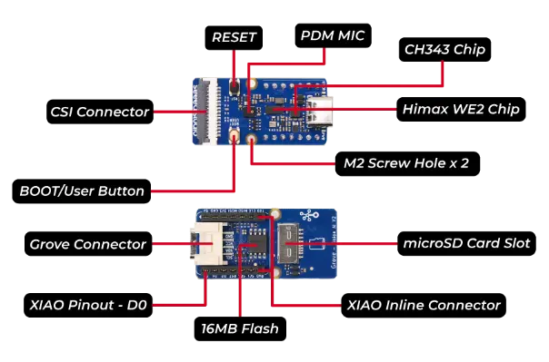
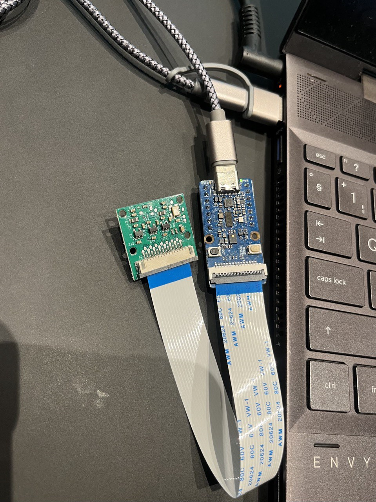

---
# User change
title: "Set up the Grove Vision AI Module V2"

weight: 6 # 1 is first, 2 is second, etc.

# Do not modify these elements
layout: "learningpathall"
---
## Before you begin 
Only follow this part of the tutorial if you have the board. Due to its constrained environment, we'll focus on lightweight, optimized tools and models (which will be introduced in the next learning path).


### Compilers 

The examples can be built with [Arm Compiler for Embedded](https://developer.arm.com/Tools%20and%20Software/Arm%20Compiler%20for%20Embedded) or [Arm GNU Toolchain](https://developer.arm.com/Tools%20and%20Software/GNU%20Toolchain). 


Use the install guides to install the compilers on your **host machine**:
- [Arm Compiler for Embedded](/install-guides/armclang/)
- [Arm GNU Toolchain](/install-guides/gcc/arm-gnu)


## Board Setup 



Hardware overview : [Image credits](https://wiki.seeedstudio.com/grove_vision_ai_v2/). 

1. Download and extract the latest Edge Impulse firmware
Grove Vision V2 [Edge impulse Firmware](https://cdn.edgeimpulse.com/firmware/seeed-grove-vision-ai-module-v2.zip). 


2. Connect the Grove - Vision AI Module V2 to your computer using the USB-C cable. 




3. In the extracted Edge Impulse firmware, locate and run the installation scripts to flash your device. 

```console
./flash_linux.sh
```

4. Configure Edge Impulse for the board
in your terminal, run:

```console
edge-impulse-daemon
```
Follow the prompts to log in.

5. If successful, you should see your Grove - Vision AI Module V2 under 'Devices' in Edge Impulse.


## Next Steps
1. Go to [Build a Simple PyTorch Model](/learning-paths/embedded-and-microcontrollers/introduction-to-tinyml-on-arm/build-model-8/) to test your environment setup.
