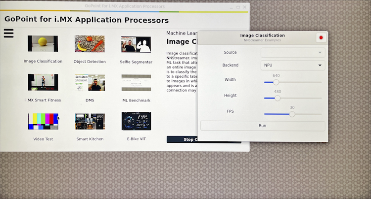

In this section, you’ll learn what makes the NXP FRDM i.MX 93 board a useful ML development platform, then you’ll boot the board and log in.

## Why this board is useful for ML on Arm

The NXP [FRDM i.MX 93](https://www.nxp.com/design/design-center/development-boards-and-designs/frdm-i-mx-93-development-board:FRDM-IMX93) board is a practical way to validate ML workloads on real Arm hardware early in your workflow.

It combines:

- An Arm Cortex-A55 application processor for Linux-based development
- An Arm Cortex-M33 microcontroller for real-time tasks
- An Arm Ethos-U65 NPU (neural processing unit) for on-device inference acceleration

The following image highlights the i.MX 93 SoC and the NPU location on the board:


## Connect to the serial console and log in

To log in, you connect to the board over a USB-to-UART serial console using `picocom`. Use a package manager to install it.


  
brew install picocom
  
  
sudo apt update
sudo apt install -y picocom
  



{}
On macOS, you might need an extra USB-to-UART driver depending on which USB serial bridge the board exposes. You can get the drivers from Silicon Labs [Downloads page](https://www.silabs.com/developer-tools/usb-to-uart-bridge-vcp-drivers?tab=downloads).
{}

The next step is to establish a USB-to-UART (serial) connection. Connect the board’s debug (**DBG**) USB-C connector to your computer. 

Find the board’s serial device:

If you see more than one candidate device, use this quick method to identify the right one:

1. Run the command once with the board disconnected.
2. Connect the **DBG** USB-C cable.
3. Run the command again and use the *new* device that appeared.


  
ls /dev/tty.*
  
  
ls /dev/ttyUSB* /dev/ttyACM* 2>/dev/null
  


Connect to the board using the `picocom` command by updating the serial device identifier. 

```bash
sudo picocom -b 115200 /dev/tty*
```

You will see the below output on a successful connection.

```output
picocom v3.1
...
Terminal ready
```

Now you're ready to log in to Linux on the board. Connect the board’s **POWER** USB-C connector to your laptop and toggle the **OFF/ON** switch if it's set to off. You should see one red and one white light on the board. In the `picocom` terminal window, the board will print boot logs. The last line should end with a login prompt.

```bash
...
[  OK  ] Reached target Graphical Interface.
                Starting Record Runlevel Change in UTMP...
[  OK  ] Finished Record Runlevel Change in UTMP.

NXP i.MX Release Distro 6.6-scarthgap imx93frdm ttyLP0

imx93frdm login:
```

Type `root` to log in as root (no password is needed).

## (Optional) Run the built-in NXP demos

If you connect the board to a display, you can see ML demos and application output directly on the device. This is useful when you want quick visual confirmation that your model runs on the target hardware. As per the setup instructions in [NXP’s getting started guide](https://www.nxp.com/document/guide/getting-started-with-frdm-imx93:GS-FRDM-IMX93):

- Connect the board to a monitor via HDMI.
- Connect a mouse to the board’s USB-A port.

The demos will then show up automatically.

