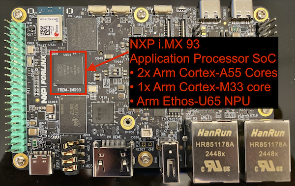
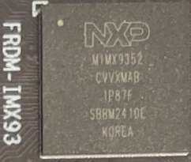

## Hardware Overview - NXP's FRDM i.MX 93 Board

Selecting the best hardware for machine learning (ML) models depends on effective tools. You can visualize ML performance early in the development cycle by using NXP's [FRDM i.MX 93](https://www.nxp.com/design/design-center/development-boards-and-designs/frdm-i-mx-93-development-board:FRDM-IMX93) board.

<iframe src='//players.brightcove.net/4089003392001/Sk5u9ln3l_default/index.html?videoId=6366294691112' allowfullscreen frameborder=0 width="800" height="400"></iframe>

*Unboxing NXP's FRDM i.MX 93 board*

### NXP's FRDM i.MX 93 Processor Decoded

**NXP's Processor Labeling Convention:**
|Line|Meaning|
|----|-------|
|MIMX9352|• MI – Microcontroller IC • MX93 – i.MX 93 family • 52 – Variant: • Dual-core Arm Cortex-A55  • Single Cortex-M33 • Includes **Ethos-U65 NPU**|
|CVVXMAB|• C - Commercial temperature grade (0°C to 95°C) • VVX - Indicates package type and pinout (BGA, pitch, etc.) • MAB - Specific configuration (e.g., NPU present, security level, memory interfaces)
|
|1P87F|• Silicon mask set identifier|
|SBBM2410E|• NXP traceability code|

## Benefits and applications

NPUs, like Arm's [Ethos-U65](https://www.arm.com/products/silicon-ip-cpu/ethos/ethos-u65) NPU are available on physical devices specifically made for developers. Development boards like NXP's [FRDM i.MX 93](https://www.nxp.com/design/design-center/development-boards-and-designs/frdm-i-mx-93-development-board:FRDM-IMX93) also connect to displays via a HDMI cable. Additionally the board accepts video inputs. This is useful for for ML performance visualization due to:
- visual confirmation that your ML model is running on the physical device,
- image and video inputs for computer vision models running on the device,
- clearly indicated instruction counts,
- confirmation of total execution time and
- visually appealing output for prototypes and demos.