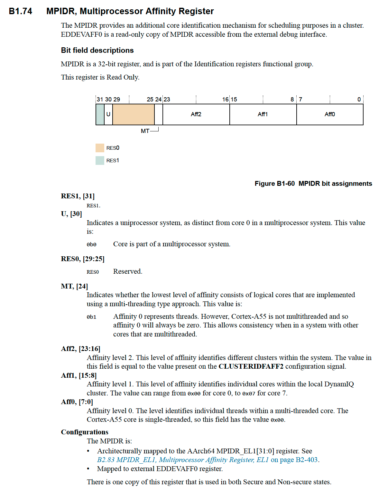
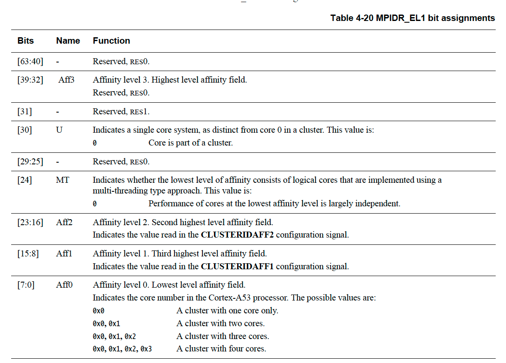

### 1. Remove PCI and SMMU nodes

If you build the software without modifying the device tree, you might get the following error message after running the software stack:

```
[    0.563774] pci-host-generic 40000000.pci: host bridge /pci@40000000 ranges:
[    0.563972] pci-host-generic 40000000.pci:      MEM 0x0050000000..0x005fffffff -> 0x0050000000
[    0.564233] pci-host-generic 40000000.pci: ECAM at [mem 0x40000000-0x4fffffff] for [bus 00-01]
[    0.564878] pci-host-generic 40000000.pci: PCI host bridge to bus 0000:00
[    0.565014] pci_bus 0000:00: root bus resource [bus 00-01]
[    0.565138] pci_bus 0000:00: root bus resource [mem 0x50000000-0x5fffffff]
[    0.565266] Internal error: synchronous external abort: 96000010 [#1] PREEMPT SMP
[    0.565366] Modules linked in:
[    0.565448] CPU: 2 PID: 1 Comm: swapper/0 Not tainted 5.13.13 #1
[    0.565534] Hardware name: FVP Base RevC (DT)
[    0.565621] pstate: 204000c9 (nzCv daIF +PAN -UAO -TCO BTYPE=--)
[    0.565746] pc : pci_generic_config_read+0x3c/0xe4
[    0.565832] lr : pci_generic_config_read+0x28/0xe4
[    0.565966] sp : ffff80001205b960
[    0.566006] x29: ffff80001205b960 x28: 0000000000000000 x27: ffff8000116904b8
[    0.566179] x26: ffff800011741060 x25: 0000000000000000 x24: ffff800011fca8b8
[    0.566366] x23: 0000000000000000 x22: ffff80001205ba64 x21: 0000000000000087
[    0.566566] x20: 0000000000000004 x19: ffff80001205b9c4 x18: 0000000000000030
[    0.566723] x17: 000000000000003f x16: 000000000000000b x15: ffffffffffffffff
[    0.566923] x14: ffff80009205b697 x13: ffff800011ca2a30 x12: 0000000000000267
[    0.567096] x11: 00000000000000cd x10: ffff800011cfaa30 x9 : 00000000fffff000
[    0.567270] x8 : ffff800011ca2a30 x7 : ffff800011cfaa30 x6 : 0000000000000001
[    0.567443] x5 : 0000000000000000 x4 : ffff800012800000 x3 : 0000000000000000
[    0.567624] x2 : 0000000000000000 x1 : 0000000000000000 x0 : ffff800012800000
[    0.567790] Call trace:
[    0.567866]  pci_generic_config_read+0x3c/0xe4
[    0.567966]  pci_bus_read_config_dword+0x7c/0xd0
[    0.568066]  pci_bus_generic_read_dev_vendor_id+0x38/0x1b4
[    0.568198]  pci_scan_single_device+0xa0/0x150
[    0.568311]  pci_scan_slot+0x44/0x130
[    0.568435]  pci_scan_child_bus_extend+0x54/0x2a0
[    0.568525]  pci_scan_root_bus_bridge+0x68/0xdc
[    0.568666]  pci_host_probe+0x1c/0xc4
[    0.568782]  pci_host_common_probe+0x11c/0x19c
[    0.568918]  platform_probe+0x6c/0xdc
[    0.569017]  really_probe+0xe4/0x510
[    0.569129]  driver_probe_device+0x64/0xc4
[    0.569263]  device_driver_attach+0xc4/0xd0
[    0.569366]  __driver_attach+0x94/0x134
[    0.569508]  bus_for_each_dev+0x70/0xd0
[    0.569613]  driver_attach+0x28/0x34
[    0.569737]  bus_add_driver+0x108/0x1f0
[    0.569836]  driver_register+0x7c/0x130
[    0.569966]  __platform_driver_register+0x2c/0x40
[    0.570084]  gen_pci_driver_init+0x20/0x2c
[    0.570171]  do_one_initcall+0x50/0x1b0
[    0.570266]  kernel_init_freeable+0x220/0x2a4
[    0.570409]  kernel_init+0x18/0x124
[    0.570491]  ret_from_fork+0x10/0x30
[    0.570566] Code: 7100069f 540001c0 71000a9f 54000300 (b9400001)
[    0.570778] ---[ end trace 6db9afd6e7186a9a ]---
[    0.570827] note: swapper/0[1] exited with preempt_count 1
[    0.570952] Kernel panic - not syncing: Attempted to kill init! exitcode=0x0000000b
[    0.571066] SMP: stopping secondary CPUs
[    0.571147] Kernel Offset: disabled
[    0.571174] CPU features: 0x10000081,a3300e46
[    0.571266] Memory Limit: none
[    0.571366] ---[ end Kernel panic - not syncing: Attempted to kill init! exitcode=0x0000000b ]---
```

On CPU FVP platforms, PCI and SMMU devices are not supported. To make Linux run successfully, remove the PCI and SMMU nodes from the device tree.

The [Arm reference software stack](https://gitlab.arm.com/arm-reference-solutions/arm-reference-solutions-docs/-/blob/master/docs/aemfvp-a/user-guide.rst) uses the following device tree:

```
linux/arch/arm64/boot/dts/arm/fvp-base-revc.dts
```

1.1 Delete the following lines from the device tree:

```
155         pci: pci@40000000 {
156                 #address-cells = <0x3>;
157                 #size-cells = <0x2>;
158                 #interrupt-cells = <0x1>;
159                 compatible = "pci-host-ecam-generic";
160                 device_type = "pci";
161                 bus-range = <0x0 0x1>;
162                 reg = <0x0 0x40000000 0x0 0x10000000>;
163                 ranges = <0x2000000 0x0 0x50000000 0x0 0x50000000 0x0 0x10000000>;
164                 interrupt-map = <0 0 0 1 &gic 0 0 GIC_SPI 168 IRQ_TYPE_LEVEL_HIGH>,
165                                 <0 0 0 2 &gic 0 0 GIC_SPI 169 IRQ_TYPE_LEVEL_HIGH>,
166                                 <0 0 0 3 &gic 0 0 GIC_SPI 170 IRQ_TYPE_LEVEL_HIGH>,
167                                 <0 0 0 4 &gic 0 0 GIC_SPI 171 IRQ_TYPE_LEVEL_HIGH>;
168                 interrupt-map-mask = <0x0 0x0 0x0 0x7>;
169                 msi-map = <0x0 &its 0x0 0x10000>;
170                 iommu-map = <0x0 &smmu 0x0 0x10000>;
171
172                 dma-coherent;
173         };
174
175         smmu: iommu@2b400000 {
176                 compatible = "arm,smmu-v3";
177                 reg = <0x0 0x2b400000 0x0 0x100000>;
178                 interrupts = <GIC_SPI 74 IRQ_TYPE_EDGE_RISING>,
179                              <GIC_SPI 79 IRQ_TYPE_EDGE_RISING>,
180                              <GIC_SPI 75 IRQ_TYPE_EDGE_RISING>,
181                              <GIC_SPI 77 IRQ_TYPE_EDGE_RISING>;
182                 interrupt-names = "eventq", "gerror", "priq", "cmdq-sync";
183                 dma-coherent;
184                 #iommu-cells = <1>;
185                 msi-parent = <&its 0x10000>;
186         };
```

1.2 Rebuild Linux by using the following commands:

```
./build-scripts/build-linux.sh -p aemfvp-a -f busybox clean
./build-scripts/build-linux.sh -p aemfvp-a -f busybox build
```

1.3 Package the built Linux to the BusyBox disk image by using the following command:

```
./build-scripts/aemfvp-a/build-test-busybox.sh -p aemfvp-a package
```

### 2. Modify CPU nodes

On Arm64 SMP systems, cores are identified by the MPIDR_EL1 register. The MPIDR_EL1 in the [Arm Architecture Reference Manual](https://developer.arm.com/documentation/ddi0487/latest) does not provide strict enforcement of MPIDR_EL1 layout.

For example, Cortex-A55 has a layout different from the layout of Cortex-A53.

The following two tables compare the MPIDR_EL1 Layout between Cortex-A55 and Cortex-A53.





Linux Kernel boots the CPU cores according to the affinity values in the device tree. However, different CPU FVP platforms use different affinity values. If the affinity value in the device tree is not consistent with the CPU FVP platform, you might get the following error:

```
[    0.023728] psci: failed to boot CPU2 (-22)
[    0.023948] CPU2: failed to boot: -22
[    0.025770] psci: failed to boot CPU3 (-22)
[    0.025867] CPU3: failed to boot: -22
[    0.027567] psci: failed to boot CPU4 (-22)
[    0.027679] CPU4: failed to boot: -22
[    0.029541] psci: failed to boot CPU5 (-22)
[    0.029615] CPU5: failed to boot: -22
[    0.031410] psci: failed to boot CPU6 (-22)
[    0.031467] CPU6: failed to boot: -22
[    0.033319] psci: failed to boot CPU7 (-22)
[    0.033383] CPU7: failed to boot: -22
```

Affinity values in the device tree must be consistent with the affinity values in the FVP platform. Perform the following steps to modify affinity values:

2.1 Get correct affinity value for the FVP platforms

The parameter pctl.CPU-affinities in the FVP platform shows the correct affinity values, for example:

```
$FVP_Base_Cortex-A55x4 -l |grep pctl.CPU-affinities
pctl.CPU-affinities=0.0.0.0, 0.0.1.0, 0.0.2.0, 0.0.3.0
$FVP_Base_Cortex-A57x2-A53x4 -l  |grep pctl.CPU-affinities
pctl.CPU-affinities=0.0.0.0, 0.0.0.1, 0.0.1.0, 0.0.1.1, 0.0.1.2, 0.0.1.3
```

The CPU affinity values on the FVP_Base_Cortex-A55x4 are:

```
0x0,0x0100,0x0200,0x300
```
The CPU affinity values on the FVP_Base_Cortex-A57x2-A53x4 are:

```
0x0,0x1,0x0100,0x0101,0x0102,0x0103
```

2.2 Modify the affinity values in the device tree to be consistent with the FVP platform

You must change the affinity value in the device tree:

```
linux/arch/arm64/boot/dts/arm/fvp-base-revc.dts
```

Consider FVP_Base_Cortex-A57x2-A53x4 as an example:

```
cpu0: cpu@0 {
        device_type = "cpu";
        compatible = "arm,armv8";
        reg = <0x0 0x000>;
        enable-method = "psci";
};
cpu1: cpu@1 {
        device_type = "cpu";
        compatible = "arm,armv8";
        reg = <0x0 0x01>;
        enable-method = "psci";
};
cpu2: cpu@100 {
        device_type = "cpu";
        compatible = "arm,armv8";
        reg = <0x0 0x100>;
        enable-method = "psci";
};
cpu3: cpu@101 {
        device_type = "cpu";
        compatible = "arm,armv8";
        reg = <0x00 0x101>;
        enable-method = "psci";
};
cpu4: cpu@102 {
        device_type = "cpu";
        compatible = "arm,armv8";
        reg = <0x00 0x102>;
        enable-method = "psci";
};
cpu5: cpu@103 {
        device_type = "cpu";
        compatible = "arm,armv8";
        reg = <0x00 0x103>;
        enable-method = "psci";
};
```

2.3 Remove unnecessary CPU nodes from the device tree, according to the CPU numbers of the FVP platform.

2.4 Rebuild the Linux by using the following commands:

```
./build-scripts/build-linux.sh -p aemfvp-a -f busybox clean
./build-scripts/build-linux.sh -p aemfvp-a -f busybox build
```

2.5 Package the built Linux to the BusyBox disk image by using the following command:

```
./build-scripts/aemfvp-a/build-test-busybox.sh -p aemfvp-a package
```