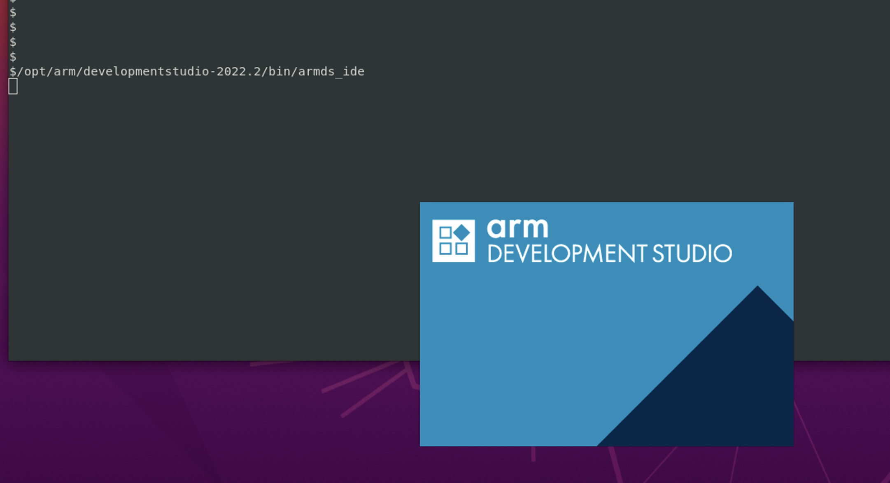
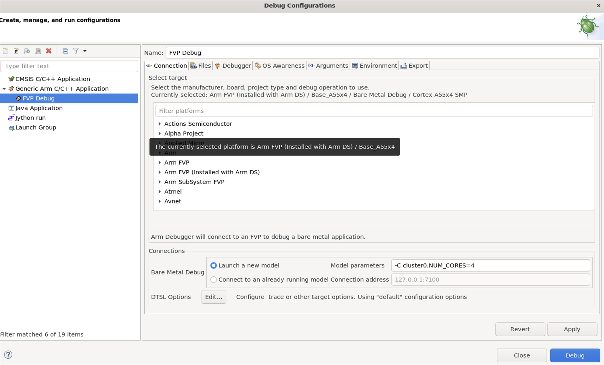

### 1. Arm DS and FVP Configuration

To debug the TF-A and Linux kernel, the Arm DS debugger is used as the debugger. You can get the [Arm DS](https://developer.arm.com/downloads/view/DS000B) from the [Arm Developer website](https://developer.arm.com/).

DWARF 5 is the default option in GCC 11 and Arm DS v2022.2 initial support for DWARF 5 debug information. If your GCC version is later than GCC11, download the latest Arm DS to get support for DWARF 5.

By default, Arm DS provides the following Base FVP models:

* FVP_Base_Cortex-A32x1
* FVP_Base_Cortex-A35x1
* FVP_Base_Cortex-A510x2
* FVP_Base_Cortex-A53x1
* FVP_Base_Cortex-A55x1
* FVP_Base_Cortex-A55x4+Cortex-A75x2
* FVP_Base_Cortex-A55x4+Cortex-A76x2
* FVP_Base_Cortex-A57x1
* FVP_Base_Cortex-A57x2-A53x4
* FVP_Base_Cortex-A65AEx2
* FVP_Base_Cortex-A65x2
* FVP_Base_Cortex-A710x2
* FVP_Base_Cortex-A72x1
* FVP_Base_Cortex-A72x2-A53x4
* FVP_Base_Cortex-A73x1
* FVP_Base_Cortex-A73x2-A53x4
* FVP_Base_Cortex-A75x1
* FVP_Base_Cortex-A76AEx2
* FVP_Base_Cortex-A76x1
* FVP_Base_Cortex-A77x2
* FVP_Base_Cortex-A78AEx2
* FVP_Base_Cortex-A78Cx2
* FVP_Base_Cortex-A78x2
* FVP_Base_Cortex-X1Cx2
* FVP_Base_Cortex-X1x2
* FVP_Base_Cortex-X2x2

Arm FVPs that are not provided by Arm DS installation must be defined in the PATH environment variable of your OS to be available for Arm DS. Otherwise, you might get the following error when starting the debug connection.


For Linux, set up the PATH in the appropriate shell configuration file. For example, add the following line in ~/.bashrc,

```
export PATH=<your model path>/bin:$PAT
```

After changing the PATH environments, you might need to start the Arm DS from the terminal for the PATH to take effect. For example:

```
/opt/arm/developmentstudio-2022.2/bin/armds_ide
```



### 2. FVP Debug Connection

The FVP model to connect must be available in the Development Studio configuration database so that you can select it in the Model Connection dialog box.

If the FVP model is not available, you must import it and create a new model configuration. For details,  see [create a new model](https://developer.arm.com/documentation/101470/2022-2/Platform-Configuration/Model-targets/Create-a-new-model-configuration).

Most CPU FVP models are available for your edition of Arm DS and the FVPs are listed under the Arm FVP (Installed with Arm DS) and Arm FVP as shown in the following figure:



To use Arm DS to connect to an FVP model for bare-metal debugging, perform the following steps:

1. From the Arm Development Studio main menu, select Run > Debug Configurations.

2. Select the Generic Arm C/C++ Application from the left panel and click the new launch configuration button to create a new debug configuration.

3. In the Connection tab, select the target and connection settings:

3.1. In the Select target panel confirm the target selected. For example, select Arm FVP (Installed with Arm DS) Base_A55 x4 > Bare Metal Debug:


3.2 Specify the Model parameters under the Connections.

3.3 The model parameters are like the following, and these parameters are described at the section Run software stack on FVP. Different CPU FVPs might have different parameters.

```
-C pctl.startup=0.0.0.0 \
-C bp.secure_memory=0  \
-C cache_state_modelled=0 \
-C bp.ve_sysregs.mmbSiteDefault=0 \
-C bp.ve_sysregs.exit_on_shutdown=1 \
-C bp.pl011_uart0.untimed_fifos=1 \
-C bp.pl011_uart0.unbuffered_output=1 \
-C bp.pl011_uart0.out_file=<PATH_TO_LOG>/uart0.log \
-C bp.pl011_uart1.untimed_fifos=1 \
-C bp.pl011_uart1.unbuffered_output=1 \
-C bp.pl011_uart1.out_file=<PATH_TO_LOG>/uart1.log \
-C bp.secureflashloader.fname=<SRC_PATH>/output/aemfvp-a/aemfvp-a/tf-bl1.bin \
-C bp.flashloader0.fname=<SRC_PATH>/output/aemfvp-a/aemfvp-a/fip-uboot.bin \
-C bp.virtioblockdevice.image_path=<SRC_PATH>/output/aemfvp-a/components/aemfvp-a/grub-busybox.img \
--data cluster0.cpu0=<SRC_PATH>/output/aemfvp-a/aemfvp-a/Image@0x80080000 \
--data cluster0.cpu0=<SRC_PATH>/output/aemfvp-a/aemfvp-a/fvp-base-revc.dtb@0x83000000
```

4. Configure debugger settings in the Debugger 

In Run control, choose Connect only to the target.

5. Select the Execute debugger commands option and add load symbols commands if you want to debug your application at source level. For example, add TF-A and Linux kernel debug symbols as follows:

```
add-symbol-file “~/arm/sw/cpufvp-a/arm-tf/build/fvp/debug/bl1/bl1.elf” EL3:0
add-symbol-file “~/arm/sw/cpufvp-a/arm-tf/build/fvp/debug/bl2/bl2.elf” EL1S:0
add-symbol-file “~/arm/sw/cpufvp-a/arm-tf/build/fvp/debug/bl31/bl31.elf” EL3:0
add-symbol-file “~/arm/sw/cpufvp-a/linux/out/aemfvp-a/defconfig/vmlinux” EL2N:0
```

6. Click Apply and then Close to save the configuration settings and close the Debug Configurations dialog box.

7. In the Debug Control view, double-click the debug configuration that you create.

This step starts the debug connection, loads the application on the model, and loads the debug information into the debugger.

8. Set breakpoints and click Continue running application to continue running your FVP.

9. After these steps, you can debug the software stack as shown in the following figure:


