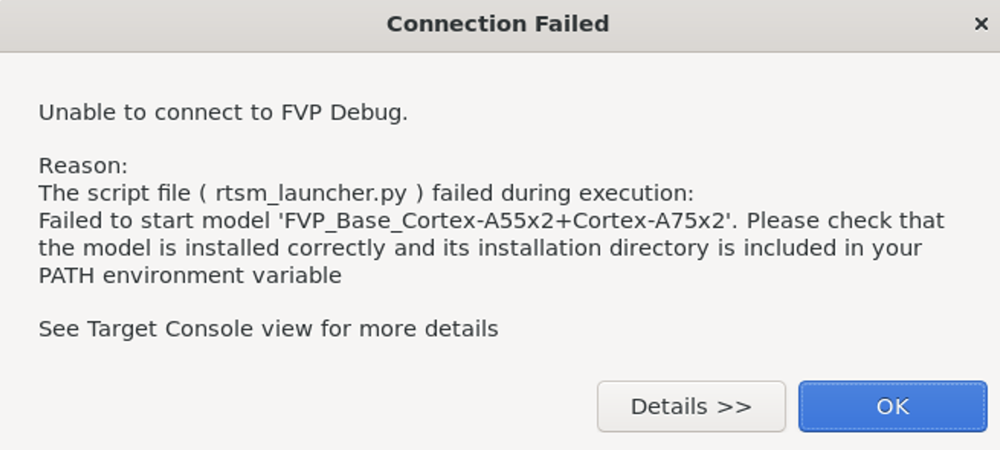
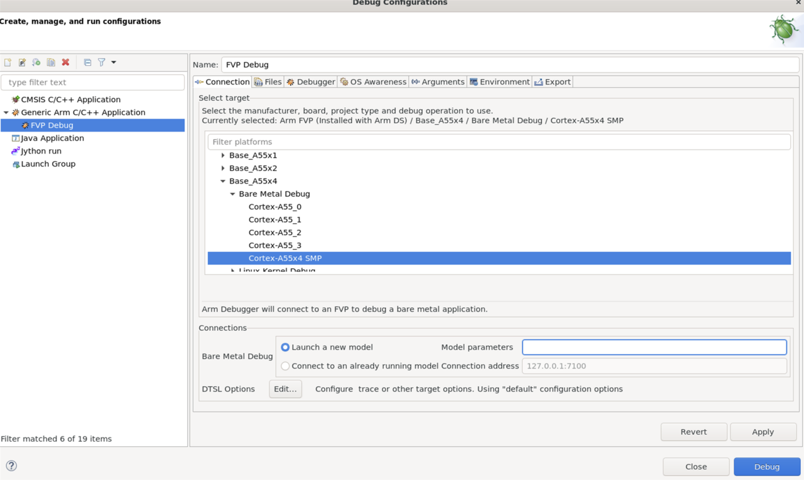

## Debug the software stack with Arm Development Studio

Once your software stack is running on the FVP, you can debug Trusted Firmware-A and the Linux kernel using Arm Development Studio (Arm DS).

## Install Arm Development Studio

Download and install the latest version from the [Arm Development Studio download page](https://developer.arm.com/downloads/view/DS000B).

DWARF 5 is enabled by default in GCC 11 and later. Arm DS v2022.2 or later is recommended to support DWARF 5 debug information.


Launch Arm DS:
```
/opt/arm/developmentstudio-2022.2/bin/armds_ide
```


## Create a debug configuration

To create a debug configuration, follow these steps:

1.	Open Arm DS, go to **Run** > **Debug Configurations**.
2.	Select **Generic Arm C/C++ Application** and create a new configuration.
3.	In the **Connection** tab:
    - Choose your FVP model (for example, Base_A55x4)
    - Enter model parameters:

```output
-C pctl.startup=0.0.0.0 \
-C bp.secure_memory=0  \
-C cache_state_modelled=0 \
-C bp.ve_sysregs.mmbSiteDefault=0 \
-C bp.ve_sysregs.exit_on_shutdown=1 \
-C bp.pl011_uart0.untimed_fifos=1 \
-C bp.pl011_uart0.unbuffered_output=1 \
-C bp.pl011_uart0.out_file=<PATH_TO_LOG>/uart0.log \
-C bp.pl011_uart1.untimed_fifos=1 \
-C bp.pl011_uart1.unbuffered_output=1 \
-C bp.pl011_uart1.out_file=<PATH_TO_LOG>/uart1.log \
-C bp.secureflashloader.fname=<SRC_PATH>/output/aemfvp-a/aemfvp-a/tf-bl1.bin \
-C bp.flashloader0.fname=<SRC_PATH>/output/aemfvp-a/aemfvp-a/fip-uboot.bin \
-C bp.virtioblockdevice.image_path=<SRC_PATH>/output/aemfvp-a/components/aemfvp-a/grub-busybox.img \
--data cluster0.cpu0=<SRC_PATH>/output/aemfvp-a/aemfvp-a/Image@0x80080000 \
--data cluster0.cpu0=<SRC_PATH>/output/aemfvp-a/aemfvp-a/fvp-base-revc.dtb@0x83000000
```

## Load debug symbols

In the **Debugger** tab:
- Select **Connect only to the target**.
- Enable Execute debugger commands, and add:
```output
add-symbol-file "~/arm/sw/cpufvp-a/arm-tf/build/fvp/debug/bl1/bl1.elf" EL3:0
add-symbol-file "~/arm/sw/cpufvp-a/arm-tf/build/fvp/debug/bl2/bl2.elf" EL1S:0
add-symbol-file "~/arm/sw/cpufvp-a/arm-tf/build/fvp/debug/bl31/bl31.elf" EL3:0
add-symbol-file "~/arm/sw/cpufvp-a/linux/out/aemfvp-a/defconfig/vmlinux" EL2N:0
```

Select **Apply** and then **Close**.

## Start debugging

1.	In the **Debug Control** view, double-click your new configuration.
2.	Wait for the target to connect and the symbols to load.
3.	Set breakpoints, step through code, and inspect registers or memory.

You might get the following error when starting the debug connection:



This means your Arm FVP is not provided by default in the Arm DS installation. Set the `PATH` in this case:

```bash
export PATH=<your model path>/bin:$PATH
```

{}
Ensure your FVP instance is running and matches the model and parameters selected in Arm DS.
{}

After these steps, you can debug the software stack as shown in the following figure:


