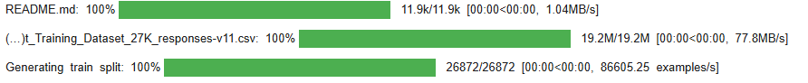
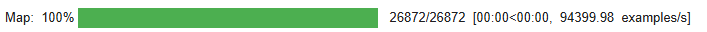

## Fine Tuning Large Language Model - Prepare Dataset
This step prepares the dataset for fine-tuning by formatting it to match the LLaMA-3.1 chat template.

###### Import Chat Template for Tokenizer
This imports the chat template functionality from Unsloth and It allows us to structure the dataset in a format that LLaMA-3.1 expects
```python
from unsloth.chat_templates import get_chat_template
```

###### Apply the Chat Template to Tokenizer
- Apply the Chat Template to Tokenizer.
- Ensures prompt formatting is consistent when training the model.
```python
tokenizer = get_chat_template(
    tokenizer,
    chat_template = "llama-3.1",
)


```
###### Format Dataset Prompts
- Extracts the instruction column from the dataset.
- Applies the chat template formatting to each instruction.
- Returns a new dictionary with the formatted text.
```python
def formatting_prompts_func(examples):
    convos = examples["instruction"]
    texts = [tokenizer.apply_chat_template(convo, tokenize = False, add_generation_prompt = False) for convo in convos]
    return { "text" : texts, }
pass
```
###### Load the Dataset
- LLoads a [customer support chatbot training dataset](https://huggingface.co/datasets/bitext/Bitext-customer-support-llm-chatbot-training-dataset) from Hugging Face
- The dataset contains example conversations with instructions for fine-tuning
- Loads the corresponding tokenizer for tokenizing inputs properly

```python
from datasets import load_dataset
dataset = load_dataset("bitext/Bitext-customer-support-llm-chatbot-training-dataset", split = "train")

```


###### Import Standardization Function
- Imports standardize_sharegpt, a function that helps in structuring dataset inputs in a ShareGPT-like format (a commonly used format for LLM fine-tuning).
- Ensures that data follows a standardized format required for effective instruction tuning.
```python
from unsloth.chat_templates import standardize_sharegpt
```
###### Define a Function to Format Dataset
- Extracts the instruction (input text) and response (output text) from the dataset.
- Stores them as "instruction_text" and "response_text".
```python
def formatting_prompts_func(examples):
    return { "instruction_text": examples["instruction"], "response_text": examples["response"] }

```

###### Apply Formatting to Dataset
- Applies formatting_prompts_func to every record in the dataset.
- Uses batch processing (batched=True) for efficiency.
```python
def formatting_prompts_func(examples):
    return { "instruction_text": examples["instruction"], "response_text": examples["response"] }

```
