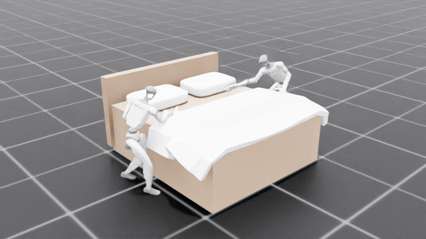

## What you will build

In this Learning Path you run a demo in which **two Unitree G1 humanoid robots work together at a bed** in NVIDIA Isaac Sim, entirely in simulation on an NVIDIA DGX Spark. Each robot:

- **walks in** on its own two feet under a pretrained velocity-walk policy,
- **leans over the bed** under a whole-body reinforcement-learning (RL) reach policy that keeps it balanced while it bends,
- **reaches for the draped sheet and works to draw it toward the head of the bed**, and
- **coordinates with the other robot as an equal peer over the Model Hardware Standard (MHS)** — the two robots share the goal *"the bed is made,"* claim work, emit events, and ask each other for help.

Everything is physically simulated. There are **no kinematic cheats**: no base pinning, no teleporting, and no joint freezing, so every motion is one a real G1 could reproduce on hardware.

## Why this is hard: loco-manipulation

Bed-making for a free-standing humanoid is a **loco-manipulation** problem. When the robot bends deeply over the bed to reach the sheet, its centre of mass moves past its feet, so a walking-balance policy alone topples on the reach. The demo solves this with a **single whole-body RL policy** that owns all the robot's joints and holds **balance and reach at the same time**. You will play and inspect that policy later in the Learning Path.

Because the demo refuses kinematic shortcuts, balance-while-reaching is a genuine control problem rather than a scripted animation — which is exactly what makes it a valid target for sim-to-real transfer.

## Why coordinate over MHS

Two robots working on the same bed need a shared way to **find each other**, **call each other's capabilities**, and **exchange events** — without hard-coding one robot as a master. This is the job of a device layer.

The **Model Hardware Standard (MHS)** is an open standard for exactly this: devices join a fabric, advertise the procedures and state they expose, and any peer can discover and invoke them over a transport such as NATS. MHS absorbed the driver framework from **Arm Device Connect**, so a device is written as an `MhsDriver` subclass whose methods are marked `@rpc` (callable procedures) and `@emit` (events).

In this demo, **each G1 is an MHS device**. The two robots are peers on the same fabric: each advertises procedures like `pickUpBedSheet`, `walkToNextCorner`, `askForHelp`, and `offerHelp`, and emits events as it claims corners and trades help. No robot is in charge — coordination emerges from peers pursuing a shared goal. This is the "the device layer adds real value to robotics" story that the rest of this Learning Path makes concrete.

{}
The same MHS driver model extends to a **human partner as a device**: a person on a Bluetooth headset can be registered as a `human_agent` device so a robot can call `ask(...)` and get a spoken answer back — a robot consulting a human exactly like any other device. That human-in-the-loop connector ships in [robotics-connect](https://github.com/armwaheed/robotics-connect); it runs on a physical robot and is out of scope for this simulation-only Learning Path.
{}

## What you need

- An **NVIDIA DGX Spark** (Arm GB10), or a comparable Arm + NVIDIA GPU Linux host.
- **NVIDIA Isaac Sim 5.1** and **Isaac Lab 2.3.2** (you build these in the next step).
- The **MHS Python SDK**, installed from source (also in the next step).

Continue to the next step to set up the environment.
