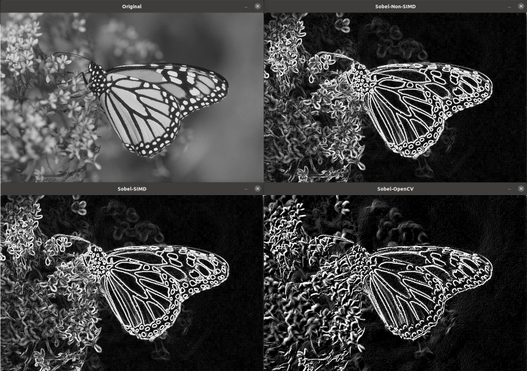

---
# User change
title: "Run and evaluate" 

weight: 6 # 1 is first, 2 is second, etc.

# Do not modify these elements
layout: "learningpathall"
---

# Run and evaluate

It is straight forward to compile and run the application, run the commands below:

```bash
cmake -S src -B build
cd build/
make
./sobel_simd_opencv
```

A successful run will output execution time measurement results in microseconds in the terminal for the three implementations, and open four windows showing (as seen below) of the original, non-SIMD, SIMD and OpenCV images of a butterfly.



In the results presented below, a value >1 is faster and a value <1 is slower in comparison to the normalized value. In short, higher values are better.

| | QEMU | | 
| --- | --- | --- |
| Compiler | GCC 11.3.0 |
| Non-SIMD | 1.00 |
| SIMD     | 0.29 |
| OpenCV   | 0.02 |

The results in the table above have been normalized to the _QEMU Non-SIMD_ value, giving the relative speed-up. 

You observe the following: 
* the non-SIMD implementation is the fastest but does not reflect the performance on an `aarch64` system

{}
Emulation does not give a representative view of how efficiently the algorithms run on Arm, it is only useful for functional purposes, **not** to measure performance
{}

## Closing notes

You have now ported an `x86_64` application to `aarch64`, built and run the ported application on `aarch64` using emulation, well done!

Continue to the next section to evaluate application performance on Arm hardware.
