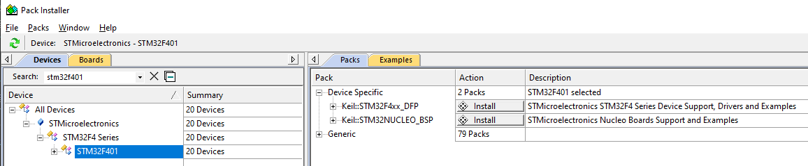
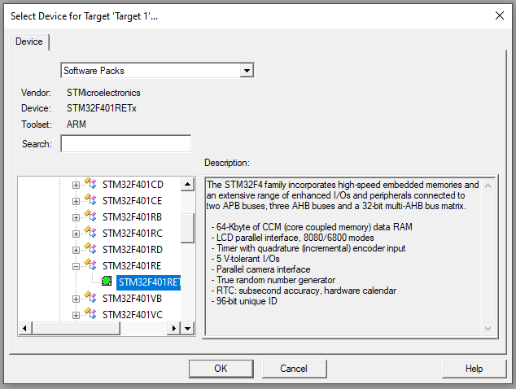
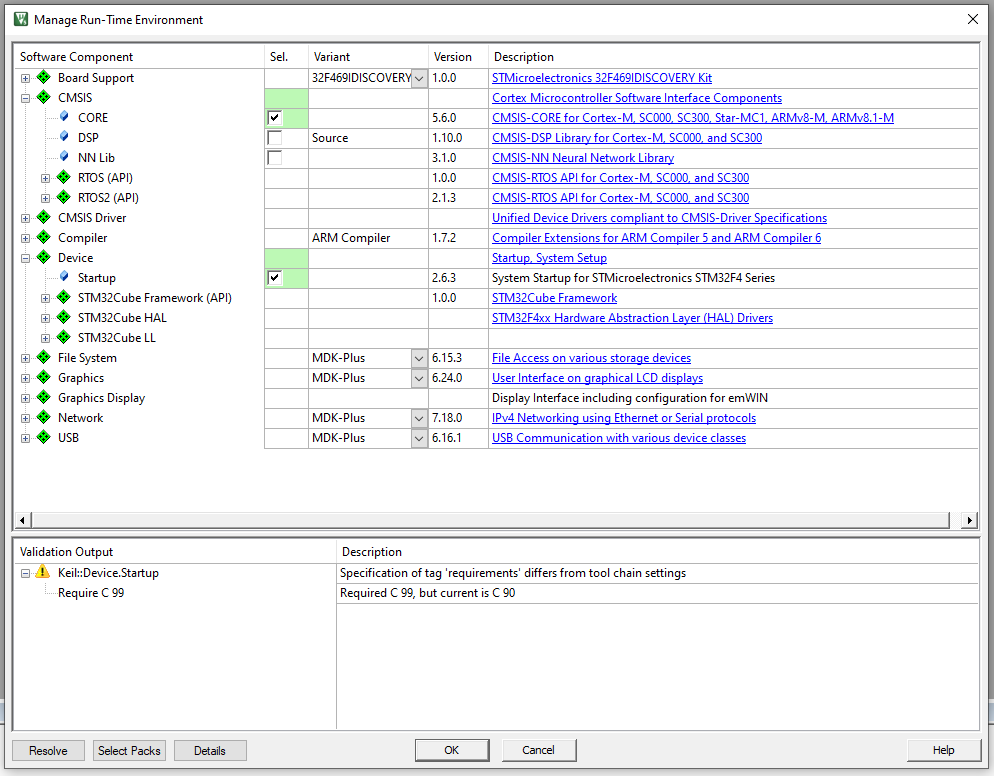
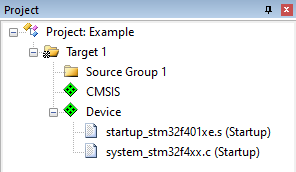
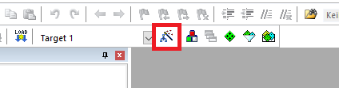
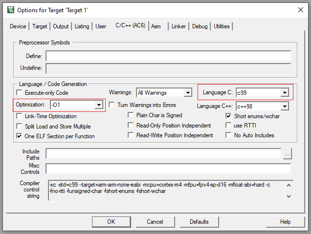
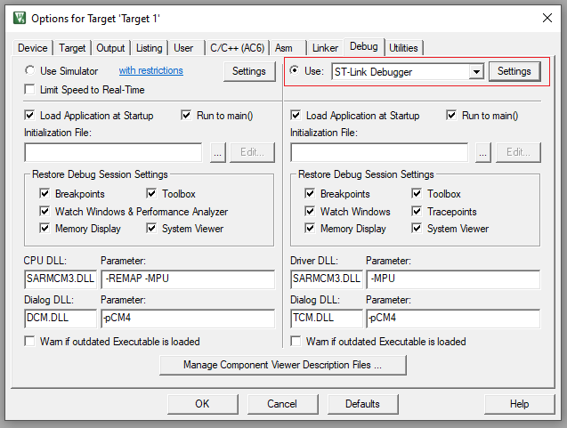

---
# User change
title: "Set up a project in Keil MDK" 

weight: 3 # 1 is first, 2 is second, etc.

# Do not modify these elements
layout: "learningpathall"
---

In this exercise, you will execute assembly code using the `Keil MDK`, and examine its execution at the processor level.

This exercise is adapted from the [Efficient Embedded Systems Education Kit](https://github.com/arm-university/Efficient-Embedded-Systems-Design-Education-Kit).

Please make sure to read and go through the [Getting Started with MDK](https://developer.arm.com/documentation/KGS1/latest/) documentation or [Learning Path](/learning-paths/embedded-and-microcontrollers/uv_debug/) if you are unfamiliar with its usage.

The example can run on any supported development platform. Instructions are provided for the `Nucleo-F401RE` development board from ST Microelectronics as well as the Cortex-M3 Virtual Hardware Target (`VHT`) supplied with MDK Professional Edition.

* [Set up project for Nucleo-F401RE ](#nucleo)
* [Set up project for Cortex-M3 VHT ](#vht)

## Set up project for Nucleo-F401RE {#nucleo}

### CMSIS Packs

Open the `CMSIS Pack Installer` and install/update the necessary `CMSIS Packs` for the `STM32F401` and `Nucleo` boards.

Close the Pack installer and return to the uVision IDE.

### Create project

Go to `Project` > `New uVision Project`, and create a project.

A window will show up requesting you to select the target device for the project. select `STM32F401RE`, as shown in this image:

### Configure project

Next, you will be required to select software components/packages that you wish to include in your project.

Add `CMSIS` > `Core`, and `Device` > `Startup`.

Your project should now look like this:

Next you need to configure some options for the target. Select the `Options for target` icon shown below.

Then under the `C/C++` tab set the `Language C` option to `c99` and the `Optimization` level to `-O1`.

Also, under the `Debug` tab, set the debugger to `ST-Link Debugger`.

You are ready to start writing the program.

## Set up project for Cortex-M3 VHT {#vht}

### CMSIS Packs

Open the `CMSIS Pack Installer` and install/update the necessary `CMSIS Packs` for the `ARM` > `Cortex-M3` > `CMSDK_CM3_VHT` target.

Close the Pack installer and return to the uVision IDE.

### Create project

Go to `Project` > `New uVision Project`, and create a project.

A window will show up requesting you to select the target device for the project. select `ARM` > `Cortex-M3` > `CMSDK_CM3_VHT`. Click `OK`.

### Configure project

Next, you will be required to select software components/packages that you wish to include in your project.

Add `CMSIS` > `Core`, and `Device` > `Startup`. Click `OK` to save.

Select the `Options for target` icon.

Under the `C/C++` tab set the `Language C` option to `c99` and the `Optimization` level to `-O1`.

Under the `Debug` tab, set the debugger to `Models Cortex-M Debugger`.

Click the `Settings` button, and the `Command` > `...` button. Browse to the `ARM/VHT` folder of your Keil MDK installation, and select `VHT_MPS2_Cortex-M3.exe`.

Click `OK` to save, and again to close the `Options` view.

You are ready to start writing the program.
