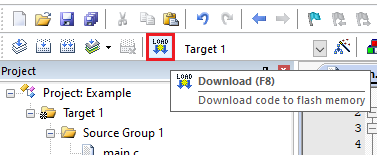

---
# User change
title: "Running the code on the board" 

weight: 5 # 1 is first, 2 is second, etc.

# Do not modify these elements
layout: "learningpathall"
---

You are now ready to build the code and run it on the target hardware.

## Compile the code

Click the `Build` button to compile source code, and link together.

## Run and debug the code on the target

If running the code from Flash on the board, ensure your board is connected to your host machine. Click `Download` to load it onto the Flash memory on the board.

This step is not necessary if using the `VHT` target, or running code from SRAM.

### Debug

Once flashed onto the board, you can start a debug session.

Open the `Call Stack + Locals` tab in the IDE. This will show the value of the variables `a` and `b`.

Step through the program and notice how the values of `a` and `b` change.

You will see the string "Hello world!" copy to b, and then be capitalized.

