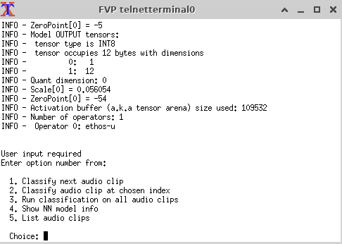
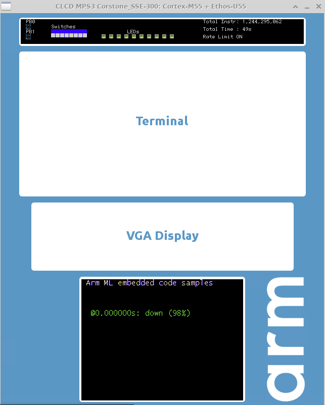

---
# User change
title: "Run the examples on the FVP"

weight: 3 # 1 is first, 2 is second, etc.

# Do not modify these elements
layout: "learningpathall"
---
## Run an example

Now you are ready to combine the FVP installation and the example application. Navigate to the evaluation kit repository.

```bash
cd ml-embedded-evaluation-kit/
```

To run an example on the Corstone-320 FVP target, launch the FVP executable with `-a` to specify the software application.

To run the key word spotting example `ethos-u-kws.axf` compiled with `gcc` use one of the two options below.

## Option 1: On your computer with the FVP installed

Run the FVP.

```console
FVP_Corstone_SSE-320                                    \
    -C mps4_board.subsystem.ethosu.num_macs=256         \
    -C mps4_board.visualisation.disable-visualisation=1 \
    -C vis_hdlcd.disable_visualisation=1                \
    -a cmake-build-mps4-sse-320-ethos-u85-256-gnu/bin/ethos-u-kws.axf
```

{}
The number of NPU MACs specified in the build MUST match the number specified in the FVP. Else an error similar to the below will be emitted.

```
E: NPU config mismatch. npu.macs_per_cc=E: NPU config mismatch..
```
{}

## Option 2: On Arm Virtual Hardware

```console
VHT_Corstone_SSE-300_Ethos-U55 -a cmake-build-mps3-sse-300-ethos-u55-128-gnu/bin/ethos-u-kws.axf
```
When the example is running, a telnet instance will open allowing you to interact with the example.

{}
It may take some time to initialize the terminal, please be patient.

If you see warnings regarding loading the image, these can likely be ignored.
{}

## Interact with the application

Use the menu to control the application. For the key word spotting application enter 1 to classify the next audio clip.



The results of the classification will appear in the visualization window of the FVP.

The display shows a 98% chance of the audio clips sound was down.



End the simulation by pressing Control-C in the terminal where to started the FVP.

You now have the ML Evaluation Kit examples running. Experiment with the different examples provided.

## Addendum: Setting model parameters

You can specify additional parameters to configure certain aspects of the simulated Corstone-300.

### List parameters

List the available parameters by running the FVP executable with the `--list-params` option, for example:

```console
FVP_Corstone_SSE-320 --list-params > parameters.txt
```

{}
If you are running with Arm Virtual Hardware substitute `VHT_Corstone_SSE-300_Ethos-U55` as the executable name.
{}

Open the file `parameters.txt` to see all of the possible parameters and the default values.

### Set parameters

Individual parameters can be set with the `-C` command option.

For example, to put the Ethos-U component into fast execution mode:

```console
FVP_Corstone_SSE-320 -a cmake-build-mps4-sse-320-ethos-u85-256-gnu/bin/ethos-u-kws.axf -C mps4_board.subsystem.ethosu.extra_args="--fast"
```
{}
Do not use fast execution mode whilst benchmarking performance.
{}

To set multiple parameters it may be easier to list them in a text file (without `-C`) and use `-f` to specify the file.

For example, use a text editor to create a file named `options.txt` with the contents:

```console
mps4_board.visualisation.disable-visualisation=1
mps4_board.subsystem.ethosu.extra_args="--fast"
```

Run the FVP with the `-f` option and the `options.txt` file:

```console
FVP_Corstone_SSE-320 -a cmake-build-mps4-sse-320-ethos-u85-256-gnu/bin/ethos-u-kws.axf -f options.txt
```

Full instructions are provided in the evaluation kit [documentation](https://review.mlplatform.org/plugins/gitiles/ml/ethos-u/ml-embedded-evaluation-kit/+/HEAD/docs/quick_start.md).

You have now run an example application on an Arm Fixed Virtual Platform.