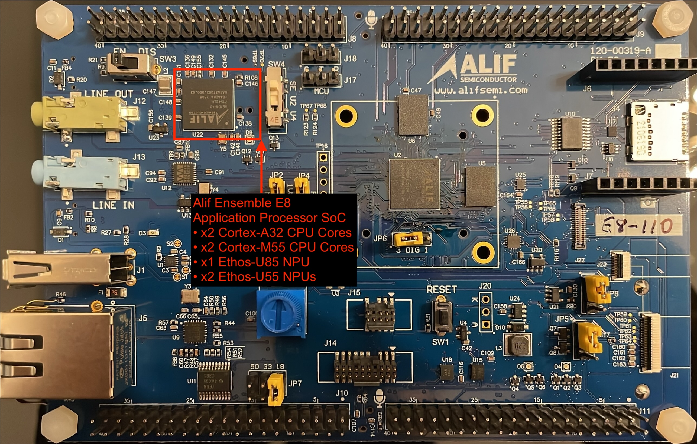
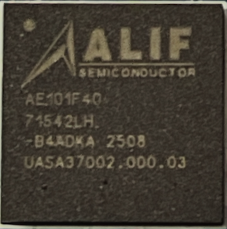

This Learning Path covers deploying PyTorch neural network models on the **Alif Ensemble E8 DevKit** using ExecuTorch with Ethos-U55 NPU acceleration.

## What you'll build

A complete pipeline to:
1. Export PyTorch models to ExecuTorch format (`.pte`)
2. Optimize models for Ethos-U55 NPU using Vela compiler
3. Build the ExecuTorch runtime for Cortex-M55
4. Deploy and run inference on Alif E8 hardware

## Hardware Overview - Alif Ensemble E8 Series

Selecting the best hardware for machine learning (ML) models depends on effective tools. You can visualize Arm Ethos-U performance early in the development cycle using Alif's [Ensemble E8 Series Development Kit](https://alifsemi.com/ensemble-e8-series/).

<center>
<iframe src='https://www.youtube.com/embed/jAvi2xKxkE4?si=Wd-E1PUCM4Y49uXM' allowfullscreen frameborder=0 width="800" height="400"></iframe>

*Alif Ensemble Series Overview*
</center>



### Alif Ensemble E8 DevKit (DK-E8-Alpha)

| Component | Specification |
|-----------|---------------|
| **CPU** | Arm Cortex-M55 (HE core @ 160MHz) |
| **NPU** | Arm Ethos-U55 (128 MAC configuration) |
| **ITCM** | 256 KB (fast instruction memory) |
| **DTCM** | 256 KB (fast data memory) |
| **SRAM0** | 4 MB (general purpose) |
| **SRAM1** | 4 MB (NPU accessible) |
| **MRAM** | 2-5.5 MB (non-volatile code storage) |

{}
The DK-E8-Alpha DevKit may use E7 silicon (AE722F80F55D5AS) which has 5.5MB MRAM and 13.5MB SRAM total. SETOOLS will auto-detect your actual chip variant. Always build for the detected silicon type.
{}

### Alif's Ensemble E8 Processor Decoded



**Alif's Processor Labeling Convention:**
|Line|Meaning|
|----|-------|
|AE101F|• AE – Ensemble E-series family<br>• 101F – Specific device SKU within the E8 series (quad-core Fusion processors: x2 Cortex-A32 + x2 Cortex-M55 + Ethos-U85 + x2 Ethos-U55)|
|4Q|• Usually denotes package type and temperature grade|
|71542LH|• Likely a lot code / internal wafer lot number used for traceability|
|B4ADKA 2508|• B4ADKA - Assembly site & line identifier<br>• 2508 - year + week of manufacture (Week 08 of 2025)|
|UASA37002.000.03|• UASA37002 - Identifies the silicon mask set<br>• .000.03 - means revision 3 of that mask|

## Software Stack

```
┌────────────────────────────────────────────────────┐
│                    Your Application                │
├────────────────────────────────────────────────────┤
│  ExecuTorch Runtime                                │
│  ├── Program Loader                                │
│  ├── Executor                                      │
│  └── Memory Manager                                │
├────────────────────────────────────────────────────┤
│  Delegates & Kernels                               │
│  ├── Ethos-U Delegate (NPU acceleration)          │
│  ├── Cortex-M Kernels (CPU fallback)              │
│  └── Quantized Kernels (INT8 ops)                 │
├────────────────────────────────────────────────────┤
│  Alif SDK / CMSIS                                  │
│  ├── Device HAL                                    │
│  ├── UART Driver                                   │
│  └── GPIO Driver                                   │
├────────────────────────────────────────────────────┤
│  Hardware: Cortex-M55 + Ethos-U55                  │
└────────────────────────────────────────────────────┘
```

## Prerequisites

### Required hardware
- Alif Ensemble E8 DevKit (DK-E8-Alpha)
- USB-C cable (connect to **PRG USB** port)
- Optional: USB-to-Serial adapter for UART debugging

### Required software

| Tool | Version | Purpose |
|------|---------|---------|
| Docker | Latest | Development container |
| Arm GCC | 13.x or 14.x | Cross-compiler |
| CMSIS-Toolbox | 2.6.0+ | Build system |
| J-Link | 7.x+ | Programming/debugging |
| SETOOLS | 1.107.x | Alif flashing tools |
| Python | 3.10+ | ExecuTorch export |

## Key concepts

### Model quantization

ExecuTorch uses **INT8 quantization** for Ethos-U55:
- Reduced memory footprint (4x smaller than FP32)
- Faster inference on NPU
- Minimal accuracy loss with proper calibration

### Memory layout

{}
Large tensors and model weights must be placed in **SRAM0** (4MB), not DTCM (256KB). Failing to do this causes linker overflow errors.
{}

Place large buffers in SRAM0 using the section attribute:

```c
static uint8_t __attribute__((section(".bss.noinit"), aligned(16)))
    tensor_arena[512 * 1024];  // 512KB in SRAM0
```

### SRAM0 power management

{}
SRAM0 must be powered on before use via Secure Enclave services. Accessing unpowered SRAM causes HardFault crashes.
{}

```c
#include "se_services_port.h"
#include "services_lib_api.h"

uint32_t mem_error = 0;
SERVICES_power_memory_req(
    se_services_s_handle,
    POWER_MEM_SRAM_0_ENABLE,
    &mem_error);
```

## Example: MNIST digit classification

The included MNIST example demonstrates:
- Loading a quantized CNN model (~100KB)
- INT8 input preprocessing (28x28 grayscale image)
- NPU-accelerated inference (~10-20ms)
- Output processing (argmax of 10 classes)

```
Input: 28x28 grayscale image (784 bytes INT8)
  │
  ▼
┌─────────────────────────────────────────┐
│ Conv2d(1→16) → ReLU → MaxPool          │  NPU
│ Conv2d(16→32) → ReLU → MaxPool         │  accelerated
│ Linear(1568→64) → ReLU                 │
│ Linear(64→10)                          │
└─────────────────────────────────────────┘
  │
  ▼
Output: 10 class scores (10 bytes INT8)
```

## Benefits and applications

NPUs like Arm's [Ethos-U55](https://www.arm.com/products/silicon-ip-cpu/ethos/ethos-u55) and [Ethos-U85](https://www.arm.com/products/silicon-ip-cpu/ethos/ethos-u85) provide significant advantages for embedded ML applications:

- **Hardware acceleration**: 10-50x faster inference compared to CPU-only execution
- **Power efficiency**: Lower power consumption per inference operation
- **Real-time capable**: Suitable for latency-sensitive applications
- **On-device processing**: No cloud dependency, enhanced privacy
- **Visual feedback**: RGB LED indicators provide immediate status confirmation
- **Debug capabilities**: UART and RTT output for detailed performance analysis

The Alif [Ensemble E8 Series Development Kit](https://alifsemi.com/ensemble-e8-series/) integrates the Ethos-U55 NPU with Cortex-M55 and Cortex-A32 cores, making it ideal for prototyping TinyML applications that require both ML acceleration and general-purpose processing.