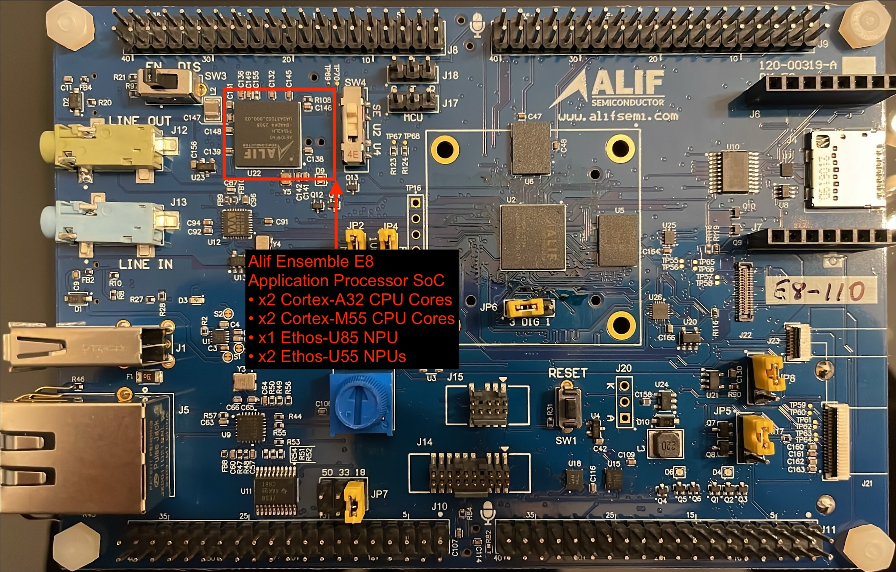
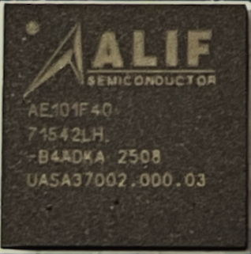

## Hardware Overview - Alif's Ensemble E8 Series Board

Selecting the best hardware for machine learning (ML) models depends on effective tools. You can visualize Arm Ethos-U85 performance early in the development cycle by using Alif's [Ensemble E8 Series Development Kit](https://alifsemi.com/ensemble-e8-series/).

<iframe src='https://www.youtube.com/embed/jAvi2xKxkE4?si=Wd-E1PUCM4Y49uXM' allowfullscreen frameborder=0 width="800" height="400"></iframe>

*Alif Ensemble Series Overview*

### Alif's Ensemble E8 Processor Decoded

**Alif's Processor Labeling Convention:**
|Line|Meaning|
|----|-------|
|AE101F|• AE – Ensemble E-series family • 101F – Specific device SKU within the E8 series (quad-core Fusion processors: x2 Cortex-A32 + x2 Cortex-M55 + Ethos-U85 + x2 Ethos-U55)|
|4Q|• Usually denotes package type and temperature grade|
|71542LH|• Likely a lot code / internal wafer lot number used for traceability|
|B4ADKA 2508|• B4ADKA - Assembly site & line identifier • 2508 - year + week of manufacture (Week 08 of 2025)|
|UASA37002.000.03|• UASA37002 - Identifies the silicon mask set • .000.03 - means revision 3 of that mask|

## Software Overview - Alif SETOOLS

The [Alif Security Toolkit](https://swrm.alifsemi.com/Content/3.4%20SETOOLS.htm?TocPath=Secure%20Enclave%20Subsystem%7C_____4) (SETOOLS) contains utlities for working with the Alife Ensemble E8 board. You will install this later in this learning path on the following page: [Install Alif SETOOLS](/learning-paths/embedded-and-microcontrollers/observing-ethos-u-on-alif/3-install-setools/).

## Software Overview - TinyML

This Learning Path uses TinyML. TinyML is machine learning tailored to function on devices with limited resources, constrained memory, low power, and fewer processing capabilities.

For a learning path focused on creating and deploying your own TinyML models, please see [Introduction to TinyML on Arm using PyTorch and ExecuTorch](/learning-paths/embedded-and-microcontrollers/introduction-to-tinyml-on-arm/)

## Benefits and Applications

NPUs like Arm's [Ethos-U85](https://www.arm.com/products/silicon-ip-cpu/ethos/ethos-u85) provide significant advantages for embedded ML applications:

- **Hardware Acceleration**: 10-50x faster inference compared to CPU-only execution
- **Power Efficiency**: Lower power consumption per inference operation
- **Real-time Capable**: Suitable for latency-sensitive applications
- **On-device Processing**: No cloud dependency, enhanced privacy
- **Visual Feedback**: RGB LED indicators provide immediate status confirmation
- **Debug Capabilities**: UART and RTT output for detailed performance analysis

The Alif [Ensemble E8 Series Development Kit](https://alifsemi.com/ensemble-e8-series/) integrates the Ethos-U85 NPU with Cortex-M55 and Cortex-A32 cores, making it ideal for prototyping TinyML applications that require both ML acceleration and general-purpose processing.