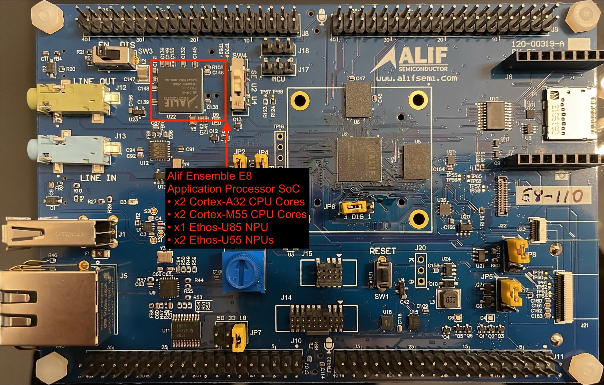

## What MNIST is

[MNIST](https://en.wikipedia.org/wiki/MNIST_database), widely classified as the "Hello World" of machine learning, is a dataset containing 70,000 28 × 28 pixel grayscale images of handwritten digits 0 to 9. The dataset is commonly used for training image processing systems.

## What the Alif Ensemble E8 DevKit is

The Alif Ensemble E8 DevKit features two dual-core Arm processors (Cortex-A32 and Cortex-M55) and three neural processing units (NPUs): two Ethos-U55s and one Ethos-U85.

You'll run an MNIST digit-classification model on the Arm Ethos-U85 NPU. You can either use the provided `.pte` model or follow optional steps to train and export your own MNIST model. 

## What you've learned and what's next

You've now learned what MNIST is and what the Alif Ensemble E8 DevKit includes.

Next, you'll connect to the DevKit and install dependencies.
