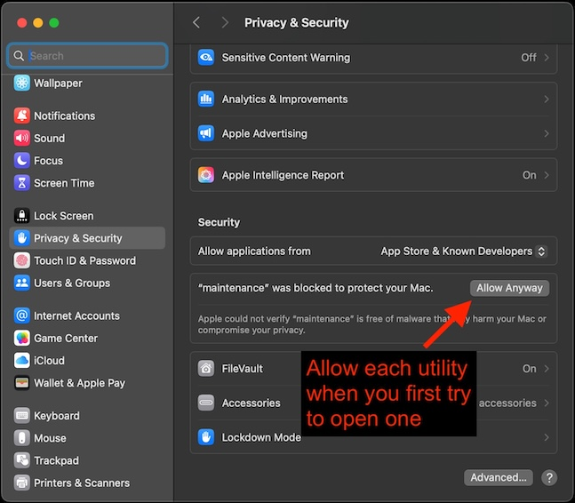

## Overview

This section covers installing all required tools for ExecuTorch development on the Alif Ensemble E8 DevKit.

You need:
- Docker for the build environment
- CMSIS-Toolbox for Alif E8 projects
- J-Link for programming and debugging
- SETOOLS for Alif-specific flashing
- ARM GCC Toolchain (installed within Docker)

## Install Docker

Docker provides an isolated environment with all build dependencies.

### Install Docker Desktop

Select your operating system:




```bash
# Download and install Docker Desktop from:
# https://www.docker.com/products/docker-desktop

# Or install via Homebrew
brew install --cask docker

# Start Docker Desktop from Applications
# Verify installation
docker --version
```

Expected output:
```output
Docker version 24.0.7, build afdd53b
```




```bash
# Ubuntu/Debian
curl -fsSL https://get.docker.com -o get-docker.sh
sudo sh get-docker.sh

# Add user to docker group
sudo usermod -aG docker $USER

# Log out and back in, then verify
docker --version
```

Expected output:
```output
Docker version 24.0.7, build afdd53b
```




1. Download Docker Desktop from [docker.com](https://www.docker.com/products/docker-desktop)
2. Run the installer
3. Restart your computer when prompted
4. Open PowerShell and verify:

```powershell
docker --version
```

Expected output:
```output
Docker version 24.0.7, build afdd53b
```




### Verify Docker Installation

Test Docker is working:

```bash
docker run hello-world
```

The output is similar to:
```output
Hello from Docker!
This message shows that your installation appears to be working correctly.
```

## Install CMSIS-Toolbox

CMSIS-Toolbox provides the `cbuild` command for building Alif E8 projects.


  
# Install via Homebrew
brew install cmsis-toolbox

# Verify installation
cbuild --version
# Expected output: cbuild 2.6.0 or later
  
  
# Download from https://github.com/Open-CMSIS-Pack/cmsis-toolbox/releases
wget https://github.com/Open-CMSIS-Pack/cmsis-toolbox/releases/download/2.6.0/cmsis-toolbox-linux-amd64.tar.gz

# Extract
tar -xzf cmsis-toolbox-linux-amd64.tar.gz
sudo mv cmsis-toolbox /opt/

# Add to PATH
echo 'export PATH="/opt/cmsis-toolbox/bin:$PATH"' >> ~/.bashrc
source ~/.bashrc

# Verify installation
cbuild --version
  
  
1. Download installer from https://github.com/Open-CMSIS-Pack/cmsis-toolbox/releases
2. Run the installer
3. Add to PATH if not automatic
4. Verify in PowerShell: cbuild --version
  


### Install Alif Ensemble Pack

After installing CMSIS-Toolbox, add the Alif Ensemble device pack:

```bash
cpackget add AlifSemiconductor::Ensemble@2.0.4
```

Verify the pack is installed:

```bash
cpackget list
```

The output shows:
```output
AlifSemiconductor::Ensemble@2.0.4
```

## Install J-Link

J-Link is used for programming and debugging the Alif E8 hardware.

{}
J-Link version 7.94 or later is required for Alif Ensemble E8 support.
{}


  
# Download from SEGGER website or use Homebrew
brew install --cask segger-jlink

# Verify installation
JLinkExe --version
# Expected output: SEGGER J-Link Commander V7.94 or later
  
  
# Download from SEGGER website
wget https://www.segger.com/downloads/jlink/JLink_Linux_x86_64.deb
sudo dpkg -i JLink_Linux_x86_64.deb

# Verify installation
JLinkExe --version
  
  
1. Download installer from https://www.segger.com/downloads/jlink/
2. Run the installer and follow prompts
3. Verify in Command Prompt: JLink.exe --version
  


## Install SETOOLS

SETOOLS (Secure Enclave Tools) is Alif's proprietary toolset for flashing firmware to MRAM via the Secure Enclave.

{}
SETOOLS is provided by Alif Semiconductor. Contact Alif support to obtain the latest release for your platform.
{}

### Install SETOOLS


  
# Extract the release package (provided by Alif)
cd ~/Downloads
unzip app-release-exec-macos.zip
cd app-release-exec-macos

# Make tools executable
chmod +x app-gen-toc app-write-mram

# Add to PATH (add to ~/.zshrc or ~/.bashrc)
export PATH="$PATH:$HOME/Downloads/app-release-exec-macos"
echo 'export PATH="$PATH:$HOME/Downloads/app-release-exec-macos"' >> ~/.zshrc
  
  
# Extract the release package
cd ~/Downloads
unzip app-release-exec-linux.zip
cd app-release-exec-linux

# Make tools executable
chmod +x app-gen-toc app-write-mram

# Add to PATH
export PATH="$PATH:$HOME/Downloads/app-release-exec-linux"
echo 'export PATH="$PATH:$HOME/Downloads/app-release-exec-linux"' >> ~/.bashrc
  
  
1. Extract app-release-exec-windows.zip to a folder (for example, C:\setools)
2. Add the folder to your system PATH:
   - Right-click "This PC" → Properties → Advanced System Settings
   - Click "Environment Variables"
   - Under System Variables, select PATH and click Edit
   - Add the SETOOLS folder path
   - Click OK on all dialogs
  


### macOS Gatekeeper Warning

On macOS, when you first run SETOOLS commands, you may see a security warning:


To allow SETOOLS to run:

1. Open **System Preferences** → **Security & Privacy** → **General**
2. Click **Allow Anyway** for the blocked app



### Verify SETOOLS Installation

Test that SETOOLS is accessible:

```bash
app-write-mram -d
```

If your Alif E8 DevKit is connected, the output shows device information:

```output
Device Part# AE722F80F55D5AS Rev A1
MRAM Size (KB)  = 5632  (5.5 MB)
SRAM Size (KB)  = 13824 (13.5 MB)
```

{}
The DK-E8-Alpha DevKit may contain E7 silicon (AE722F80F55D5AS) rather than E8 silicon. SETOOLS auto-detects your actual chip. You'll use the detected silicon type when building projects.
{}

## Install Serial Terminal Software

For viewing UART debug output, you need a serial terminal program.


  
# Install picocom
brew install picocom

# Verify installation
picocom --help
  
  
# Install picocom or minicom
sudo apt-get install picocom minicom

# Verify installation
picocom --help
  
  
Download and install PuTTY from https://www.putty.org/
  


## Summary

You have installed:
- ✅ Docker for the build environment
- ✅ CMSIS-Toolbox (cbuild 2.6.0+) for Alif E8 projects
- ✅ J-Link (7.94+) for programming and debugging
- ✅ SETOOLS for Alif-specific flashing
- ✅ Serial terminal for UART debugging

In the next section, you'll set up the hardware connections.
