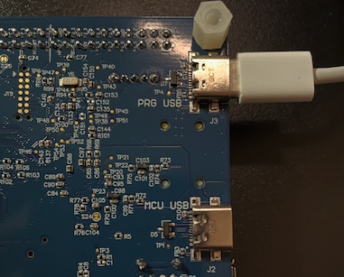

## Overview

This section covers the physical hardware setup for the Alif Ensemble E8 DevKit, including USB connections, UART wiring, and silicon detection.

## Hardware Required

- **Alif Ensemble E8 DevKit** (DK-E8-Alpha)
- **USB-C cable** (for programming and power)
- **USB-to-Serial adapter** (optional, for UART debugging)
- **Jumper wires** (if using UART)

## Understanding the DevKit

### Key Components

| Component | Location | Purpose |
|-----------|----------|---------|
| PRG USB | Corner port | J-Link programming, SETOOLS communication |
| DEBUG USB | Center port | Debug and data transfer |
| SW4 Switch | Board edge | Selects UART2 or SEUART mode |
| RGB LED | Near corner | Visual status indicator |
| Reset Button | Near USB ports | Hardware reset |

### Important Silicon Note

{}
The DK-E8-Alpha DevKit may contain **E7 silicon** (AE722F80F55D5AS) rather than E8 silicon, even though the board is labeled "E8". This is normal for Alpha development kits. SETOOLS auto-detects your actual chip type.
{}

Always build your project for the silicon type detected by SETOOLS:
- **E7 silicon**: Use target `E7-HE` in your builds
- **E8 silicon**: Use target `E8-HE` in your builds

## USB Connection Setup

### Step 1: Connect the PRG USB Port

The **PRG USB** port (closest to the corner) is used for:
- J-Link programming
- SETOOLS MRAM flashing
- Secure Enclave communication



Connect a USB-C cable from your computer to the **PRG USB** port on the DevKit.

{}
Using the wrong USB port (DEBUG USB instead of PRG USB) will prevent programming and flashing. Always use the **PRG USB** port for development.
{}

### Step 2: Verify USB Connection

Check that your computer recognizes the DevKit:


  
# List USB devices
system_profiler SPUSBDataType | grep -A 10 "J-Link"
# Expected output shows J-Link device connected.
  
  
# List USB devices
lsusb | grep -i segger
# Expected output: Bus 001 Device 005: ID 1366:1051 SEGGER J-Link
  
  
Open Device Manager and look for "SEGGER J-Link" under "Universal Serial Bus devices".
  


### Step 3: Detect Silicon Type with SETOOLS

Use SETOOLS to detect which silicon variant your DevKit contains:

```bash
app-write-mram -d
```

**If you have E7 silicon**, the output is:

```output
Device Part# AE722F80F55D5AS Rev A1
MRAM Size (KB)  = 5632  (5.5 MB)
SRAM Size (KB)  = 13824 (13.5 MB)
```

**If you have E8 silicon**, the output is:

```output
Device Part# AE722F80F55D5LS Rev A1
MRAM Size (KB)  = 2048  (2 MB)
```

{}
Remember your silicon type (E7 or E8) as you'll need this for building projects. Most DK-E8-Alpha boards contain E7 silicon.
{}

## UART Connection Setup (Optional but Recommended)

UART provides debug output with `printf()` statements, which is invaluable for debugging.

### Hardware Wiring

Connect a USB-to-Serial adapter to the DevKit:

| Adapter Pin | DevKit Pin | Signal |
|-------------|------------|--------|
| TX | P3_17 | UART2_RX (HE core) |
| RX | P3_16 | UART2_TX (HE core) |
| GND | GND | Ground |

{}
Connect adapter TX to DevKit RX, and adapter RX to DevKit TX (crossover connection).
{}

### SW4 Switch Configuration

The **SW4 switch** selects the UART mode:

| Position | Mode | Use Case |
|----------|------|----------|
| SEUART | Secure Enclave UART | SETOOLS communication (required for flashing) |
| UART2 | Application UART | Debug output via `printf()` |

**For development workflow:**
1. Set SW4 to **SEUART** when using SETOOLS to flash
2. Set SW4 to **UART2** when running your application and viewing debug output
3. Switch back to **SEUART** before reflashing

### Configure Serial Terminal

After wiring and setting SW4 to UART2, open a serial terminal:


  
# Find serial port
ls /dev/cu.usbserial*

# Connect with picocom
picocom -b 115200 /dev/cu.usbserial-XXXX

# Or with screen
screen /dev/cu.usbserial-XXXX 115200

# To exit picocom: Press Ctrl+A then Ctrl+X
# To exit screen: Press Ctrl+A then type :quit
  
  
# Find serial port
ls /dev/ttyUSB*

# Connect with picocom
picocom -b 115200 /dev/ttyUSB0

# Or with minicom
minicom -D /dev/ttyUSB0 -b 115200

# To exit picocom: Press Ctrl+A then Ctrl+X
  
  
Use PuTTY:
1. Open PuTTY
2. Select "Serial" connection type
3. Enter the COM port (check Device Manager)
4. Set speed to 115200
5. Click Open
  


## Alternative: RTT (Real-Time Transfer)

If you don't have a USB-to-Serial adapter, you can use RTT for debug output via J-Link.

RTT provides debug output without additional hardware, using the J-Link connection.

### Start RTT

**Terminal 1** - Start J-Link:

```bash
JLinkExe -device AE722F80F55D5AS_M55_HE -if swd -speed 4000
```

In the J-Link console:

```
J-Link> connect
J-Link> r
J-Link> g
```

**Terminal 2** - Start RTT Client:

```bash
JLinkRTTClient
```

Debug output from your application appears in the RTT Client terminal.

## Alif E8 Memory Map Reference

Understanding the memory layout helps with debugging:

| Region | Address | Size | Purpose |
|--------|---------|------|---------|
| MRAM | 0x80000000 | 5.5 MB (E7) / 2 MB (E8) | Non-volatile code storage |
| SRAM0 | 0x02000000 | 4 MB | General-purpose data |
| SRAM1 | 0x08000000 | 4 MB | NPU-accessible memory |
| ITCM | 0x00000000 | 256 KB | Fast instruction memory |
| DTCM | 0x20000000 | 256 KB | Fast data memory |

{}
ExecuTorch model data and tensor arenas should be placed in SRAM0 or SRAM1, not in the smaller DTCM.
{}

## LED Indicator Reference

The RGB LED provides visual feedback:

| Color | Meaning |
|-------|---------|
| Red | Error or stopped state |
| Green | Normal operation |
| Blue | Debug or special mode |
| Blinking | Activity or inference running |

Your application code controls the LED to indicate status.

## Summary

You have:
- ✅ Connected the PRG USB port for programming
- ✅ Detected your silicon type (E7 or E8) using SETOOLS
- ✅ Configured UART connections for debug output (optional)
- ✅ Set up SW4 switch positions for different modes
- ✅ Configured a serial terminal or RTT for viewing output

In the next section, you'll set up the Docker development environment with ExecuTorch.
