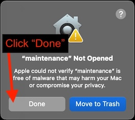
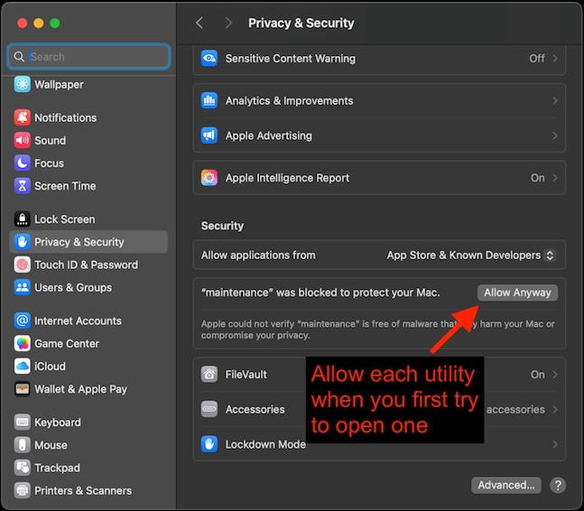
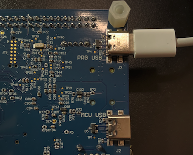

---
# User change
title: "Install Alif SETOOLS"

weight: 4 # 1 is first, 2 is second, etc.

# Do not modify these elements
layout: "learningpathall"
---

1. Navigate to the [Alif SETOOLS download page](https://swrm.alifsemi.com/Content/3.4%20SETOOLS.htm?TocPath=Secure%20Enclave%20Subsystem%7C_____4) and download the zip / achive file for your operating system (Windows, Linux or macOS).

2. When you extract the files from the zip / archive, you will find the below usage instructions in a PDF file named similarly to this one: 

   `AUGD0005-Alif-Security-Toolkit-User-Guide-v1.107.0.pdf `

   * Execute the utilities directly from the command line; example:
     ```bash { output_lines = "2-7" }
     ./maintenance
     # Example output:
     COM ports detected = 3
     -> /dev/cu.wlan-debug  
     -> /dev/cu.debug-console
     -> /dev/cu.Bluetooth-Incoming-Port
     Enter port name:
     ```

  {}

  Allow SETOOLS utilities when you first try to open them:

  

  

  {}

3. The recommended <release-location> installation directories are:
   * Windows: `C:\app-release-exec`
   * Linux: `/home/$USER/app-release-exec-linux`
   * macOS: `/Users/$USER/app-release-exec-macos`

4. Connect the Alif board's `PRG USB` port (on the underside of the board) to your machine via a USB Type-C cable:

   

   * The board should power on, with a LED in the bottom right alternating red-green-blue

     <center>
     <iframe src='/learning-paths/embedded-and-microcontrollers/observing-ethos-u-on-alif/e8-board-connected.mp4' allowfullscreen frameborder=0 width="800" height="400"></iframe>

     *Alif Ensemble E8 Board Connected*
     </center>

5. Update the Alif Ensemble E8 board to the latest System Package release:
   ```bash
   ./updateSystemPackage
   ```
   * You will see output prompting you to connect to a COM port:
     ```bash { output_lines = "1-8" }
     Burning: System Package in MRAM
     ...
     COM ports detected = 4
     -> /dev/cu.wlan-debug  
     -> /dev/cu.debug-console
     -> /dev/cu.Bluetooth-Incoming-Port
     -> /dev/cu.usbmodem0012195566321
     Enter port name:
     ```
   * Enter (copy-paste) the port name that is similar to `/dev/cu.usbmodem0012195566321`:
     ```bash { output_lines = "1-12" }
     Enter port name:/dev/cu.usbmodem0012195566321
     # Example output
     Bootloader stage: SERAM
     [INFO] Detected Device:
     Part# AE822FA0E5597LS0 - Rev: A0
     ...
     Download Image
     alif/SP-AE822FA0E5597LS0-rev-a0-dev.bin[####################]100%: 270400/270400 bytes
     ...
     Download Image
     alif/offset-58-rev-a0-dev.bin   [####################]100%: 16/16 bytes
     ...
     ```
   * You can confirm that you have the correct device by looking for the part number `AE822FA0E5597LS0` in the above `Bootloader` output:
     * `AE822FA0E5597LS0` is the product number of the [Alif Ensemble E8 processor](https://alifsemi.com/ensemble-e8-series/)
     * You can find your processor's serial number (starting with `AE101F`) by going back to the [Overview](/learning-paths/embedded-and-microcontrollers/observing-ethos-u-on-alif/1-overview/) page of this learning path

## Troubleshooting
* If you need to rediscover your USB UART adapter port, just add `-d` to any SETOOLS utility; for example:
  ```bash
  ./updateSystemPackage -d
  ```