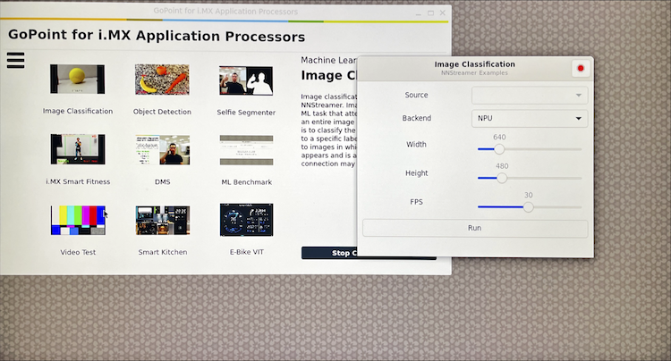

---
# User change
title: "Boot the NXP FRDM i.MX 93 Board"

weight: 3

# Do not modify these elements
layout: "learningpathall"
---

In this section, you will prepare the NXP [FRDM i.MX 93](https://www.nxp.com/design/design-center/development-boards-and-designs/frdm-i-mx-93-development-board:FRDM-IMX93) board for ML development.

## Unbox the NXP Board

Follow NXP's getting started instructions: [Getting Started with FRDM-IMX93](https://www.nxp.com/document/guide/getting-started-with-frdm-imx93:GS-FRDM-IMX93):
* Stop when you complete section "1.6 Connect Power Supply"

## Connect to the NXP Board

Prior to logging in to the NXP board, you need to configure `picocom`. This allows you to connect to the board using a USB cable.

{}

1. Install the Silicon Labs driver:

   https://www.silabs.com/developer-tools/usb-to-uart-bridge-vcp-drivers?tab=downloads
   
2. Install [picocom](https://github.com/npat-efault/picocom):
   ```bash
   brew install picocom
   ```
{}

1. Establish a USB-to-UART (serial) connection:
   - Connect the board's "DEBUG" USB-C connector to your laptop
   - Find the NXP board's USB connections in your computer's terminal:
     ```bash { output_lines = "2-7" }
     ls /dev/tty.*
     # output lines
     ...
     /dev/tty.debug-console
     /dev/tty.usbmodem56D70442811
     /dev/tty.usbmodem56D70442813
     ...
     ```

   - Connect to the NXP board:
     ```bash { output_lines = "2-5" }
     sudo picocom -b 115200 /dev/tty.usbmodem56D70442811
     # output lines
     picocom v3.1
     ...
     Terminal ready
     ```
2. Log in to the NXP board:
   - Connect the board's "POWER" USB-C connector to your laptop
   - At this point you should see one red and one white light on the board
   - Next you should see scrolling text in your `picocom` window, as the NXP board boots
   - The last line should say `login:`
     ```bash { output_lines = "1-9" }
     # output lines
     ...
     [  OK  ] Reached target Graphical Interface.
              Starting Record Runlevel Change in UTMP...
     [  OK  ] Finished Record Runlevel Change in UTMP.

     NXP i.MX Release Distro 6.6-scarthgap imx93frdm ttyLP0

     imx93frdm login: 
     ```

3. [Optional] Troubleshooting:
     - Restart the NXP board, to get to the `login:` prompt:
       - Hold the NXP board's power button for 2-seconds, until the lights turn off
       - Hold the NXP board's power button again for 2-seconds, until the lights turn on

## [Optional] Run the Built-In NXP Demos
* Connect the NXP board to a monitor via HDMI
* Connect a mouse to the NXP board's USB-A port


