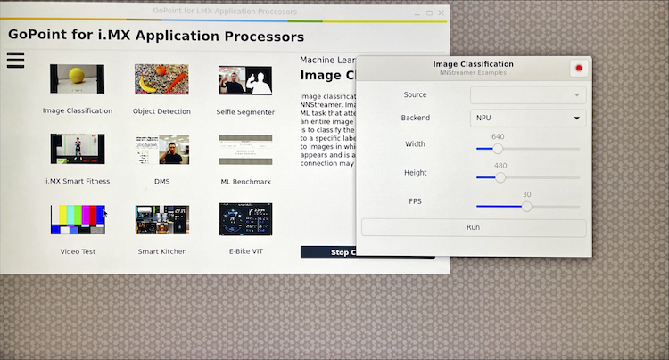

---
# User change
title: "Boot the NXP FRDM i.MX 93 board"

weight: 3

# Do not modify these elements
layout: "learningpathall"
---

This section walks through powering on the board and establishing a serial console connection. If your board is already running Linux and you can log in, skip ahead to the next section.

## Connect to the board

You need a serial terminal to see the boot console and log in.

{}
On macOS as your host, you'll need the following set up before getting started: 

- Install the [Silicon Labs USB-to-UART driver](https://www.silabs.com/developer-tools/usb-to-uart-bridge-vcp-drivers?tab=downloads)
- Install [picocom](https://github.com/npat-efault/picocom)
   ```bash
   brew install picocom
   ```
{}

1. Connect the board's "DEBUG" USB-C connector to your host machine.

2. Find the board's serial device:

   ```bash { output_lines = "2-5" }
   ls /dev/tty.*
   ...
   /dev/tty.usbmodem<SERIAL_ID_1>
   /dev/tty.usbmodem<SERIAL_ID_2>
   ...
   ```

   The exact device names vary per board. Look for entries containing `usbmodem`.

3. Open a serial connection using the first `usbmodem` device:

   ```bash { output_lines = "2-4" }
   sudo picocom -b 115200 /dev/tty.usbmodem<SERIAL_ID_1>
   picocom v3.1
   ...
   Terminal ready
   ```

4. Connect the board's "POWER" USB-C connector to your host machine. You should see a red and a white LED on the board.

5. Wait for the boot log to scroll past in the picocom window. When it finishes, you'll see a login prompt:

   ```output
   NXP i.MX Release Distro 6.6-scarthgap imx93frdm ttyLP0

   imx93frdm login:
   ```

{}
If you miss the login prompt, hold the board's power button for two seconds to power off, then press it again to reboot.
{}

## [Optional] Run the built-in NXP demos

Connect the board to a monitor via HDMI and plug a mouse into the board's USB-A port. NXP includes several ML demos that run out of the box.



## What you've learned and what's next

In this section you've:

- Connected to the board via serial console
- Booted the NXP FRDM i.MX 93 board and confirmed Linux is running
- Verified you can access the login prompt

With the board running and Linux accessible, the next step is setting up the build environment for ExecuTorch.
