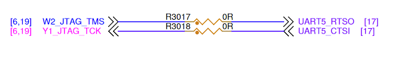
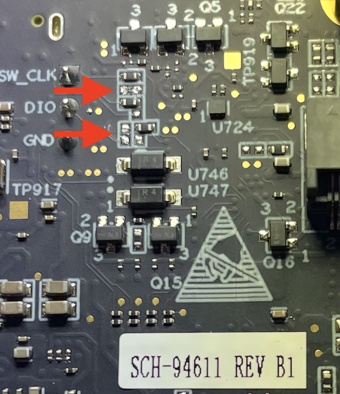

---
# User change
title: "Enable UART5 for Debugging the NXP Board"

weight: 4

# Do not modify these elements
layout: "learningpathall"
---

You will need NXP's [MCU-Link Pro Debug Probe](https://www.nxp.com/design/design-center/software/software-library/mcu-link-pro-debug-probe:MCU-LINK-PRO), in order to deploy ExecuTorch ML models to the [FRDM i.MX 93](https://www.nxp.com/design/design-center/development-boards-and-designs/frdm-i-mx-93-development-board:FRDM-IMX93) board.

## Modifying the NXP Board for Debugging

Follow NXP's getting started instructions: [Getting Started with FRDM-IMX93 and MCU-LINK Pro for M Core Debugging](https://community.nxp.com/t5/i-MX-Processors-Knowledge-Base/Getting-Started-with-FRDM-IMX93-and-MCU-LINK-Pro-for-M-Core/ta-p/2108089):

{}

Step "Install Segger Firmware on MCU-LINK Pro" requires replacing a firmware file, whose macOS location is undocumented:

* On Windows, the firmware location is:
  ```
  C:\nxp\LinkServer_1.6.133\MCU-LINK_installer\probe_firmware
  ```
* On macOS, after installing [LinkServer](https://www.nxp.com/design/design-center/software/development-software/mcuxpresso-software-and-tools-/linkserver-for-microcontrollers:LINKERSERVER), the firmware location will be:
  ```
  /Applications/LinkServer_25.7.33/MCU-LINK_installer/probe_firmware
  ```

{}

* You will need to do soldering in section "Rework the FRDM-IMX93 Board".
* Flip over the boad and remove the glass panel, to gain access to the Bluetooth / UART5 resistors.

<center>
  <video width="800" height="400" controls>
    <source src="/learning-paths/embedded-and-microcontrollers/observing-ethos-u-on-nxp/nxp-board-soldering-location.mp4" type="video/mp4">
    Your browser does not support the video tag.
  </video>
  <br>
  <em>NXP Board Soldering Location</em>
</center>

* Here is a brief explanation of the electical schematic of the two resistors that you need to remove:

  

  * R3017 and R3018 are 0-ohm resistors (i.e., jumpers used for routing).
  * They’re connecting JTAG signals (W2_JTAG_TMS, Y1_JTAG_TCK) to UART5 control lines (RTS and CTS).
  * UART5 is shared with the Bluetooth module, so keeping these jumpers can cause debug conflicts.
  * Removing R3017 and R3018 disables Bluetooth under Linux but allows reliable UART debugging.

* This is what the board looks like, once you have removed the two resistos.



* Complete all of the remaining instructions, to ensure that Visual Studio Code can connect to the NXP debug probe and board.