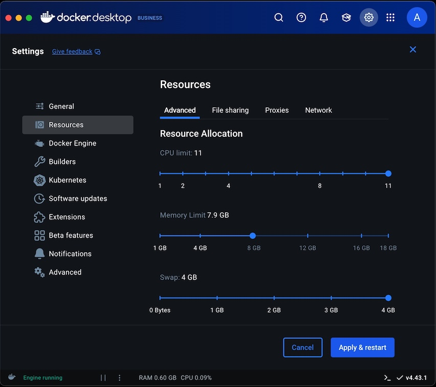

---
# User change
title: "Build ExecuTorch"

weight: 7 # 1 is first, 2 is second, etc.

# Do not modify these elements
layout: "learningpathall"
---

For a full tutorial on building ExecuTorch please see learning path [Introduction to TinyML on Arm using PyTorch and ExecuTorch](/learning-paths/embedded-and-microcontrollers/introduction-to-tinyml-on-arm/)

1. Build and install the `executorch` pip package from Source:

    ```bash
    git submodule sync
    git submodule update --init --recursive
    ./install_executorch.sh
    ```

# Troubleshooting

1. Allocate at least 4 GB of swap space:
   ```bash
   fallocate -l 4G /swapfile
   chmod 600 /swapfile
   mkswap /swapfile
   swapon /swapfile
   ```
   [optional] Deallocate the swap space after you complete this learning path:
   ```bash
   swapoff /swapfile
   rm /swapfile
   ```

   {}

   Increase the "Swap" space in Docker settings to 4 GB: 
   

   {}

2. Kill the `buck2` process:
   ```bash 
   ps aux | grep buck
   pkill -f buck
   ```

3. Clean the build environment and reinitialize all submodules:
   ```bash
   ./install_executorch.sh --clean
   git submodule sync
   git submodule update --init --recursive
   ```

4. Try `install_executorch.sh` again, in development mode:
   ```bash
   ./install_executorch.sh
   ```