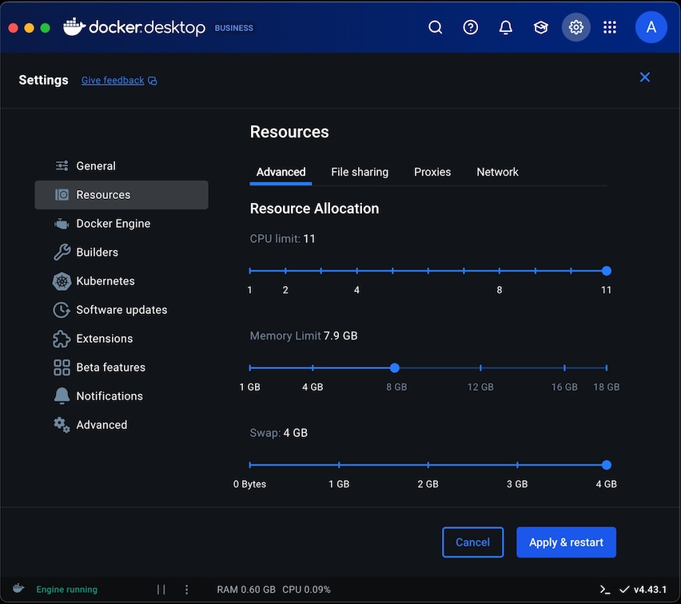

---
# User change
title: "Build ExecuTorch"

weight: 7 # 1 is first, 2 is second, etc.

# Do not modify these elements
layout: "learningpathall"
---

With the ExecuTorch source checked out and your virtual environment active, you can now build ExecuTorch and set up the Arm toolchain for Ethos-U cross-compilation.

For a full tutorial on building ExecuTorch, see the Learning Path [Introduction to TinyML on Arm using PyTorch and ExecuTorch](/learning-paths/embedded-and-microcontrollers/introduction-to-tinyml-on-arm/).

## Install ExecuTorch

Upgrade pip and install build tools:

```bash
pip install --upgrade pip setuptools wheel
```

Build and install the `executorch` pip package:

```bash
./install_executorch.sh
```

After the installation finishes, verify the package is available:

```bash
pip list | grep executorch
```

### Build troubleshooting

If `install_executorch.sh` fails, install the dependencies manually:

```bash
pip install torch torchvision
pip install --no-build-isolation .
pip install --no-build-isolation third-party/ao
```

## Set up the Arm toolchain

Initialize the Arm-specific environment and accept the EULA:

```bash
./examples/arm/setup.sh --i-agree-to-the-contained-eula
```

Source the environment variables:

```bash
source ./examples/arm/ethos-u-scratch/setup_path.sh
```

## Apply the Ethos-U65 patch

As of ExecuTorch 1.0, the Ethos-U65 is not included in the default compile spec. You need to patch `compile_spec.py` to add the U65 target.

Create and run the patch:

```bash
cat > /tmp/patch_u65.py << 'PATCH'
import importlib.util

spec = importlib.util.find_spec("executorch.backends.arm.ethosu.compile_spec")
if spec is None or spec.origin is None:
    raise RuntimeError("Cannot find compile_spec.py. Is executorch installed?")
filepath = spec.origin

with open(filepath, 'r') as f:
    content = f.read()

old_code = '        elif "ethos-u85" in self.target:'
if old_code not in content:
    raise RuntimeError(f"Cannot find U85 config block in {filepath}. File may have changed.")

new_code = '''        elif "ethos-u65" in self.target:
            if system_config is None:
                system_config = "Ethos_U65_High_End"
            if memory_mode is None:
                memory_mode = "Shared_Sram"
        elif "ethos-u85" in self.target:'''

content = content.replace(old_code, new_code)

with open(filepath, 'w') as f:
    f.write(content)

print(f"Patched {filepath}! U65 support added.")
PATCH

python3 /tmp/patch_u65.py
```

Verify the patch by running:

```bash
python3 -c "from executorch.backends.arm.ethosu import EthosUCompileSpec; EthosUCompileSpec(target='ethos-u65-256'); print('U65 OK')"
```

If successful, the output is `U65 OK`.

## Additional troubleshooting

If the build runs out of memory, allocate swap space:

```bash
fallocate -l 4G /swapfile
chmod 600 /swapfile
mkswap /swapfile
swapon /swapfile
```

Deallocate the swap space after you complete this Learning Path (optional):

```bash
swapoff /swapfile
rm /swapfile
```

{}
In Docker Desktop, increase the swap space to 4GB under **Settings > Resources**.


{}

If `buck2` hangs during the build:

```bash
ps aux | grep buck
pkill -f buck
```

To clean the build environment and start fresh:

```bash
./install_executorch.sh --clean
git submodule sync
git submodule update --init --recursive
./install_executorch.sh
```
