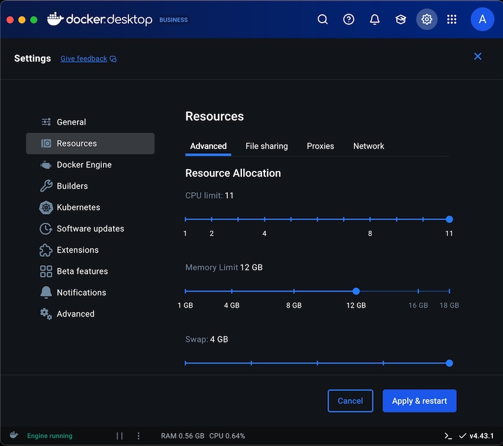

---
# User change
title: "Build the ExecuTorch .pte "

weight: 8 # 1 is first, 2 is second, etc.

# Do not modify these elements
layout: "learningpathall"
---

Embedded systems like the NXP board require two ExecuTorch runtime components: a `.pte` file and an `exeuctor_runner` file.

**ExecuTorch Runtime Files for Embedded Systems**
|Component|Role in Deployment|What It Contains|Why It’s Required|
|---------|------------------|----------------|-----------------|
|**`.pte file`**  (e.g., `mv2_arm_delegate_ethos-u55-256.pte`)|The model itself, exported from ExecuTorch|Serialized and quantized operator graph + weights + metadata|Provides the neural network to be executed|
|**`executor_runner`**  (binary [ELF](https://www.netbsd.org/docs/elf.html) file)|The runtime program that runs the .pte file|C++ application that loads the .pte, prepares buffers, and calls the NPU or CPU backend|Provides the execution engine and hardware access logic|

<style>
.ascii-diagram {
  font-size: 12px; /* Or smaller, like 10px */
  line-height: 1.2;
  font-family: monospace;
  white-space: pre-wrap;
  overflow-x: auto;
}
</style>
<center>
<br>
<pre class="ascii-diagram">
┌───────────────────────────────────────────────────┐
│                                                   │
│                Host Development                   │
│         (e.g., Linux or macOS+Docker)             │
│                                                   │
│  [Model export / compilation with ExecuTorch]     │
│                                                   │
│     ┌───────────────────┐        ┌───────────┐    │
│     │                   │        │           │    │
│     │  executor_runner  │        │  .pte     │    │
│     │  (ELF binary)     │        │ (model)   │    │
│     │                   │        │           │    │
│     └───────────┬───────┘        └─────┬─────┘    │
│                 │                      │          │
└─────────────────┼──────────────────────┼──────────┘
       │ SCP/serial transfer  │
       │                      │
       ▼                      ▼
┌───────────────────────────────────────────────────┐
│                                                   │
│            NXP i.MX93 Embedded Board              │
│                                                   │
│                                                   │
│  ┌───────────────────────────────────────────┐    │
│  │   executor_runner (runtime binary)        │    │
│  │                                           │    │
│  │    ┌───────────────────────────────┐      │    │
│  │    │ Load .pte (model)             │      │    │
│  │    └───────────────┬───────────────┘      │    │
│  │                    │                      │    │
│  │                    ▼                      │    │
│  │    ┌───────────────────────────────┐      │    │
│  │    │ Initialize hardware (CPU/NPU) │      │    │
│  │    └───────────────┬───────────────┘      │    │
│  │                    │                      │    │
│  │                    ▼                      │    │
│  │    ┌───────────────────────────────┐      │    │
│  │    │ Perform inference             │      │    │
│  │    └───────────────┬───────────────┘      │    │
│  │                    │                      │    │
│  │                    ▼                      │    │
│  │    ┌───────────────────────────────┐      │    │
│  │    │ Output results                │      │    │
│  │    └───────────────────────────────┘      │    │
│  └───────────────────────────────────────────┘    │
│                                                   │
└───────────────────────────────────────────────────┘
</pre>
<i>ExecuTorch runtime deployment to an embedded system</i>
</center>

## Accept the Arm End User License Agreement

```bash
export ARM_FVP_INSTALL_I_AGREE_TO_THE_CONTAINED_EULA=True
```

## Set Up the Arm Build Environment

This example builds the [MobileNet V2](https://pytorch.org/hub/pytorch_vision_mobilenet_v2/) computer vision model. The model is a convolutional neural network (CNN) that extracts visual features from an image. It is used for image classification and object detection. The actual Python code for the MobileNet V2 model is in the `executorch` repo: [executorch/examples/models/mobilenet_v2/model.py](https://github.com/pytorch/executorch/blob/main/examples/models/mobilenet_v2/model.py).

You can read a detail explanation of the build steps here: [ARM Ethos-U Backend](https://docs.pytorch.org/executorch/stable/backends-arm-ethos-u.html).

1. Run the steps to set up the build environment: 
    
   ```bash
   ./examples/arm/setup.sh \
     --target-toolchain arm-none-eabi-gcc
   ```
  
2. Update your environment:
   ```bash
   source examples/arm/ethos-u-scratch/setup_path.sh
   ```

## Build the ExecuTorch .pte
Now you will build the `.pte` file, that will be used on the NXP board.

1. Build the [MobileNet V2](https://pytorch.org/hub/pytorch_vision_mobilenet_v2/) ExecuTorch `.pte` runtime file using [aot_arm_compiler](https://github.com/pytorch/executorch/blob/2bd96df8de07bc86f2966a559e3d6c80fc324896/examples/arm/aot_arm_compiler.py):

   ```bash
      python3 -m examples.arm.aot_arm_compiler \
         --model_name="mv2" \
         --quantize \
         --delegate \
         --debug \
         --target ethos-u55-256

   ```

{}
| Flag                     | Meaning                                             |
| ------------------------ | --------------------------------------------------- |
| `--model_name="mv2"`     | Example model: MobileNetV2 (small, efficient)       |
| `--quantize`             | Enables int8 quantization (required for Ethos-NPUs) |
| `--delegate`             | Enables offloading layers to the Ethos backend      |
| `--debug`                | Verbose build output                                |
| `--target ethos-u55-256` | Targets the Ethos-U55      |

The `--quantize` flag uses one input example, so the resulting model will likely have poor classification performance.
{}

3. Check that the `mv2_arm_delegate_ethos-u55-256.pte` file was generated:
   
   ```bash
   ls mv2_arm_delegate_ethos-u55-256.pte
   ```

## Troubleshooting
**`setup.sh`**
- If you see the following error in the `setup.sh` output:
  ```bash { output_lines = "1-2" }
  Failed to build tosa-tools-v0.80
  ERROR: Could not build wheels for tosa-tools-v0.80, which is required to install pyproject.toml-based projects
  ```
  then:
  1. Increase the swap space to 8 GB:
     ```bash
     fallocate -l 8G /swapfile
     chmod 600 /swapfile
     mkswap /swapfile
     swapon /swapfile
     ```
     - [optional] Deallocate the swap space after you complete this learning path:
        ```bash
        swapoff /swapfile
        rm /swapfile
        ```

  {}
  Increase the "Memory Limit" in Docker settings to 12 GB: 
  

  {}

  2. Re-run `setup.sh`
     ```bash
     ./examples/arm/setup.sh --i-agree-to-the-contained-eula
     ```

- If you see the following error in the `setup.sh` output:
  ```bash { output_lines = "1-2" }
  Failed to build tosa-tools
  ERROR: Failed to build installable wheels for some pyproject.toml based projects (tosa-tools)
  ```
  then do the below troubleshooting steps.
   1. Install any missing build tools:
      ```bash
      apt update && apt install -y \
         cmake \
         build-essential \
         ninja-build \
         python3-dev \
         libboost-all-dev
      ```
   2. Re-run `setup.sh`
      ```bash
      ./examples/arm/setup.sh --i-agree-to-the-contained-eula
      ```
- If you see the following error in the `setup.sh` output:
   ```bash { output_lines = "1-8" }
   ...
   ERROR: pip's dependency resolver does not currently take into account all the packages that are installed. This behaviour is the source of the following dependency conflicts.
   tosa-tools 0.80.2.dev1+g70ed0b4 requires jsonschema, which is not installed.
   tosa-tools 0.80.2.dev1+g70ed0b4 requires flatbuffers==23.5.26, but you have flatbuffers 24.12.23 which is incompatible.
   tosa-tools 0.80.2.dev1+g70ed0b4 requires numpy<2, but you have numpy 2.3.1 which is incompatible.
   ...
   ```
   then just re-run `setup.sh`
   ```bash
   ./examples/arm/setup.sh --i-agree-to-the-contained-eula