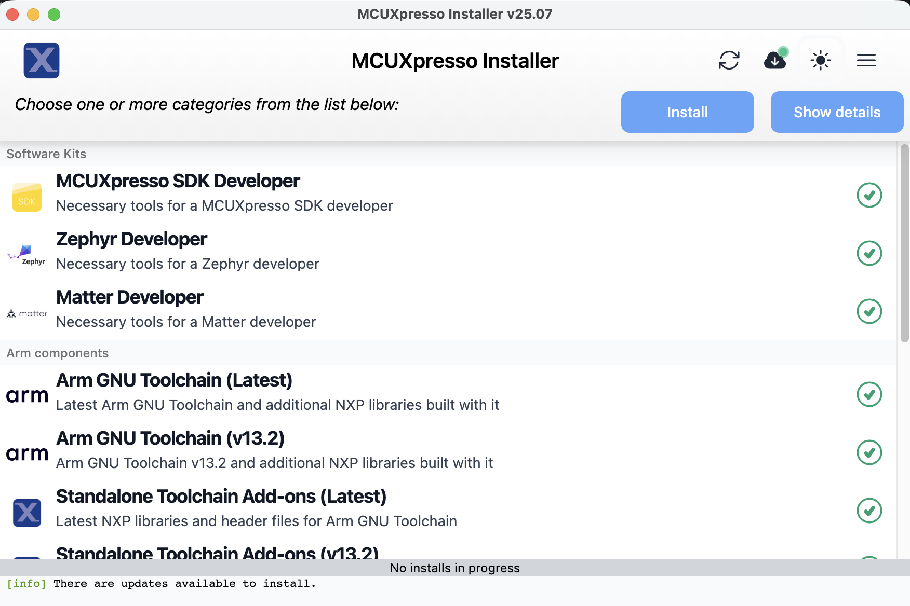
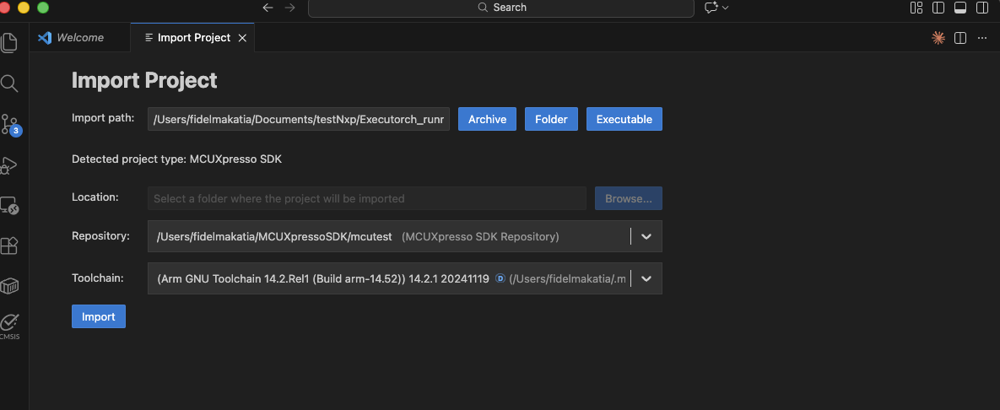
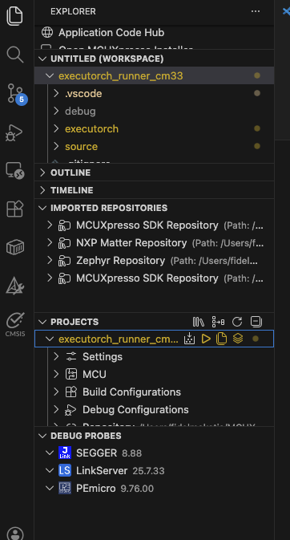

You build the Cortex-M33 `executor_runner` firmware on your host machine, then deploy it to the FRDM i.MX 93 board.

This is the core milestone of the Learning Path.
On i.MX 93, Linux runs on the application cores, but the real-time ML runtime that talks to Ethos-U65 runs as **firmware on Cortex-M33**.
When you can build and boot your own `executor_runner`, you've proven that the microcontroller side of the system is under your control and ready to host ML workloads.

The project includes prebuilt ExecuTorch static libraries in the repository, so this section focuses on pulling the runner project, applying the required SDK patches, wiring it up to your toolchain, and building it.

In architectural terms:

- The application core (Linux) loads the firmware image and manages its lifecycle
- The Cortex-M33 firmware owns model execution and the delegate path into Ethos-U65
- The `.pte` model remains a separate artifact that you update independently

## Set up MCUXpresso for VS Code

Install the [MCUXpresso extension for VS Code](https://marketplace.visualstudio.com/items?itemName=NXPSemiconductors.mcuxpresso).

In VS Code, open **Extensions**, search for "MCUXpresso", and install the extension published by NXP.

## Install MCUXpresso SDK and Arm toolchain

Use the MCUXpresso Installer to install the SDK and toolchain components.

In VS Code, open the Command Palette and run **MCUXpresso for VS Code: Open MCUXpresso Installer**. Select the following items, then select **Install**:

- **MCUXpresso SDK Developer** (under Software Kits)
- **Arm GNU Toolchain (Latest)** (under Arm components)
- **Standalone Toolchain Add-ons (Latest)** (under Arm components)



## Clone the executor_runner repository

Clone the ready-to-build executor_runner project:

```bash
git clone https://github.com/fidel-makatia/Executorch_runner_cm33.git
cd Executorch_runner_cm33
```

The repository contains the complete runtime source code, pre-built ExecuTorch libraries, and build configuration for Cortex-M33 with Ethos-U65 NPU support.

## Configure the project for FRDM-MIMX93

Open the project in VS Code:

```bash
code .
```

If the MCUXpresso extension doesn't automatically pick up the project, import it:

1. Open the Command Palette
2. Run **MCUXpresso for VS Code: Import Project**
3. Select the `Executorch_runner_cm33` folder
4. When prompted, choose **Arm GNU Toolchain**



## Set environment variables

Set three environment variables so the build can find your toolchain, your SDK, and the MCUXpresso Python environment. These must be set before building or running the SDK patch script.

Do this once for your user account, then restart VS Code so the changes take effect.

### Required variables

| Variable | Description |
|----------|-------------|
| `ARMGCC_DIR` | Path to the Arm GCC toolchain root, i.e. a directory starting with `arm-gnu-toolchain-14.2.rel1*` |
| `SdkRootDirPath` | Path to the folder that contains the `mcuxsdk/` subdirectory |
| `MCUX_VENV_PATH` | Path to the MCUXpresso Python venv executables |

Find the installed toolchain directory name:



ls ~/.mcuxpressotools/arm-gnu-toolchain-*


dir $env:USERPROFILE\.mcuxpressotools\arm-gnu-toolchain-*



Use the directory name from the output for the `ARMGCC_DIR` variable below. The name looks like `arm-gnu-toolchain-14.2.rel1-darwin-arm64-arm-none-eabi` (the version number may differ).



export ARMGCC_DIR="$HOME/.mcuxpressotools/<toolchain-dir>"
export SdkRootDirPath="$HOME/mcuxsdk_root"
export MCUX_VENV_PATH="$HOME/.mcuxpressotools/.venv/bin"


[Environment]::SetEnvironmentVariable("ARMGCC_DIR", "$env:USERPROFILE\.mcuxpressotools\<toolchain-dir>", "User")
[Environment]::SetEnvironmentVariable("SdkRootDirPath", "$env:USERPROFILE\mcuxsdk_root", "User")
[Environment]::SetEnvironmentVariable("MCUX_VENV_PATH", "$env:USERPROFILE\.mcuxpressotools\.venv\Scripts", "User")



These quick checks catch most path mistakes before you start debugging build errors:



test -x "$ARMGCC_DIR/bin/arm-none-eabi-gcc" && echo "OK: toolchain" || echo "FAIL: ARMGCC_DIR"
test -d "$SdkRootDirPath/mcuxsdk" && echo "OK: SDK" || echo "FAIL: SdkRootDirPath"


if (Test-Path "$env:ARMGCC_DIR\bin\arm-none-eabi-gcc.exe") { "OK: toolchain" } else { "FAIL: ARMGCC_DIR" }
if (Test-Path "$env:SdkRootDirPath\mcuxsdk") { "OK: SDK" } else { "FAIL: SdkRootDirPath" }



## Apply required SDK patches

The MCUXpresso SDK ships with a linker script and an Ethos-U driver log header that need two fixes before the firmware can run correctly. The patch script in the repository reads `SdkRootDirPath` to locate your SDK and applies both fixes automatically.

Using a `bash` shell, navigate to the `Executorch_runner_cm33` directory and run:

```bash
./patches/apply_patches.sh
```

You should see output confirming each patch:

```output
=== ExecuTorch Runner SDK Patches ===

[1/2] Linker script GOT fix: .../MIMX9352xxxxM_ram.ld
  APPLIED: Added *(.got) and *(.got.plt) inside .data section.

[2/2] Ethos-U driver log redirect: .../ethosu_log.h
  APPLIED: LOG_ERR/LOG_WARN/LOG_INFO/LOG_DEBUG now write to remoteproc trace buffer.

=== All patches applied successfully ===
```

The two patches and what they fix:

| Patch | What it changes | What happens without it |
|-------|----------------|------------------------|
| **GOT initialization** | Adds `*(.got)` and `*(.got.plt)` inside the `.data` section of the SDK linker script so the startup code copies the Global Offset Table from flash to RAM | The GOT stays zeroed out after boot. Every C++ virtual call resolves to address zero, causing a **BUS FAULT** the first time the firmware calls `load_method` |
| **NPU log redirect** | Replaces the Ethos-U driver's `LOG_ERR`/`LOG_INFO` macros so they write to the remoteproc trace buffer instead of the UART | NPU error messages go to UART only. When you read `trace0` from Linux, driver errors are invisible, making NPU failures difficult to diagnose |

{}
Run the patch script once after installing the SDK. If you run it again, the script detects that the patches are already in place and skips them. If you reinstall or update the SDK, run the script again.
{}

## Pre-built ExecuTorch libraries

The repository includes pre-built static libraries in `executorch/lib/`, cross-compiled for Cortex-M33 with size optimization (`-Os`, MinSizeRel):

| Library | Size | Purpose |
|---------|------|---------|
| `libexecutorch.a` | 52KB | ExecuTorch runtime |
| `libexecutorch_core.a` | 217KB | Core runtime (gc-sections removes unused code) |
| `libexecutorch_delegate_ethos_u.a` | 19KB | Ethos-U NPU delegate backend |
| `libquantized_ops_lib_selective.a` | 7KB | Registers only `quantize_per_tensor.out` and `dequantize_per_tensor.out` |
| `libquantized_kernels.a` | 242KB | Kernel implementations (gc-sections removes unused code) |
| `libkernels_util_all_deps.a` | 308KB | Kernel utilities (gc-sections removes unused code) |

{}
The selective quantized ops library registers only the two CPU operators needed at the NPU delegation boundary. The full `libquantized_ops_lib.a` registers all quantized operators and pulls in approximately 92KB of kernel code, which overflows the 128KB ITCM. If you rebuild the libraries from source, you must build this selective library separately.
{}

## Understand the memory configuration

The Cortex-M33 has 128KB of ITCM (code) and 108KB of DTCM (data). The firmware also uses reserved DDR regions for the model and NPU working memory. The key settings are defined in `CMakeLists.txt`:

```cmake
target_compile_definitions(${MCUX_SDK_PROJECT_NAME} PRIVATE
  ET_ARM_BAREMETAL_METHOD_ALLOCATOR_POOL_SIZE=0x6000      # 24KB method allocator
  ET_ARM_BAREMETAL_SCRATCH_TEMP_ALLOCATOR_POOL_SIZE=0x200000  # 2MB scratch allocator
  ET_MODEL_PTE_ADDR=0xC0000000  # DDR address where U-Boot loads the .pte model
)
```

| Setting | Value | Description |
|---------|-------|-------------|
| Method allocator | 24KB (`0x6000`) | Method metadata and small model activations |
| Scratch allocator | 2MB (`0x200000`) | NPU scratch buffer (MobileNet V2 needs approximately 1.5MB) |
| Model address | `0xC0000000` | Start of the 4MB reserved DDR region |

{}
The i.MX93 device tree reserves two DDR regions: `model@c0000000` (4MB for the `.pte` model) and `ethosu_region@A8000000` (128MB for NPU working memory). The NPU scratch buffer is placed at `0xA8000000` and planned buffers for large models at `0xA8200000`, both inside the 128MB ethosu_region. The Ethos-U65 accesses memory via the AXI bus and cannot reach the CM33's tightly-coupled DTCM, so all NPU buffers must be in DDR.
{}

## Build the firmware

Build the project from VS Code. In the left sidebar, open **Explorer**, then in the MCUXpresso **Projects** view select the build icon next to `executorch_runner_cm33`.



The build output shows the progress:

```output
[build] Scanning dependencies of target executorch_runner_cm33.elf
[build] [ 25%] Building CXX object source/arm_executor_runner.cpp.obj
[build] [ 50%] Building CXX object source/arm_memory_allocator.cpp.obj
[build] [ 75%] Linking CXX executable executorch_runner_cm33.elf
[build] [100%] Built target executorch_runner_cm33.elf
[build] Build finished with exit code 0
```

Verify the memory usage to ensure the firmware fits in the Cortex-M33:

```output
Memory region         Used Size  Region Size  %age Used
    m_interrupts:        1140 B       1144 B     99.65%
          m_text:      103476 B     129928 B     79.64%
          m_data:       61984 B       108 KB     56.05%
```

The text section uses approximately 80% of the 128KB ITCM, and data uses approximately 56% of the 108KB DTCM.

You now have everything you need to deploy the `.elf` binary on your NXP board.

{}
**SDK patches not applied:**

If you see a BUS FAULT during `load_method` or vtable corruption errors, the GOT linker script patch has not been applied. Run:

```bash
./patches/apply_patches.sh
```

Then rebuild the project.

**Region `m_text` overflowed:**

The 128KB ITCM is nearly full. Verify that `CMakeLists.txt` links `libquantized_ops_lib_selective.a` (not the full `libquantized_ops_lib.a`). The selective library registers only the two operators needed for NPU delegation.

**`resolve_operator` error for `quantized_decomposed::*`:**

The quantized operator kernels are not linked. Verify that `CMakeLists.txt` links `libquantized_ops_lib_selective.a` with `--whole-archive` and that `libquantized_kernels.a` and `libkernels_util_all_deps.a` are also listed.

{}

With the firmware binary built and its memory usage verified, you're ready to deploy it to the FRDM i.MX 93 and run your first inference.