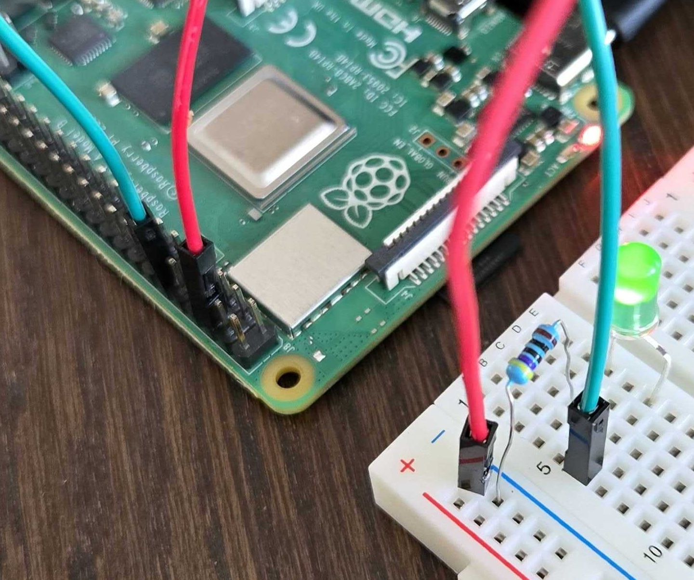

The next step is to test the GPIO functionality. In this section, you will configure a LED light to simulate a smart-home device.

## Verify GPIO Functionality

Bring out your electronics components. Connect the anode (long leg) of an LED in series with a 220Ω resistor to GPIO 17 (physical pin 11). Connect the cathode (short leg) to a ground (GND) pin. See image below for the full setup:



Create a Python script named `testgpio.py`:

```bash
cd $HOME/smart-home
vim testgpio.py
```

Copy this code into the file:

```python
#!/usr/bin/env python3
import time
from gpiozero import Device, LED
from gpiozero.pins.lgpio import LGPIOFactory

# Set lgpio backend for Raspberry Pi 5
Device.pin_factory = LGPIOFactory()

# Setup GPIO pin 17
pin1 = LED(17)

try:
    while True:
        pin1.toggle()  # Switch pin 17 state
        time.sleep(2)  # Wait 2 seconds
except KeyboardInterrupt:  # Ctrl+C pressed
    pin1.close()  # Clean up pin 17
```

Run the script:

```bash
python testgpio.py
```

The LED should blink every two seconds. If you observe this behavior, your GPIO setup works correctly.

{}
If you run into issues with the hardware setup, here are some things to check:
- Try fixing missing dependencies by running the following command:
```bash
sudo apt-get install -f
```
- If you're running into GPIO permission issues, run Python scripts with `sudo` or add your user to the `gpio` group. Don't forget to log out for the changes to take effect.
```bash
sudo usermod -a -G gpio $USER
```
- Double-check wiring and pin numbers using the Raspberry Pi 5 pinout diagram
- Ensure proper LED and resistor connections
- Verify GPIO enablement in `raspi-config` if needed
- Use a high-quality power supply
{}

With a way to control devices using GPIO pins, you can move on to the next section to interact with them using language models and the user interface.