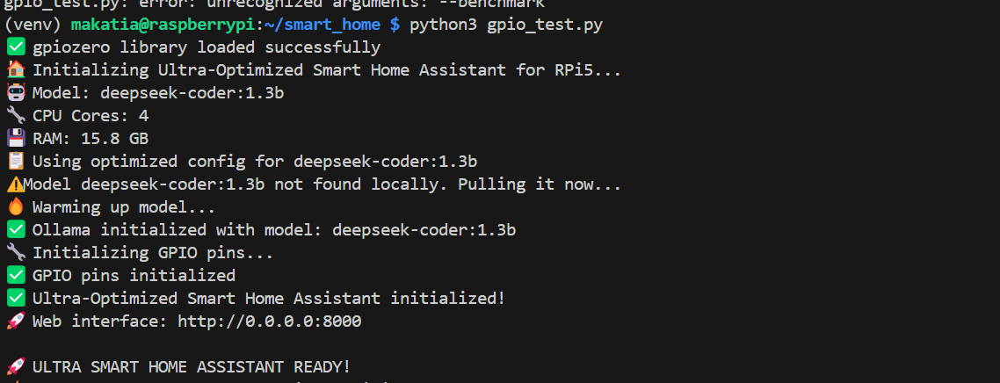
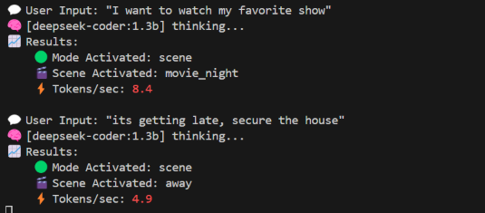

## Understand the Smart Home Assistant

In this section, you will run the assistant through the `smart_home_assistant.py` script. It initializes all configured smart devices on specific GPIO pins and starts a local web server for interacting with the assistant. The script processes user commands using a local language model (via Ollama), parses the model’s JSON output, and executes actions such as toggling lights or locking doors. It supports both terminal and web-based control.

The assistant is available on GitHub. Clone the code and navigate to the project directory:

```bash
git clone https://github.com/fidel-makatia/EdgeAI_Raspi5.git
cd EdgeAI_Raspi5
```

## Connect additional smart home hardware on Raspberry Pi GPIO pins

In the previous section, you configured a LED on GPIO pin 17. The smart home assistant is by default associating this with a `living_room_light` device. The single LED setup is enough to run through this Learning Path. If you'd like to connect actual devices, or play with more mock sensors, the default configuration looks like the table below. You can repeat the steps on the previous page to verify the hardware setup on the different GPIO pins. See the image below for an example.

| Device Name       | GPIO Pin | Type      | Room        |
| ----------------- | -------- | --------- | ----------- |
| living_room_light | 17       | LIGHT     | living_room |
| living_room_fan   | 27       | FAN       | living_room |
| smart_tv          | 22       | SMART_TV  | living_room |
| bedroom_light     | 23       | LIGHT     | bedroom     |
| bedroom_ac        | 24       | AC        | bedroom     |
| kitchen_light     | 5        | LIGHT     | kitchen     |
| front_door_lock   | 26       | DOOR_LOCK | entrance    |
| garden_light      | 16       | LIGHT     | outdoor     |

{}
The code uses gpiozero with lgpio backend for Raspberry Pi 5 compatibility. You can use compatible output devices such as LEDs, relays, or small loads connected to these GPIO pins to represent actual smart home devices. All pin assignments are optimized for the Raspberry Pi 5's GPIO layout.
{}

, a red LED, push button, and a sensor module.")

This setup illustrates a simulated smart home with controllable devices.

## Run the Smart Home Assistant

Run the assistant in different modes depending on your use case. The default model is `deepseek-coder:1.3b`:



python3 smart_home_assistant.py


python3 smart_home_assistant.py --model qwen:0.5b


python3 smart_home_assistant.py --port 8080


python3 smart_home_assistant.py --no-api



## Command options

| Option            | Description                                                                                       | Example                                    |
|------------------|---------------------------------------------------------------------------------------------------|--------------------------------------------|
| `--model`         | Specify the model to use with Ollama             | `--model tinyllama:1.1b`                   |
| `--port`          | Run the web server on a custom port (default: `8000`)                                            | `--port 8080`                              |
| `--no-api`        | Disable the web API and run in CLI-only mode

If everything is set up correctly, you should see the following output on running the default command:



## Interact with your assistant

Try asking the assistant to `turn on living room light`. If you've connected additional devices, come up with prompts to test the setup.

## Web interface

Open your browser and navigate to `http://0.0.0.0:8000`, or as printed in the terminal output.


## Command line interface

Type commands directly in the terminal.

Sample commands:

```bash
turn on living room light
I want to watch my favorite show
its getting late, secure the house
```



{}
If you're running into issues with the assistant, here are some things to check:
- Make sure your virtual environment is activated and that you installed all the packages from previous sections
- For model loading problems, check if Ollama is running and list available models:
  ```bash
  ollama list
  ollama serve
  ```
- If port 8000 is unavailable, run the assistant with a different port using the `--port` flag.
{}

## Wrap up

From here, you can modify the `smart_home_assistant.py` and extend the system by adding more devices, experimenting with conversational commands, or integrating sensors and automation logic into your smart home setup.

You should now know more about setting up a Raspberry Pi 5 to control real-world devices using GPIO pins, and running a smart home assistant powered by local language models through Ollama. You’ve learned how to wire basic circuits with LEDs and resistors to simulate smart devices, and how to launch and interact with the assistant through both the command-line interface and a web dashboard. Along the way, you also explored common troubleshooting steps for GPIO access, missing dependencies, and model loading issues.
