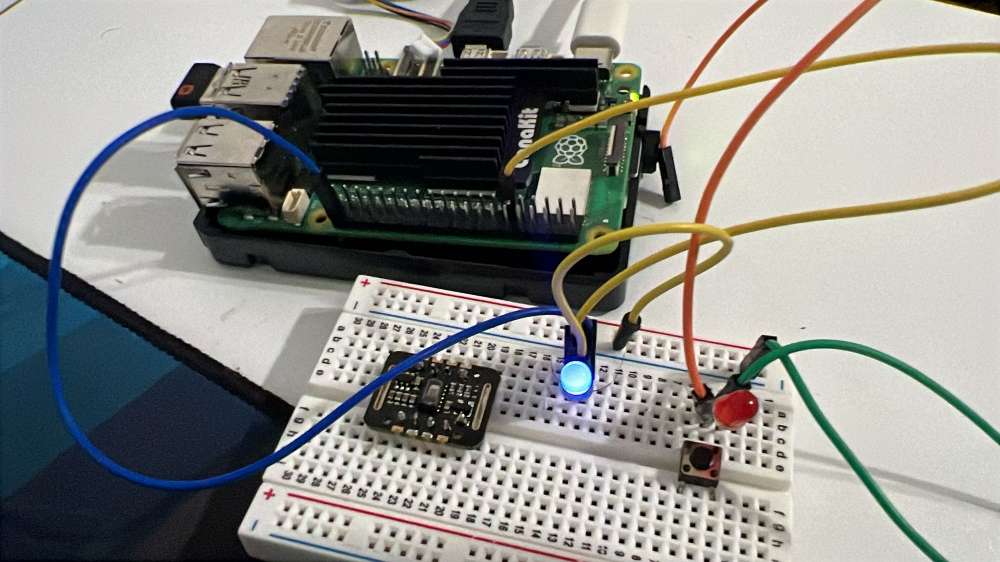
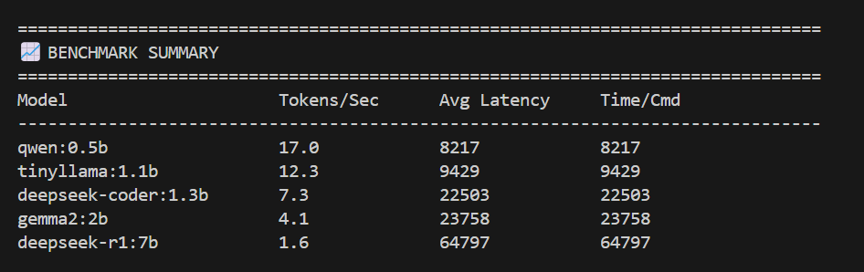

# Run the Smart Home Assistant on Raspberry Pi 5

Set up and launch your smart home GenAI assistant on your Raspberry Pi 5. This code has been specifically adapted for the Raspberry Pi 5 with 16GB RAM.

{}
This guide assumes you have installed Python, all required dependencies, and Ollama as described in the previous steps.
{}

## Clone the Repository

Deactivate your virtual environment if you created one earlier:

```bash
deactivate
```

Clone the repository and navigate to the project directory:

```bash
git clone https://github.com/fidel-makatia/EdgeAI_Raspi5.git
cd EdgeAI_Raspi5
```

## Activate Your Virtual Environment (Optional)

If you created a Python virtual environment earlier, activate it:

```bash
source venv/bin/activate
```

## Connect Your Hardware

Configure the following GPIO pin assignments for the Raspberry Pi 5. You do not need to connect all pins for initial testing. Using LEDs to simulate each device is acceptable and simplifies setup.

| Device Name       | GPIO Pin | Type      | Room        |
| ----------------- | -------- | --------- | ----------- |
| living_room_light | 17       | LIGHT     | living_room |
| living_room_fan   | 27       | FAN       | living_room |
| smart_tv          | 22       | SMART_TV  | living_room |
| bedroom_light     | 23       | LIGHT     | bedroom     |
| bedroom_ac        | 24       | AC        | bedroom     |
| kitchen_light     | 5        | LIGHT     | kitchen     |
| front_door_lock   | 26       | DOOR_LOCK | entrance    |
| garden_light      | 16       | LIGHT     | outdoor     |

{}
The code uses gpiozero with lgpio backend for Raspberry Pi 5 compatibility. You can use compatible output devices such as LEDs, relays, or small loads connected to these GPIO pins to represent actual smart home devices. All pin assignments are optimized for the Raspberry Pi 5's GPIO layout.
{}



## Run the Smart Home Assistant

Run the assistant in different modes depending on your use case. The default model is deepseek-coder:1.3b:



python3 smart_home_assistant.py


python3 smart_home_assistant.py --model qwen:0.5b


python3 smart_home_assistant.py --port 8080


python3 smart_home_assistant.py --no-api



**Command Options**

**Default:** Runs the application using the default model and starts both web server and CLI.

**Specify Model:** Use --model <model-name> to select a specific model (e.g., tinyllama:1.1b, gemma2:9b, deepseek-coder:1.3b).

**Custom Web Port:** Use --port <port-number> to run the web server on a different port (default is 8000).

**CLI Only:** Use --no-api to disable the web API and use only the command-line interface.


## Interact With Your Assistant

**Web Interface:** Open your browser and navigate to **http://your-raspi5-ip:5000** (or your chosen port).

**CLI Mode:** Type commands directly in the terminal.

Sample commands:

```bash
turn on living room light
I want to watch my favorite show
its getting late, secure the house
```


## Model Performance Benchmarks on Raspberry Pi 5 16GB RAM



| Model               | Tokens/Sec | Avg Latency (ms) | Performance Rating   |
| ------------------- | ---------- | ---------------- | -------------------- |
| qwen:0.5b           | 17.0       | 8,217            | ⭐⭐⭐⭐⭐ Excellent |
| tinyllama:1.1b      | 12.3       | 9,429            | ⭐⭐⭐⭐⭐ Excellent |
| deepseek-coder:1.3b | 7.3        | 22,503           | ⭐⭐⭐⭐ Very Good   |
| gemma2:2b           | 4.1        | 23,758           | ⭐⭐⭐⭐ Very Good   |
| deepseek-r1:7b      | 1.6        | 64,797           | ⭐⭐⭐ Good          |

**Performance Insights:**

- Qwen 0.5B and TinyLlama 1.1B provide optimal performance for real-time smart home commands
- DeepSeek-Coder 1.3B and Gemma2 2B handle complex automation tasks effectively
- DeepSeek-R1 7B offers advanced reasoning capabilities with acceptable latency

The 16GB RAM allows smooth operation of all models while maintaining system responsiveness.

## Raspberry Pi 5 Specific Features

**16GB RAM Support:** Takes advantage of the full 16GB RAM for enhanced model performance

**lgpio Backend:** Uses the modern lgpio library for reliable GPIO control

**Optimized Performance:** Code optimized for the Raspberry Pi 5's ARM Cortex-A76 quad-core processor

**Enhanced Stability:** Improved GPIO handling prevents conflicts with other system processes

## Troubleshooting

**Missing packages:** Ensure you activated your virtual environment and installed requirements:

```bash
pip install gpiozero lgpio ollama
```

**GPIO errors:** Verify lgpio backend installation:

```bash
sudo apt update
sudo apt install python3-lgpio
```

**Model loading issues:** Check Ollama status and available models:

```bash
ollama list
ollama serve
```

**Port conflicts:** Specify a different port with --port if the default port is in use.

**GPIO permission issues:** Add your user to the gpio group:

```bash
sudo usermod -a -G gpio $USER
# Log out and log in again for changes to take effect
```
