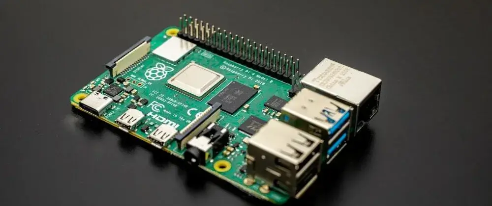

---
# User change
title: "Introduction to the Raspberry Pi 4" 

weight: 2 # 1 is first, 2 is second, etc.

# Do not modify these elements
layout: "learningpathall"
---

Raspberry Pi products have made a significant impact in many areas of computing. In 2022, the Raspberry Pi was hailed as the [most successful computer ever created in the UK](https://www.cam.ac.uk/stories/raspberrypi). More than 40 million boards have shipped during the first 10 years.

Software developers use the Raspberry Pi 4 to prototype embedded Linux and IoT projects. The architecture compatibility between the Raspberry Pi 4 and Arm cloud instances make a good combination for developers. Developers are interested to compare and contrast Arm cloud virtual machines with single board computers such as the Raspberry Pi 4. 

This Learning Path introduces the Raspberry Pi 4 using a few common developer tasks as examples. It also compares and contrasts the Raspberry Pi 4 with Arm cloud instances. 

## Raspberry Pi 4 hardware specs

Here are the Raspberry Pi 4 specifications.

- SoC: Broadcom BCM2711B0 quad-core A72 (ARMv8-A) 64-bit @ 1.5GHz
- GPU: Broadcom VideoCore VI 	
- Networking: 2.4 GHz and 5 GHz 802.11b/g/n/ac wireless LAN
- RAM: 1GB, 2GB, or 4GB LPDDR4 SDRAM 
- Bluetooth: Bluetooth 5.0, Bluetooth Low Energy (BLE) 		
- GPIO: 40-pin GPIO header, populated
- Storage: microSD
- Ports: 2 × micro-HDMI 2.0, 3.5 mm analogue audio-video jack, 2 × USB 2.0, 2 × USB 3.0, Gigabit Ethernet, Camera Serial Interface (CSI), Display Serial Interface (DSI)

In many ways the Raspberry Pi 4 looks like a regular Arm Linux computer. Recent performance increases, dual-monitor support, and the Raspberry Pi 400 kit make it a suitable desktop computer for many use cases. 

In other ways, the Raspberry Pi 4 looks more like a single board computer for embedded systems. It has GPIO pins for connecting to extra hardware and has inspired people around the world to create thousands of unique projects.

