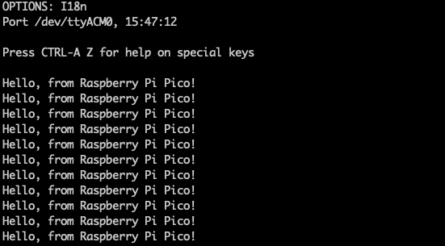

---
# User change
title: "How do I run Hello World for Raspberry Pi Pico?"

weight: 3 # 1 is first, 2 is second, etc.

# Do not modify these elements
layout: "learningpathall"
---

The first program to run on the Pico both prints "Hello" and blinks an LED.

The print statements are directed to USB.

## How do I build "hello" for Raspberry Pi Pico?

Save the C code below to a file named `hello.c`

```c
#include <stdio.h>
#include "pico/stdlib.h"

int main()
{
    const uint LED_PIN = PICO_DEFAULT_LED_PIN;

    gpio_init(LED_PIN);
    gpio_set_dir(LED_PIN, GPIO_OUT);

    stdio_init_all();

    while (true)
    {
        printf("Hello, from Raspberry Pi Pico!\n");
        gpio_put(LED_PIN, 1);
        sleep_ms(500);
        gpio_put(LED_PIN, 0);
        sleep_ms(500);
    }

    return 0;
}
```

The Pico SDK uses cmake. Save the information below as `CMakeLists.txt`

```cmake
cmake_minimum_required(VERSION 3.18)

include($ENV{PICO_SDK_PATH}/external/pico_sdk_import.cmake)

project(hello C CXX ASM)
set(CMAKE_C_STANDARD 11)

pico_sdk_init()

add_executable(${PROJECT_NAME}
            ${PROJECT_NAME}.c
        )

# pull in common dependencies
target_link_libraries(${PROJECT_NAME} pico_stdlib)

# enable usb or uart output
pico_enable_stdio_usb(${PROJECT_NAME} 1)
pico_enable_stdio_uart(${PROJECT_NAME} 0)

# create map/bin/hex/uf2 file etc.
pico_add_extra_outputs(${PROJECT_NAME})
```

Create a new directory for the build output and navigate to it.

```bash
mkdir build ; cd build
```

Build the application.

```bash
cmake -DCMAKE_BUILD_TYPE=Debug  ..
make
```

The hello application is now ready to run.

## How do I run "hello" for Raspberry Pi Pico?

To run, hold down the BOOTSEL button on the Raspberry Pi Pico and plug in the USB cable between the Pico and your development computer. 

The Pico will appear as a USB storage device on your computer. 

When developing on a Raspberry Pi OS or Ubuntu, the Pico appears in `/media/$HOME/RPI-RP2`

Copy the executable (in uf2 format) to the Pico.

```bash
cp hello.uf2 /media/$USER/RPI-RP2/
```

After copying the file the Pico disappears as a storage device and the hello program starts running. 

The LED on the Pico will start blinking as specified in hello.c. 

The print statement with the hello string is directed to USB serial. 

Connect to USB serial using minicom. 

For a Raspberry Pi or Ubuntu development computer the USB device to connect to is /dev/ttyACM0

```bash
sudo minicom -b 115200 -o -D /dev/ttyACM0
```

The terminal will show the output of the hello string.




