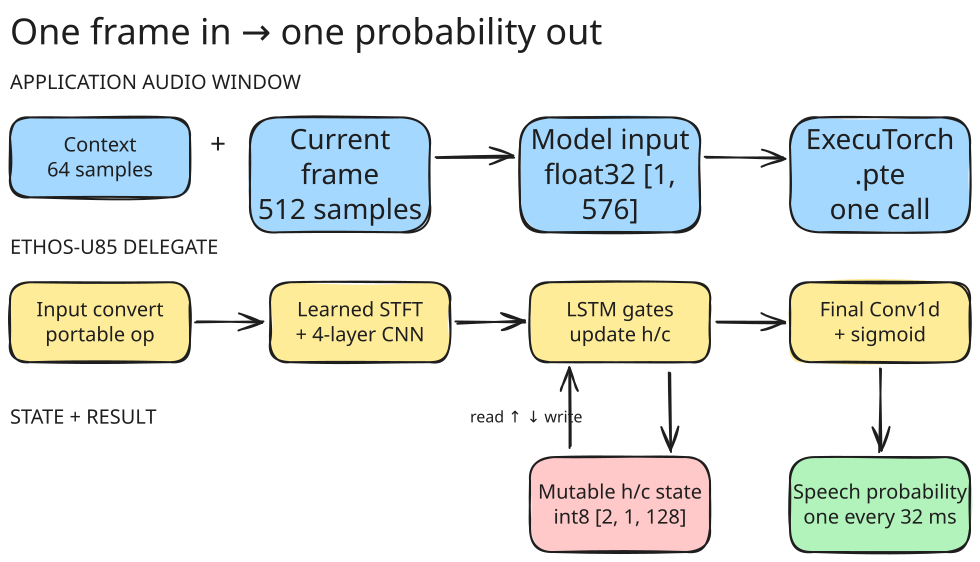

## Export the model

You prepared the model and two audio clips on the previous page. Now use the calibration clip to quantize Silero VAD and the validation clip to create a host reference.

From the ExecuTorch repository root, activate the environment and run the exporter:

```bash
source .venv/bin/activate
source examples/arm/arm-scratch/setup_path.sh

python3 examples/arm/silero_vad_example_ethos_u/model_export/export_silero_vad_ethos_u.py \
  --jit-model silero-vad-work/assets/silero_vad.jit \
  --calibration-audio silero-vad-work/assets/calibration.wav \
  --validation-audio silero-vad-work/assets/validation.wav \
  --output-path silero-vad-work/export/silero_vad_ethos_u.pte \
  --expected-output-path silero-vad-work/export/expected_probs.bin \
  --num-calibration-frames 32 \
  --num-validation-frames 0
```

The final messages are similar to:

```output
Wrote expected probabilities to silero-vad-work/export/expected_probs.bin
Lowering to Ethos-U85...
Exported model saved to silero-vad-work/export/silero_vad_ethos_u.pte
```

The command creates two outputs:

| Output | Purpose |
| --- | --- |
| `silero-vad-work/export/silero_vad_ethos_u.pte` | Quantized program for Ethos-U85 |
| `silero-vad-work/export/expected_probs.bin` | Host probabilities for final validation |

## Understand the streaming model

The application supplies one 512-sample audio frame at a time. The exported program keeps the LSTM hidden and cell state between calls and produces one speech probability every 32 ms.



The LSTM calculations run in the Ethos-U graph. Only small boundary conversions and the state update remain as portable ExecuTorch operations.

## What you've accomplished and what's next

You have exported Silero VAD as a stateful ExecuTorch program and saved the host reference output.

Next, build the bare-metal application and run it on the Corstone-320 FVP.
