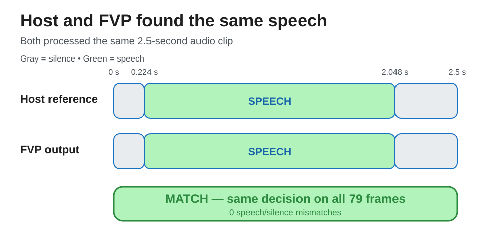

## 1. Inspect the streaming decisions

The application sends one `PROB` line over the simulated UART for every 512-sample frame. It also merges consecutive speech frames into `SEGMENT` lines.

Inspect the first probability records and the detected speech segments:

```bash
grep -Eo 'PROB .*$' \
  silero-vad-work/fvp/fvp.log | head -n 10
grep -Eo 'SEGMENT .*$' \
  silero-vad-work/fvp/fvp.log
```

The output is similar to:

```output
PROB 0.000 0.211681 silence
PROB 0.032 0.211681 silence
...
PROB 0.224 0.995684 speech
...
SEGMENT 0.224 2.048 speech
```

Each `PROB` line contains the frame timestamp in seconds, the probability of speech, and the decision produced with a threshold of `0.55`. Your probability values and speech segments depend on the validation audio.

The validation question is simple: did the host and FVP label every frame the same way? In this run, both found one speech segment from `0.224` to `2.048` seconds, with no decision mismatches.



## 2. Compare the host and FVP results

Compare the saved host reference with the probabilities in the FVP serial log:

```bash
source .venv/bin/activate
python3 examples/arm/silero_vad_example_ethos_u/runtime/compare_vad_probs.py \
  --expected silero-vad-work/export/expected_probs.bin \
  --actual-log silero-vad-work/fvp/fvp.log \
  --threshold 0.55 \
  --atol 0.25 \
  --mean-atol 0.02
```

The expected output is similar to:

```output
Compared 79 probability values
Max abs error: 0.156800 at frame 22
Mean abs error: 0.018459
Threshold mismatches at 0.550: 0
```

The comparison confirms that the host and FVP produced the same number of finite probabilities, the numerical differences stay within tolerance, and every frame has the same speech or silence decision.

## What you've accomplished

You have completed an end-to-end streaming audio workflow for Arm Ethos-U. You exported Silero VAD with model-owned recurrent state, built a bare-metal Cortex-M85 application, ran it on the Corstone-320 FVP, and validated its speech decisions against a host reference.

You can now replace the example audio with another 16 kHz mono, 16-bit PCM WAV file or use the runtime integration as a starting point for an Ethos-U85 device.
