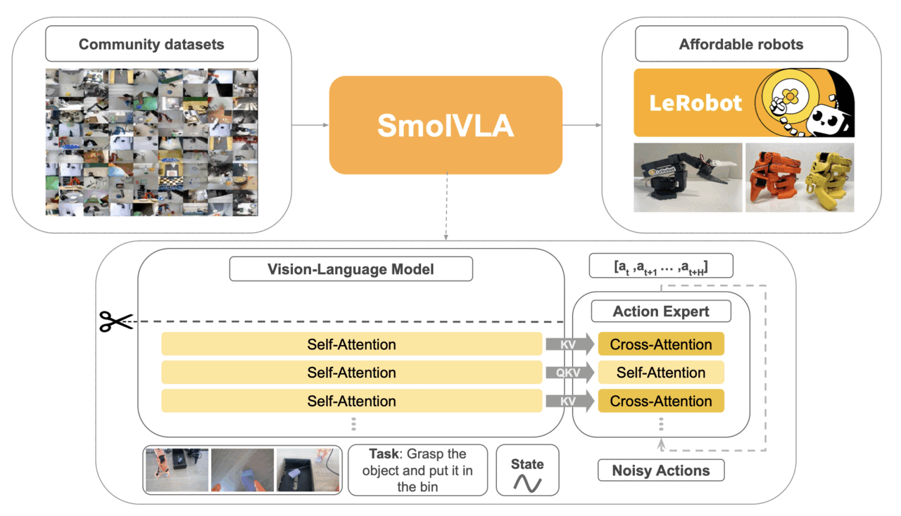

## Understand SmolVLA

SmolVLA is a compact vision-language-action model. It combines camera images,
a task instruction, and the robot state to generate a sequence of robot
actions.



Image source: [SmolVLA paper](https://arxiv.org/pdf/2506.01844).

## Export SmolVLA to ONNX

The checkpoint includes the SmolVLA policy and the LeRobot processors used
before and after inference. The exporter writes the policy to an ONNX graph;
the processors remain outside it.

Run the exporter:

```bash
work/venv/bin/python scripts/export_onnx.py \
  --checkpoint work/artifacts/smolvla_libero \
  --output work/onnx/fp32/model.onnx \
  --reference-dir work/onnx/fp32/reference
```

The exporter creates a fixed-shape model and a deterministic reference batch.
The batch includes an explicit flow-matching noise tensor, so the PyTorch and
ONNX Runtime paths receive the same inputs.

The expected output ends with:

```output
PASS: ONNX Runtime matches PyTorch within atol=0.001 and rtol=0.001
```

The FP32 graph contains the exported policy computation. Large weights can be
stored in external data files beside `model.onnx`, so keep the complete
`work/onnx/fp32` directory together.

## Review the model interface

The graph accepts six preprocessed inputs:

| Input | Type | Shape | Description |
| --- | --- | --- | --- |
| `camera1` | `float32` | `[1, 3, 512, 512]` | Primary RGB image scaled to `[0, 1]` |
| `camera2` | `float32` | `[1, 3, 512, 512]` | Wrist RGB image scaled to `[0, 1]` |
| `lang_tokens` | `int64` | `[1, 48]` | Tokenized task instruction |
| `lang_attention_mask` | `int64` | `[1, 48]` | Valid language-token mask |
| `state` | `float32` | `[1, 8]` | Normalized robot state |
| `noise` | `float32` | `[1, 50, 32]` | Flow-matching noise |

The model returns an action chunk with shape `[1, 50, 7]`: 50 steps with seven
control values each.

The ONNX boundary deliberately starts after preprocessing and ends before
postprocessing:

```text
observation -> LeRobot preprocessor -> ONNX model -> LeRobot postprocessor -> robot action
```

Use the processors from the same checkpoint. They preserve the tokenization,
normalization, and action conversion expected by the policy.

## Inspect the validation report

View the report written by the exporter:

```bash
work/venv/bin/python -m json.tool work/onnx/fp32/validation.json
```

Confirm that the report lists `CPUExecutionProvider`, reports an output shape
of `[1, 50, 7]`, and passes validation.

## What you've accomplished and what's next

You have exported SmolVLA to FP32 ONNX and validated its action output
with ONNX Runtime on an Arm CPU. Next, you will quantize the eligible linear
weights to packed INT4 and run the resulting model through the same interface.
