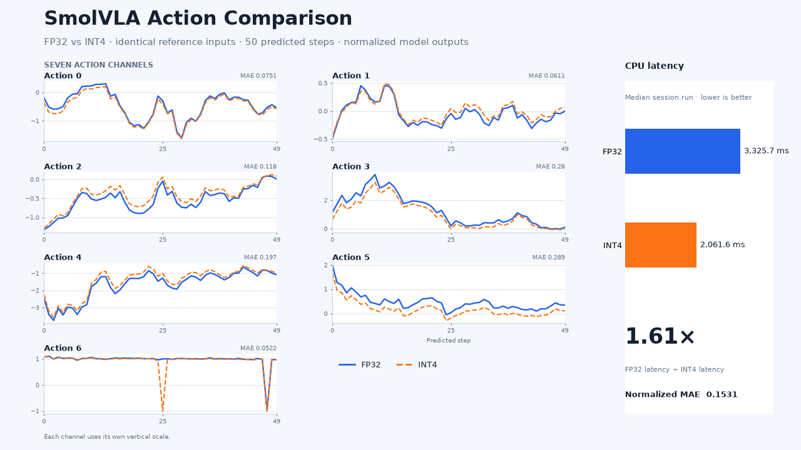

## INT4 quantization scope

TorchAO quantizes eligible constant linear weights across the exported SmolVLA
model. The converter replaces supported ONNX `MatMul` and `Gemm` operations
with packed `com.microsoft::MatMulNBits` operations.

This is weight-only quantization, not an entirely INT4 graph.

On supported Arm CPUs, ONNX Runtime can use optimized kernels such as KleidiAI.

## Create the packed INT4 model

Run the TorchAO converter:

```bash
work/venv/bin/python scripts/quantize_onnx_torchao.py \
  --input work/onnx/fp32/model.onnx \
  --output work/onnx/int4/smolvla-int4.onnx
```

The command creates a packed ONNX file and reports how many eligible linear
operations were converted. Dynamic or unsupported matrix multiplications
remain in floating point.

## Compare FP32 and INT4

Run both models with the deterministic reference batch created during export:

```bash
work/venv/bin/python scripts/compare_onnx_outputs.py \
  --fp32-model work/onnx/fp32/model.onnx \
  --int4-model work/onnx/int4/smolvla-int4.onnx \
  --reference-dir work/onnx/fp32/reference \
  --output work/comparison/smolvla-action-comparison.png
```

The script runs both models with ONNX Runtime `CPUExecutionProvider` and
creates:

```text
work/comparison/smolvla-action-comparison.png
work/comparison/smolvla-action-comparison.json
```

The figure compares all seven normalized output channels and median latency.
The JSON file records the latency and overall output error.

## Review the O6 result



On the O6, INT4 reduced median ONNX Runtime latency from 3.33 seconds to 2.06
seconds, a 1.61x speedup. The normalized outputs had an MAE of 0.153.

## What you've accomplished

You have converted eligible SmolVLA linear weights to packed INT4 in an ONNX
model, run FP32 and INT4 with identical inputs on an Arm CPU, and compared all
seven normalized output channels and ONNX Runtime latency.
