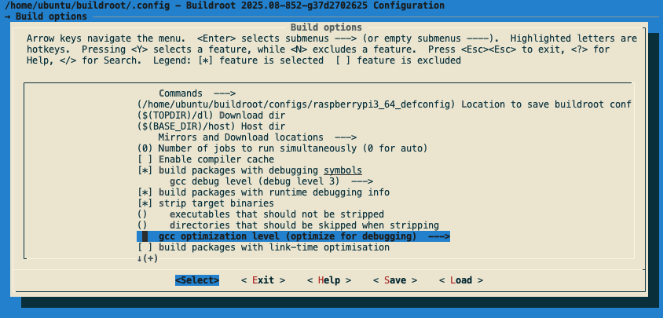

## Install packages

```
sudo apt update
sudo apt install -y which sed make binutils build-essential diffutils gcc g++ bash patch gzip \ 
bzip2 perl tar cpio unzip rsync file bc findutils gawk libncurses-dev python-is-python3 \
gcc-arm-none-eabi
```

## Build a debuggable kernel image

For this learning path you will be using [Buildroot](https://github.com/buildroot/buildroot) to build a Linux image for Raspberry Pi 3B+ with a debuggable Linux kernel. You will profile Linux kernel modules built out-of-tree and Linux device drivers built in the Linux source code tree.  

1. Clone the Buildroot Repository and initialize the build system with the default configurations.

```bash
git clone https://github.com/buildroot/buildroot.git
cd buildroot
export BUILDROOT_HOME=$(pwd)
make raspberrypi3_64_defconfig
```
{}
If you're not using a Raspberry Pi 3 for this Learning Path, change the `raspberrypi3_64_defconfig` to the option that matches your hardware in `$(BUILDROOT_HOME)/configs`
{}

2.  You will use `menuconfig` to configure the setup. Invoke it with the following command:

```
make menuconfig
```



Change Buildroot configurations to enable debugging symbols and SSH access. 

```plaintext
Build options  --->
    [*] build packages with debugging symbols
        gcc debug level (debug level 3)
    [*] build packages with runtime debugging info
        gcc optimization level (optimize for debugging)  --->

System configuration  --->
    [*] Enable root login with password
        (****) Root password    # Choose root password here
    
Kernel  --->
    Linux Kernel Tools  --->
        [*] perf

Target packages  --->
    Networking applications  --->
        [*] openssh
            [*]   server
            [*]   key utilities
```

You might also need to change your default `sshd_config` file according to your network settings. To do that, you need to modify System configuration→ Root filesystem overlay directories to add a directory that contains your modified `sshd_config` file.

3. By default the Linux kernel images are stripped. You will need to make the image debuggable as you'll be using it later.

Invoke `linux-menuconfig` and uncheck the option as shown.

```bash
make linux-menuconfig
```

```plaintext
Kernel hacking  --->
    -*- Kernel debugging
    Compile-time checks and compiler options  --->
        Debug information (Rely on the toolchain's implicit default DWARF version)
    [ ] Reduce debugging information # un-check
```

4. Now you can build the Linux image and flash it to the the SD card to run it on the Raspberry Pi.

```bash
make -j$(nproc)
```

It will take some time to build the Linux image. When it completes, the output will be in `$BUILDROOT_HOME/output/images/sdcard.img`:

```bash
ls $BUILDROOT_HOME/output/images/ | grep sdcard.img
```

For details on flashing the SD card image, see [this helpful article](https://www.ev3dev.org/docs/tutorials/writing-sd-card-image-ubuntu-disk-image-writer/).

Now that you have a target running Linux with a debuggable kernel image, you can start writing your kernel module that you want to profile.
