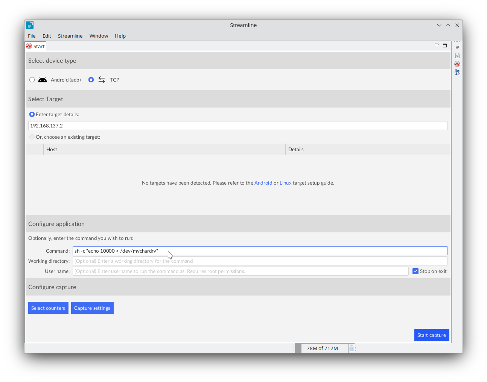
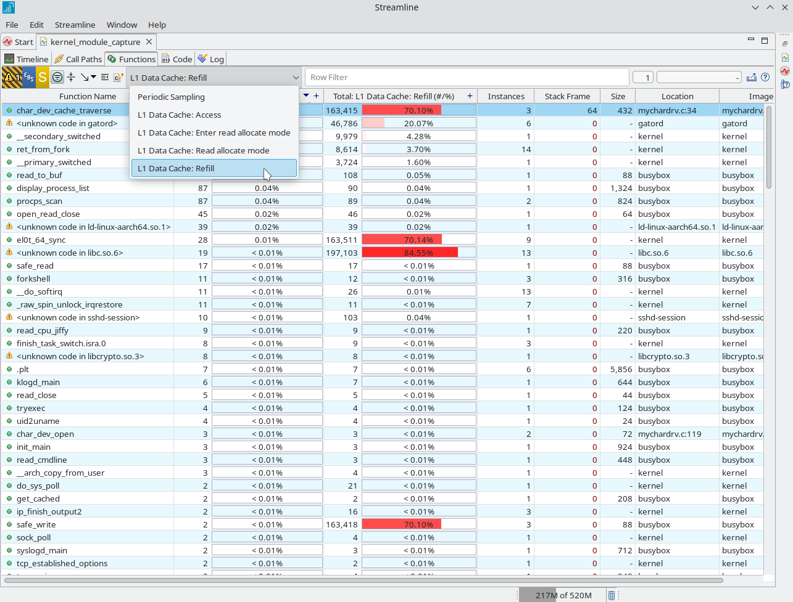

## Use Streamline to profile an out-of-tree kernel module

Arm Streamline is a tool that uses sampling to measure system performance. Instead of recording every single event (like instrumentation does, which can slow things down), it takes snapshots of hardware counters and system registers at regular intervals. This gives a statistical view of how the system runs, while keeping the overhead small.

Streamline tracks performance metrics such as CPU usage, execution cycles, memory access, cache hits and misses, and GPU activity. By putting this information together, it helps developers see how their code is using the hardware. Captured data is presented on a timeline, so you can see how performance changes as your program runs. This makes it easier to notice patterns, find bottlenecks, and link performance issues to specific parts of your application.

For more details about Streamline and its features, refer to the [Streamline user guide](https://developer.arm.com/documentation/101816/latest/Getting-started-with-Streamline/Introduction-to-Streamline).

### Download Streamline

Streamline is included with Arm Performance Studio, which you can download and use for free. Download it by following the link below.

[Arm Performance Studio downloads](https://developer.arm.com/Tools%20and%20Software/Arm%20Performance%20Studio#Downloads).

For step-by-step guidance on setting up Streamline on your host machine, follow the installation instructions provided in [Streamline installation guide](https://developer.arm.com/documentation/101816/latest/Getting-started-with-Streamline/Install-Streamline).

### Push Gator to the target and make a capture

Once Streamline is installed on the host machine, you can capture trace data of our Linux kernel module. On Linux, the binaries will be installed where you extracted the package.

1. To communicate with the target, Streamline requires a daemon, called **gatord**, to be installed and running on the target. gatord must be running before you can capture trace data. There are two pre-built gatord binaries available in Streamline's install directory, one for *Armv7 (AArch32)* and one for *Armv8 or later(AArch64)*. Push **gatord** to the target device using **scp**.

    ```bash
    scp <install_directory>/streamline/bin/linux/arm64/gatord root@<target-ip>:/root/gatord
    ```

{}
If you are using an AArch32 target, use `arm` instead of `arm64`.
{}


2. Run gator on the target to start system-wide capture mode.

    ```bash
    /root/gatord -S yes -a
    ```

    

3. Open Streamline and choose *TCP mode*.

4. Enter your target hostname or IP address.


5. Click on *Select counters* to open the counter configuration dialogue.

6. Add `L1 data Cache: Refill` and `L1 Data Cache: Access` and enable Event-Based Sampling (EBS) for both of them as shown in the screenshot and click *Save*.

  {}
  To learn more about counters and how to configure them please refer to [counter configuration guide](https://developer.arm.com/documentation/101816/latest/Capture-a-Streamline-profile/Counter-Configuration)

  To learn more about EBS, please refer to [Streamline user guide](https://developer.arm.com/documentation/101816/9-7/Capture-a-Streamline-profile/Counter-Configuration/Setting-up-event-based-sampling)
  {}

  ![Streamline counter configuration dialog showing two counters, L1 data Cache Refill and L1 Data Cache Access, both enabled with Event-Based Sampling selected. The dialog includes checkboxes and dropdown menus for configuring counters. The wider environment is a desktop application window focused on performance profiling setup. Text in the image includes labels for the counters and options for enabling EBS. The emotional tone is neutral and technical, supporting a step-by-step configuration process for Arm performance analysis. alt-text#center](./images/img03_counter_config.png)

7. In the Command section, add the same shell command you used earlier to test our Linux module.

    ```bash
    sh -c "echo 10000 > /dev/mychardrv"
    ```

    

8. In the Capture settings dialog, select Add image, add the absolut path of your kernel module file `mychardrv.ko` and click Save.
![Streamline Capture settings dialog showing fields for adding an image and specifying the absolute path to the kernel module file mychardrv.ko. The dialog includes labeled input fields and buttons for saving the configuration. The wider environment is a desktop application window focused on performance profiling setup. Text in the image includes labels such as Add image and fields for entering file paths. The emotional tone is neutral and technical, supporting a step-by-step configuration process for Arm performance analysis. alt-text#center](./images/img05_capture_settings.png)

9. Start the capture and enter a name and location for the capture file. Streamline will start collecting data and the charts will show activity being captured from the target.
![Streamline timeline view displaying performance data charts with multiple colored lines representing different hardware counters over time. The primary subject is the timeline chart, which shows activity spikes and trends for metrics such as CPU usage and cache events. The wider environment is a desktop application window focused on performance profiling, with labeled axes and a legend identifying each counter. Text in the image includes labels for counters and time intervals. The emotional tone is neutral and technical, supporting detailed analysis of Arm system performance. alt-text#center](./images/img06_streamline_timeline.png)

### Analyze the capture and inspect the code

Once the capture is stopped, Streamline automatically analyzes the collected data and provides insights to help identify performance issues and bottlenecks. This section describes how to view these insights, starting with locating the functions related to our kernel module and narrowing down to the exact lines of code that may be responsible for the performance problems.

1. Open the *Functions tab*. In the counters list, select one of the counters you selected earlier in the counter configuration dialog, as shown:

<!--
Alt text: Screenshot of the Streamline profiling tool interface showing the process of selecting a data source for counters. The main panel displays a list of available data sources with one highlighted, and a sidebar provides navigation options. The environment is a typical software profiling application window with a neutral, professional tone. Visible text includes Counter selection and labels for different data sources.
-->


2. In the Functions tab, observe that the function `char_dev_cache_traverse()` has the highest L1 Cache refill rate, which is expected.
  Also notice the Image name on the right, which is our module file name `mychardrv.ko`:

![Streamline Functions tab displaying a list of functions with performance metrics such as L1 Cache refill rates. The primary subject is the function char_dev_cache_traverse which is highlighted and shows the highest cache refill value. The right side of the table lists the image name as mychardrv.ko. The wider environment is a desktop profiling application window with columns labeled Function, Image, and various performance counters. Visible text includes function names, image names, and numerical metric values. The emotional tone is neutral and technical, supporting detailed analysis for Arm kernel module profiling. alt-text#center](./images/img08_Functions_Tab.png)

3. To view the call path of this function, right click on the function name and choose *Select in Call Paths*.

4. You can now see the exact function that called `char_dev_cache_traverse()`. In the Locations column, notice that the function calls started in the userspace (`echo` command) and terminated in the kernel space module `mychardrv.ko`:
![Streamline Call Paths tab displaying a hierarchical call stack with the function char_dev_cache_traverse highlighted. The primary subject is the call path tree, showing the sequence of function calls from userspace echo command through to the kernel module mychardrv.ko. The wider environment is a desktop profiling application window with columns labeled Function, Image, and performance counters. Visible text includes function names, image names, and numerical metric values. The emotional tone is neutral and technical, supporting detailed analysis for Arm kernel module profiling and helping users trace performance issues through the call stack. alt-text#center](./images/img09_callpaths_tab.png)

5. Since you compiled the kernel module with debug info, you will be able to see the exact code lines that are causing these cache misses.
  To do so, double-click on the function name and the *Code tab* opens. This view shows you how much each code line contributed to the cache misses and in bottom half of the code view, you can also see the disassembly of these lines with the counter values of each assembly instruction:
![Streamline Code tab displaying annotated source code and disassembly for the function char_dev_cache_traverse in the kernel module mychardrv.ko. The primary subject is the code analysis panel, which highlights individual lines of C source code and corresponding assembly instructions, each with associated cache miss metrics. The top half of the window shows the source code with numerical values indicating cache misses per line, while the bottom half presents the disassembly view with counter values for each instruction. The wider environment is a desktop profiling application window with labeled columns such as Function, Image, and performance counters. Visible text includes function names, source code lines, assembly instructions, and numerical metric values. The emotional tone is neutral and technical, supporting detailed analysis for Arm kernel module profiling and helping users identify performance bottlenecks at the code level. alt-text#center](./images/img10_code_tab.png)

{}
You may need to configure path prefix substitution in the Code tab to view the source code correctly. For details on how to set this up and for more information about code analysis, please refer to [Streamline user guide](https://developer.arm.com/documentation/101816/latest/Analyze-your-capture/Analyze-your-code?lang=en)
{}