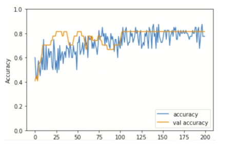
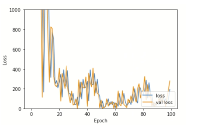
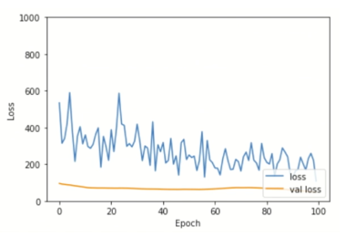

---
# User change
title: Train the model

weight: 4 # 1 is first, 2 is second, etc.

# Do not modify these elements
layout: "learningpathall"
---

## Create a model

Now you will train a multi-layer perceptron model with the dataset. Define a multi-layer perceptron model with 3 dense layers.

```python
x_train, y_train = sklearn.utils.shuffle(np.array(data), np.array(labels))
y_train = tf.keras.utils.to_categorical(y_train, len(np.unique(y_train)))

model = tf.keras.Sequential(
        [
            tf.keras.Input(shape=(3, stride)),
            tf.keras.layers.Flatten(),
            tf.keras.layers.Dense(30, activation="relu"),
            tf.keras.layers.Dropout(0.5),
            tf.keras.layers.Dense(20, activation="relu"),
            tf.keras.layers.Dropout(0.5),
            tf.keras.layers.Dense(len(np.unique(y_train)), activation="softmax")
        ]
    )

model.summary()
```
This step will output a report showing there are `3392` parameters in total.
```output
Model: "sequential"
_________________________________________________________________
 Layer (type)                Output Shape              Param #   
=================================================================
 flatten (Flatten)           (None, 90)                0         
 dense (Dense)               (None, 30)                2730      
 dropout (Dropout)           (None, 30)                0         
 dense_1 (Dense)             (None, 20)                620       
 dropout_1 (Dropout)         (None, 20)                0         
 dense_2 (Dense)             (None, 2)                 42        
=================================================================
Total params: 3,392
Trainable params: 3,392
Non-trainable params: 0
```
## Train the model {#train}

Train the model for 200 epochs.
```python
model.compile(loss='categorical_crossentropy', optimizer='adam', metrics=['accuracy'])
history = model.fit(x_train, y_train, batch_size=1, epochs=200, validation_split=0.4)

model.save('raw_model.h5')
```
### Plot the training accuracy

Plot the training and validation accuracy over epoch.
```python
plt.plot(history.history['accuracy'], label='accuracy')
plt.plot(history.history['val_accuracy'], label = 'val accuracy')
plt.xlabel('Epoch')
plt.ylabel('Accuracy')
plt.ylim([0, 1])
plt.legend(loc='lower right')

plt.figure()
plt.plot(history.history['loss'], label='loss')
plt.plot(history.history['val_loss'], label = 'val loss')
plt.xlabel('Epoch')
plt.ylabel('Loss')
plt.ylim([0, 1000])
plt.legend(loc='lower right')
```
In this example, see that the training and validation accuracy start to converge after around 150 epochs. This means that the 200 epochs are enough to train the model. If you train the model for too many epochs, then the validation accuracy may drop due to overfitting. If you experience this, re-run [training](#train) with an appropriate epoch value.



## Investigate learning rate (optional)

For training the model, you used the default learning rate. But how will the model change with different learning rates? If the learning rate is too high, the model is more likely to overshoot the minima, meaning that the model cannot converge to the minima. On the other hand, if the learning rate is too low, the model reaches the minima too slowly, requiring more training time.

First try a high learning rate. Here, you set the learning rate of the optimizer as 1000. Execute the code block. This graph shows the training and validation loss values over epoch. You can see that the loss values fluctuate a lot so the model has difficulty in reaching the minima.

```python
# High learning rate (lr = 1000)
model_hlr = tf.keras.models.clone_model(model)

optimizer = tf.optimizers.Adam(learning_rate = 1000)
model_hlr.compile(loss='categorical_crossentropy', optimizer=optimizer, metrics=['accuracy'])
history = model_hlr.fit(x_train, y_train, batch_size=32, epochs=100, validation_split=0.4)

plt.plot(history.history['loss'], label='loss')
plt.plot(history.history['val_loss'], label = 'val loss')
plt.xlabel('Epoch')
plt.ylabel('Loss')
plt.ylim([0, 1000])
plt.legend(loc='lower right')
```
Expected output shown below:



Now try a lower learning rate, which is 0.0001. Execute the code block. The graph shows the training and validation loss values decrease much more slowly. So, it is important to use a proper learning rate in training.

```python
# Low learning rate (lr = 0.0001)
model_llr = tf.keras.models.clone_model(model)

optimizer = tf.optimizers.Adam(learning_rate = 0.0001)
model_llr.compile(loss='categorical_crossentropy', optimizer=optimizer, metrics=['accuracy'])
history = model_llr.fit(x_train, y_train, batch_size=32, epochs=100, validation_split=0.4)

plt.plot(history.history['loss'], label='loss')
plt.plot(history.history['val_loss'], label = 'val loss')
plt.xlabel('Epoch')
plt.ylabel('Loss')
plt.ylim([0, 1000])
plt.legend(loc='lower right')
```

Expected output shown below:



With the model trained, you are now ready to test it.

## Test the model

To test the model you trained, run the code block shown below. 

```python
input('Press Enter once MCU is ready')
line = ser.readline()
lineList = convert_to_list(str(line))
new_df = convert_list_to_df(lineList)
print('New data acquired:\n', new_df.describe())

x = new_df['X'].to_numpy()
y = new_df['Y'].to_numpy()
z = new_df['Z'].to_numpy()

inf_data = np.array([x, y, z])
plot_single_sample(data_sample=inf_data.reshape((3, stride)))

# For inference you have to explicitly tell that the data has a batch size of 1
inf_data = inf_data.reshape((1, 3, stride))

pred = model.predict(inf_data)
print('Model Prediction: ', np.argmax(pred))
```

1. Press the blue button on the board, and "write" your letter, as before.
2. Press `Enter` in the notebook to sample data.
3. Check whether the prediction is correct or not.

Replay the step as often as you wish to test.
