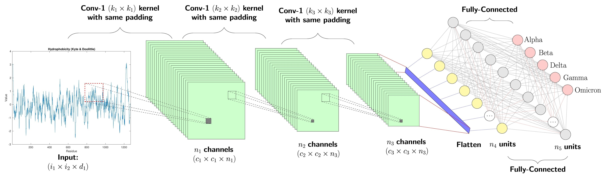

## Overview
This learning path (LP) is a direct follow-up to the [Introduction to TinyML on Arm using PyTorch and ExecuTorch](/learning-paths/embedded-and-microcontrollers/introduction-to-tinyml-on-arm) learning path. While the previous path introduced you to the core concepts and the toolchain, this one puts that knowledge into practice with a fun, real-world example. We will move from the simple ["Feedforward Neural Network"](/learning-paths/embedded-and-microcontrollers/introduction-to-tinyml-on-arm/4-build-model) in the previous LP, to a more practical computer vision task: A tiny Rock-Paper-Scissors game, to demonstrate how these tools can be used to solve a tangible problem and run efficiently on Arm-based edge devices.


We will train a lightweight CNN to classify images of the letters R, P, and S as "rock," "paper," or "scissors." The script uses a synthetic data renderer to create a large dataset of these images with various transformations and noise, eliminating the need for a massive real-world dataset.

### What is a Convolutional Neural Network (CNN)?
A Convolutional Neural Network (CNN) is a type of deep neural network primarily used for analyzing visual imagery. Unlike traditional neural networks, CNNs are designed to process pixel data by using a mathematical operation called **convolution**. This allows them to automatically and adaptively learn spatial hierarchies of features from input images, from low-level features like edges and textures to high-level features like shapes and objects.



Image of a convolutional neural network architecture : [Image credits](https://medium.com/@atul_86537/learning-ml-from-first-principles-c-linux-the-rick-and-morty-way-convolutional-neural-c76c3df511f4).

CNNs are the backbone of many modern computer vision applications, including:

- **Image Classification:** Identifying the main object in an image, like classifying a photo as a "cat" or "dog".
- **Object Detection:** Locating specific objects within an image and drawing a box around them.
- **Facial Recognition:** Identifying and verifying individuals based on their faces.

For our Rock-Paper-Scissors game, we'll use a tiny CNN to classify images of the letters R, P, and S as the corresponding hand gestures.


## Environment Setup
To get started, follow the first three chapters of the [Introduction to TinyML on Arm using PyTorch and ExecuTorch](/learning-paths/embedded-and-microcontrollers/introduction-to-tinyml-on-arm) Learning Path. This will set up your development environment and install the necessary tools.


If you just followed the LP above, you should already have your virtual environment activated. If not, activate it using:

```console
source $HOME/executorch-venv/bin/activate
```
The prompt of your terminal now has `(executorch-venv)` as a prefix to indicate the virtual environment is active.

Run the commands below to install the dependencies.

```bash
pip install argparse json numpy pillow torch
```
You are now ready to build the model.

