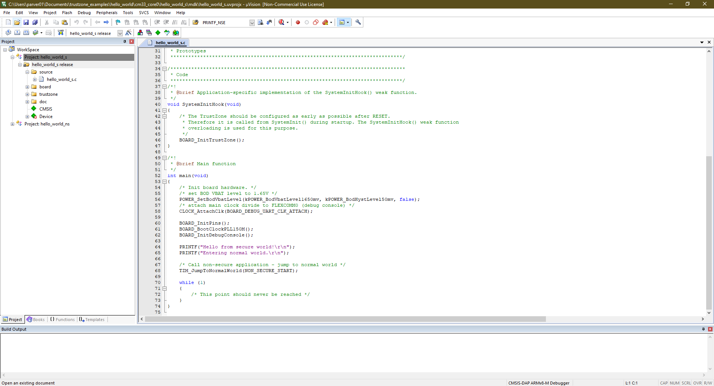

---
# User change
title: "Run TrustZone Hello World example"

weight: 2 # 1 is first, 2 is second, etc.

# Do not modify these elements
layout: "learningpathall"
---

## Before you begin

Install [Keil MDK](/install-guides/mdk) and [Arm Compiler for Embedded](/install-guides/armclang) on a Windows machine and connect the NXP LPCXpresso55S69 board to it.

## Build and Run the Hello World TrustZone example

The hello world TrustZone example can be obtained using the Pack installer in Keil µVision. 

Using the Pack Installer widget, select the LPC55S69 device and then copy the `hello_ns` and `hello_s` examples into your workspace. These are the non-secure and secure sub-projects of the TrustZone example. Then select `Project-> Open Project` on the IDE and select the `hello_world_s` example. Under this example, open the `hello_world.uvmpw` µVision Multi-Project file.



Now proceed to build the project by selecting the `Batch Build` button. This step will build both the `hello_ns` and `hello_s` sub-projects. 

Once this step is completed you can proceed to running the example on the NXP LPCXpresso55S69 board that you have connected to the same Windows machine on which you are running the Keil µVision tools.

Select the `Start/Stop Debug Session` option from the Debug Menu. This steps loads the contents of both the sub-projects onto the NXP board. Then select the `Run` button on the IDE. The output from the program is displayed via the UART port. Ensure you have connected to the UART via the COM port with the speed set to 115200. You can use the PuTTY tool to connect to the UART COM port. The COM port number that your board is using for the UART communication can be identified by checking the `Ports(COM & LPT)` section on the `Device Manager` of your Windows machine.

You should then see the following output on the COM port:

```output
Hello from secure world!
Entering normal world.
Welcome in normal world!
Thus us a text printed from normal world!
Comparing two string as a callback to normal world
String 1: Test1
String 2: Test2
Both strings are equal!
```

As shown by the printed messages, the application boots in secure world and then switches to the non-secure world. From the non-secure world it calls from secure functions and then exits. 

In the following section you will learn some of the key TrustZone concepts used in this application.
