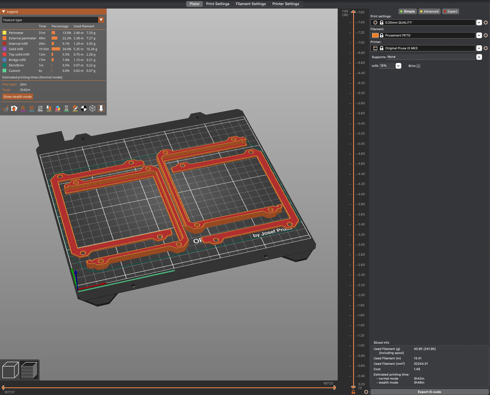
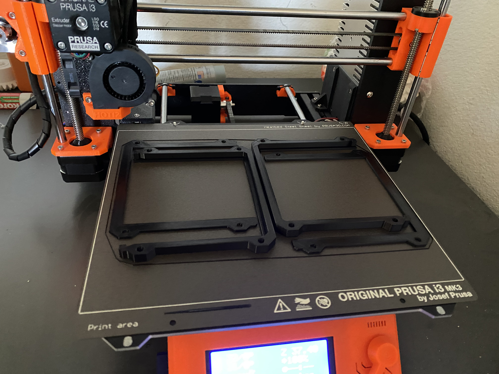

---
# User change
title: Print the Required Parts

weight: 2 # 1 is first, 2 is second, etc.

# Do not modify these elements
layout: "learningpathall"
---

## Before you begin

You will be using PETG filament to print the parts. The main reason is the card plates have tabs that you squeeze together to remove from the bays. PETG allows the material to flex and bend, rather than snap like PLA. It is non-toxic, so it doesn't require extra ventilation like ABS. And as a added bonus it is also withstands higher temperatures than PLA.

## Printed parts list 

Here is the list of parts you will need to print:

- 3D printed bay body. Number required per bay depends on the spacer size used.
- 3D printed bay cover. Same number as the bay body.
- 3D printed spacers. Number required per bay depends on the spacer size used.
- 3D printed end pieces. 2 per bay row.
- 3D printed snap-in feet for the end pieces.
- 3D printed card plate. 1 per SBC.

{}
- All STL files can be found on [GitHub](https://github.com/ArmDeveloperEcosystem/universal-sbc-rack-mount-system-for-4u-chassis)
- Boards that are currently supported: Raspberry Pi 4 Model B, Jetson Nano Dev Kit, Jetson Xavier NX, Jetson AGX Xavier Dev Kit, Ultra96-V2, HummingBoard Pulse, and DragonBoard410c 
- The Fusion 360 project file is also in the same GitHub repository. You can make changes as needed.
- The files have been designed so that there is no need for supports.
{}

## Slice and print

General printing instructions are provided. The exact steps differ based on the printer and slicing software. 

You can experiment with the quality settings. The parts are not complex shapes, so you can use thicker layer lines for faster printing.

1. Add multiple parts to your build plate
2. Rotate and move as necessary to fit as many on the build plate at a time as you can
3. Select a quality setting. 0.20mm is a good starting point, but experiment as needed
4. Select PETG as your filament
5. Slice and export G-code using your slicing software
6. Print

