---
# User change
title: "Use basic run/stop debug"

weight: 2 # 1 is first, 2 is second, etc.

# Do not modify these elements
layout: "learningpathall"
---

## Before you begin

To follow the instructions in this Learning Path, clone or download the [Blinky example project repo](https://github.com/Arm-Examples/Blinky_AVH_uV) on the same machine where you have installed Arm Keil MDK and the Corstone-300 Ecosystem FVP. Double-click the `Blinky.Debug+AVH.uvprojx` file to open it in µVision.

## Hardware Breakpoints

To use hardware breakpoints in µVision follow the steps outlined below:

1.  **Build (F7)** the example Blinky project you opened.
1.  **Start a Debug Session (Ctrl+F5)** to enter the µVision debugger.
1.  **Run (F5)** the application.
1. Bring `Blinky.c` in focus by clicking on its tab. If it is not visible, double-click on it in the **Project** window.
3. In `Blinky.c`, scroll down to the `while (1)` loop in the `main` function near line 42 as shown here:  
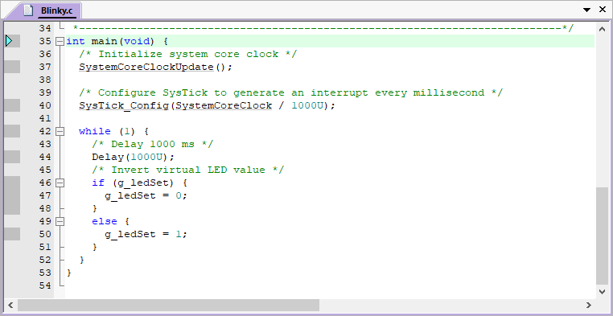
4. Note the darker grey blocks on the left of the line numbers. They indicate assembly code being present and that you can set a hardware breakpoint on these lines. You can also see these blocks in the **Disassembly** window:  
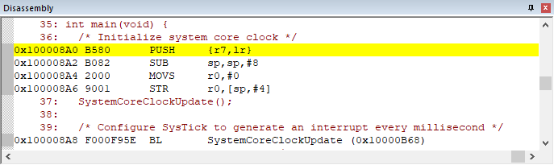
5. While the program is still running, click to the left of a suitable line in the `while` loop (for example at line 47) and a red circle will be created. This is a hardware breakpoint. The simulated Arm Cortex-M55 has eight hardware breakpoints. μVision will warn you if you exceed this limit.
6. The program will soon stop at the line where you have set the breakpoint on as shown below. The yellow arrow is the current program counter position. This will be the next instruction executed. The cyan arrow is a placeholder you can use to explore the relationship between a source window and the **Disassembly** window.  
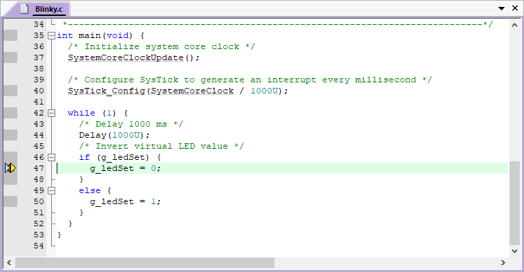
7. Add another breakpoint in `while (1)` (for example at line 50).
8. Each time you click on  **Run (F5)**, the program will cycle to the next breakpoint.

{}
- Sometimes the compiler will optimize out code. Breakpoints cannot be set on this code as shown by the lack of grey blocks. Setting the compiler to an optimization level of `-O0` will usually help (this is set in this example project already).
- You can set/unset hardware breakpoints with μVision while the program is running or stopped.
- Arm hardware breakpoints are no skid. They do not execute nor change the instruction they are set to.
- Your instructions in flash are not substituted or modified. Your flash contents are not changed.
- There is no intrusion to hardware or your program by Arm hardware breakpoints.
{}

### Manage Breakpoints

1. Go to **Debug - Breakpoints (Ctrl-B)** to manage breakpoints:  
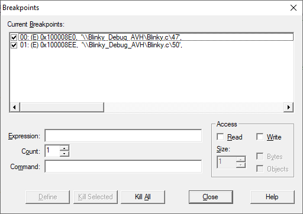
2. You can temporarily unselect, delete or create breakpoints in this window. It is easier to create a breakpoint by clicking in a source file or the **Disassembly** window.
3. [Watchpoints](#watchpoints) are also created in this window.
4. Select **Kill All** to remove all breakpoints.
5. Click **Close**.
6. Continue to  **Run (F5)** for the next exercise.

{}
For breakpoint expression examples, refer to the [Breakpoints Window](https://developer.arm.com/documentation/101407/latest/Debugging/Debug-Windows-and-Dialogs/Breakpoints-Window) documentation.
{}

## Call Stack + Locals Window

The [**Call Stack + Locals**](https://developer.arm.com/documentation/101407/latest/Debugging/Debug-Windows-and-Dialogs/Call-Stack-and-Locals-Window) window displays call stack contents as well as any local variables belonging to the active function. If possible, the values of the local variables will be displayed. If this is not possible, a message such as `<not in scope>` will be displayed. The **Call Stack + Locals** window visibility can be toggled by selecting **View - Call Stack window**.

### Call Stack Use Case

When the program is stopped, the list of stacked functions is displayed. This is when you need to know which functions have been called and are stored on the stack. This is useful to find program flow problems such as crashes. Normal functions are displayed only when they are on the stack. They are removed and added as appropriate.

1. Stop the program with the  **Stop** icon. The program will probably stop in the `Delay` function.
2. Click on the **Call Stack + Locals** window in the bottom right corner of μVision.
3. Inspect the various entries in the Call Stack + Locals window as shown below in this simple example. Local variables are displayed only when they are in scope:  
   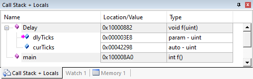  
1. Set a breakpoint in the `while (1)` loop at line 50 on the `g_ledSet = 1;`.
5.  **Run (F5)** the application.
6. Shortly after, the program will stop there.
1. 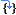 **Step (F11)** with Blinky.c in focus (its name in its tab is underlined).
9. Note how the variables displayed change in the **Call Stack + Locals** window.
1.  **Step (F11)**  a few more times.
1. Right-click on a function and select either **Show Caller Code** or **Show Callee Code** and this will be highlighted in the **Disassembly** and **source code** windows:  
   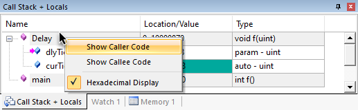
1.  **Step Out (Ctrl+F11)** to exit a function immediately.
1. Remove the **Breakpoint** (by clicking on its red circle ) to continue.

{}
- You can modify a variable value in the **Call Stack & Locals** window when the program is stopped.
- This window is only valid when the processor is halted. It does not update while the program is running because locals are normally kept in a CPU register which cannot be read by the debugger while the program is running. Any local variable values are visible only when they are in scope.
- This is standard “run/stop” debugging. With Arm CoreSight debug technology you can do more. You can display global or static variables and structures updated in real-time while the program is running. No additions or changes to your code are required. They only must be converted to global or static variables so they always remain in scope.
- When Keil RTX5 is used, all threads are displayed, even if they are not running. The active thread name and its number are highlighted in green.
- Single  **Step (F11)**: If you click inside a source window to bring it into focus, the program will step one source line at a time. If you click inside the **Disassembly** window to bring it into focus, it will then step one instruction at a time.
{}

## Watch and Memory Windows

The [**Watch**](https://developer.arm.com/documentation/101407/latest/Debugging/Debug-Windows-and-Dialogs/Watch-Window) and [**Memory**](https://developer.arm.com/documentation/101407/latest/Debugging/Debug-Windows-and-Dialogs/Memory-Window) windows display variable values in real-time using Arm CoreSight technology. It is also possible to `put` or insert values into these memory locations in real-time using the **Memory** window while the program is running. You can change memory in a **Watch** window if data is not changing fast.

There is a global variable `g_msTicks` located in `Blinky.c` near line 11 that you can use in the **Watch** and **Memory** windows.

### Watch Window

1.  **Run (F5)** the application.
2. Right click on `g_msTicks` in `Blinky.c` near line 11 and select **Add 'g_msTicks' to…** and select **Watch 1**.
3. Go to **View** in the main menu and enable **Periodic Window Update**:  
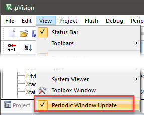
4. `g_msTicks` will be displayed in **Watch 1**:  
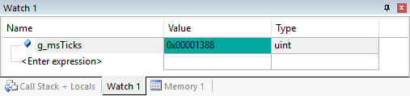
5. The values of `g_msTicks` are updated in real-time if *Periodic Window Update* is enabled.
6. You can modify the value in a **Watch** window when the program is stopped or changing slowly. You can modify a variable in a **Memory** window anytime (see next section).

#### Add the SystemCoreClock Variable

1. Click on `<Enter expression>` twice and enter: `SystemCoreClock`
2. Right click on the `Value` and deselect **Hexadecimal Display**. 32 MHz will be displayed:  
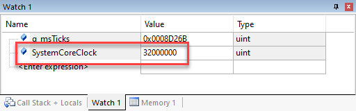

{}
You do not need to stop the program execution to enter variables, raw addresses or structures in a **Watch** or **Memory** window.
{}

### Memory Window

1. Right click on `g_msTicks` and select **Add ‘`g_msTicks` ' to…** and select **Memory 1**.
2. Note the changing value of `g_msTicks` is displaying its address in **Memory 1** as if it is a pointer. This is useful to see what address a pointer is pointing to. But this not what you want to see at this time.
3. Right click in **Memory 1** and select **Unsigned Long** to see the data field as 32-bit numbers.
4. Add an ampersand `&` in front of the variable name `g_msTicks` and press Enter. Now the physical address is shown (0x2000_0008) in this case. This physical address could change with different compilation optimizations.
5. The data contents of `g_msTicks` is displayed as shown:  
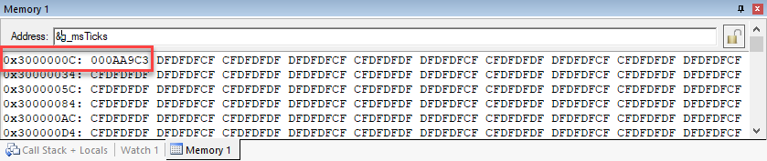
6. Right click on the memory data value and select **Modify Memory at 0x3000000C**. Enter a value and this will be pushed into `g_msTicks`. Since `g_msTicks` is updated often, you will only see the new value displayed for a very short time.
7.  **Stop** the application.

{}
- You can configure the **Watch** and **Memory** windows while the program is running in real-time without using any CPU cycles. You can change a Memory window value on-the-fly.
- [**View - Periodic Window Update**](https://developer.arm.com/documentation/101407/latest/User-Interface/View-Menu) must be selected. Otherwise variables update only when the program is stopped.
{}

#### How It Works

μVision uses Arm CoreSight technology to read or write memory locations without using CPU cycles. Most of the time, this is non-intrusive and does not impact the program execution timings. The Armv7-M/Armv8-M are Harvard architectures. This means they have separate instruction and data buses. While the CPU is fetching instructions at full speed, there is plenty of time for the CoreSight debug module to read or write to memory without stealing any CPU cycles. This can be slightly intrusive in the unlikely event the CPU and μVision reads or writes to the same memory location at exactly the same time. Then the CPU will be stalled for one clock cycle. In practice, this use of additional CPU cycles never happens.  

## System Viewer

The [**System Viewer**](https://developer.arm.com/documentation/101407/latest/Debugging/Debug-Windows-and-Dialogs/System-Viewer) provides the ability to view certain registers of peripherals and the CPU core. In many cases, these windows are updated in real-time while your program is running. They are available only in debug mode. Go to **Peripherals - System Viewer** to open the peripheral windows. Select CPU core registers by going to **Peripherals - Core Peripherals**.

#### SysTick Timer

The example application uses the Arm Cortex-M system tick timer.

1.  Go to **Peripherals - Core Peripherals** and then select **System Tick Timer S (SysTick)**.
2. The **SysTick Timer** window opens:  
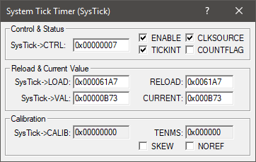
1.  **Run (F5)** the application.
6. While the program is running, type `0x10000` in the `SysTick -> LOAD` register and click in another register or press Enter.
7. The program execution will speed up. This is the power of Arm CoreSight debugging.
8. Replace LOAD with 0x007CFF. A  **Stop** and 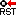 **Reset** will also accomplish this.
9. When you are done,  **Stop** the application and close the **SysTick Tick Timer (SysTick)** window.

{}
- The [documentation](https://developer.arm.com/documentation/101407/latest/Debugging/Debug-Windows-and-Dialogs/Core-Peripherals/Armv8-M-cores/Armv8-M--System-Tick-Timer) provides more information about the **System Tick Timer S (SysTick)** window.
- The window updates in real-time while your program is running.
- The `SysTick -> LOAD` register contains the reload register value. This value is set in `core_cm55.h` at line 4687:  
  ```C
  SysTick->LOAD  = (uint32_t)(ticks - 1UL);
  ```
  The value is set to 0x007CFF = dec 31,999. This is created by (32 MHz/1000)-1 = 31,999. 1000 is specified as the timer tick value. A SysTick S interrupt 15 will occur every 1 msec. Changing the reload value changes how often the SysTick interrupt 15 occurs.
- As you can modify values in the **System Viewer** while the program is running, you can make slight timing value changes instead of the usual modify, compile, program, run cycle.
- You must make sure a given peripheral register allows for and will properly react to such a change. Changing such values indiscriminately is a good way to cause serious problems that are difficult to find.
{}

## Watchpoints

**Watchpoints** can be thought of as conditional (access) breakpoints. Most Armv7-M and Armv8-M based processors have four data comparators. Since each watchpoint uses two comparators, you can configure two of them. The **Logic Analyzer** uses the same comparators in its operations. This means in μVision you must have two variables free in the Logic Analyzer to use watchpoints. μVision supports only one watchpoint.

{}
The following does not work with the FVP used in this example. Switch to a real hardware target to use watchpoints.
{}

### Configure a Watchpoint

1. Go to **Debug - Breakpoints (Ctrl-B)** to open the **Breakpoints** window.
3. In the **Expression** box, enter g_msTicks==0x44.
4. Select both the **Read** and **Write Access**.
5. Click on **Define** and it will be accepted as shown here:  
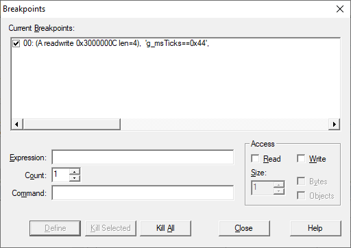
6. Click on Close.
7.  **Run (F5)** the application.
8. When `g_msTicks` equals `0x44`, the program will halt.
9. You will see `g_msTicks` displayed with a value of 0x44 in the Watch window:  
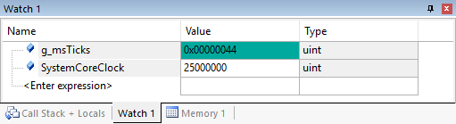
10. Delete the watchpoint by selecting **Kill All** in the **Breakpoints** window or use  **Kill all Breakpoints in Current Target**.
11. Select Close.
12. Leave Debug mode.

### Use a Watchpoint in the Stack Space

If you put a RAM address as the expression with no value, the next read and/or write (as you selected) will cause the program to halt. This can be particularly useful in the Stack. Set an address at some limit and if the program reads or writes this address, the program stops.

1. In this example a watchpoint is created with address `0x2000_0008`.
2. Running the program, the first read or write will stop the processor.
3. The [**Command**](https://developer.arm.com/documentation/101407/latest/Debugging/Debug-Windows-and-Dialogs/Command-Window) window shows the setting of this Watchpoint and its execution including the approximate instruction location:
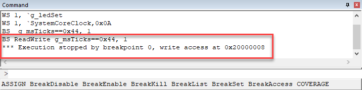

{}
- Skid: The instruction noted will not be the instruction causing the break as it has not been executed yet. It will be noted in **Disassembly**.
- The instruction causing the break is probably a few instructions before this one in the execution stream.
- To edit a watchpoint, double-click on it in the **Breakpoints** window and its information will be dropped down into the configuration area. Clicking on **Define** will create another watchpoint. You should delete the old one by highlighting it and click on Kill Selected or use the following tip.
- The checkbox beside the expression in **Current Breakpoints:** as shown above allows you to temporarily unselect or disable a watchpoint without deleting it.
- You can create a watchpoint with a raw address and no variable value. This is useful for detecting stack overruns. Physical addresses can be entered as `*((unsigned long *)0x20000000)`. Or simply enter the address as shown above.
{}
